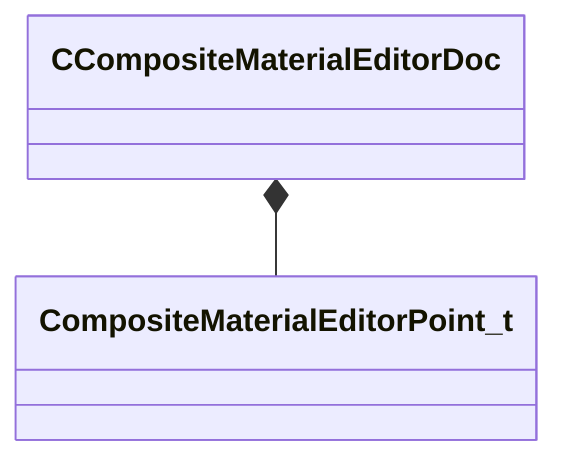
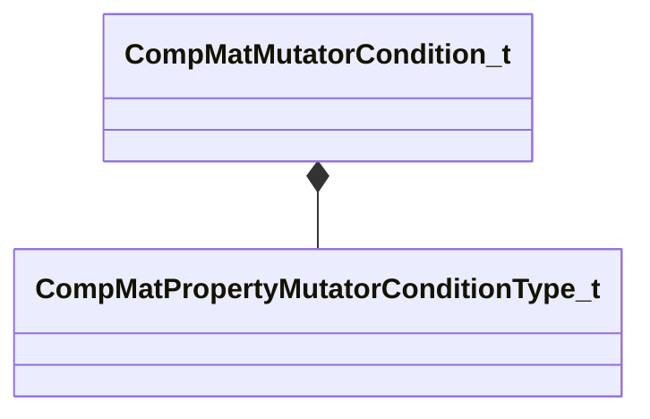
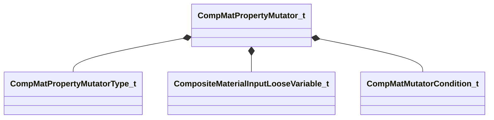
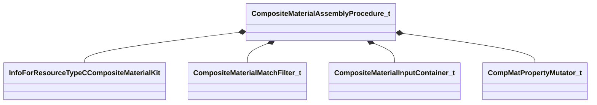
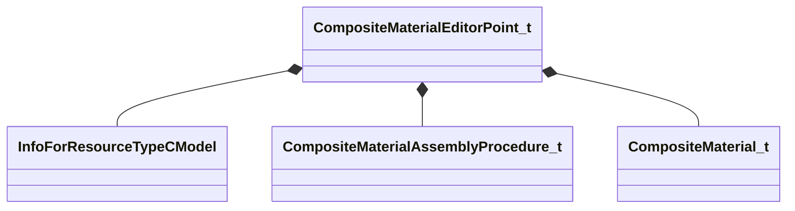
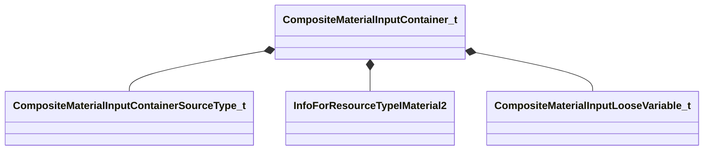
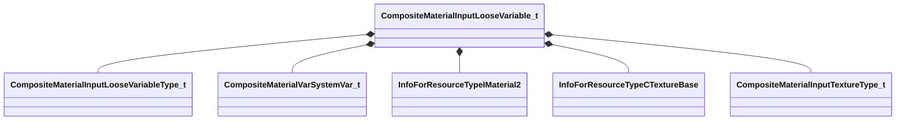
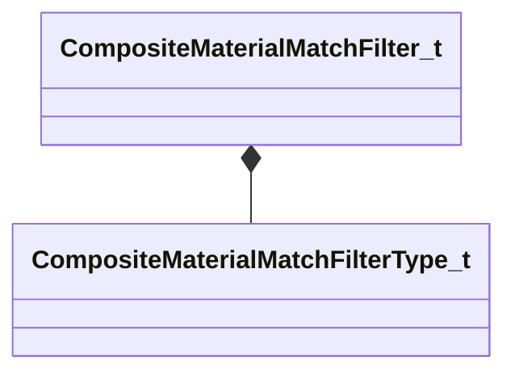
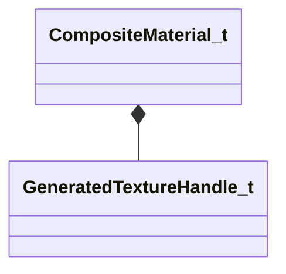

# Module: compositematerialslib

[📊 View UML Diagram](../diagrams/compositematerialslib.md)

| Name | Kind | Bases | Fields |
|------|------|-------|--------|
| [CCompositeMaterialEditorDoc](#ccompositematerialeditordoc) | class |  | 3 |
| [CompMatMutatorCondition_t](#compmatmutatorcondition_t) | class |  | 5 |
| [CompMatPropertyMutator_t](#compmatpropertymutator_t) | class |  | 29 |
| [CompositeMaterialAssemblyProcedure_t](#compositematerialassemblyprocedure_t) | class |  | 4 |
| [CompositeMaterialEditorPoint_t](#compositematerialeditorpoint_t) | class |  | 8 |
| [CompositeMaterialInputContainer_t](#compositematerialinputcontainer_t) | class |  | 8 |
| [CompositeMaterialInputLooseVariable_t](#compositematerialinputloosevariable_t) | class |  | 37 |
| [CompositeMaterialMatchFilter_t](#compositematerialmatchfilter_t) | class |  | 4 |
| [CompositeMaterial_t](#compositematerial_t) | class |  | 4 |
| [GeneratedTextureHandle_t](#generatedtexturehandle_t) | class |  | 1 |

---

### CCompositeMaterialEditorDoc

**Metadata:** `MGetKV3ClassDefaults`

**Relationships:**

```mermaid
classDiagram
    CCompositeMaterialEditorDoc *-- CompositeMaterialEditorPoint_t
```

**Fields:**

| Name | Type | Annotations |
|------|------|-------------|
| `m_nVersion` | int32 |  |
| `m_Points` | CUtlVector< [CompositeMaterialEditorPoint_t](../schemas/compositematerialslib.md#compositematerialeditorpoint_t) > |  |
| `m_KVthumbnail` | KeyValues3 |  |

### CompMatMutatorCondition_t

**Metadata:** `MGetKV3ClassDefaults`, `MPropertyElementNameFn`

**Relationships:**

```mermaid
classDiagram
    CompMatMutatorCondition_t *-- CompMatPropertyMutatorConditionType_t
```

**Fields:**

| Name | Type | Annotations |
|------|------|-------------|
| `m_nMutatorCondition` | [CompMatPropertyMutatorConditionType_t](../schemas/!GlobalTypes.md#compmatpropertymutatorconditiontype_t) | `MPropertyAutoRebuildOnChange` `MPropertyFriendlyName Condition` |
| `m_strMutatorConditionContainerName` | CUtlString | `MPropertyAttrStateCallback` `MPropertyFriendlyName Container Name` |
| `m_strMutatorConditionContainerVarName` | CUtlString | `MPropertyAttrStateCallback` `MPropertyFriendlyName Variable Name` |
| `m_strMutatorConditionContainerVarValue` | CUtlString | `MPropertyAttrStateCallback` `MPropertyFriendlyName Variable Value` |
| `m_bPassWhenTrue` | bool | `MPropertyFriendlyName Pass when True` |

### CompMatPropertyMutator_t

**Metadata:** `MGetKV3ClassDefaults`, `MPropertyElementNameFn`

**Relationships:**

```mermaid
classDiagram
    CompMatPropertyMutator_t *-- CompMatPropertyMutatorType_t
    CompMatPropertyMutator_t *-- CompositeMaterialInputLooseVariable_t
    CompMatPropertyMutator_t *-- CompMatMutatorCondition_t
```

**Fields:**

| Name | Type | Annotations |
|------|------|-------------|
| `m_bEnabled` | bool | `MPropertyAutoRebuildOnChange` `MPropertyFriendlyName Enabled` |
| `m_nMutatorCommandType` | [CompMatPropertyMutatorType_t](../schemas/!GlobalTypes.md#compmatpropertymutatortype_t) | `MPropertyAttrStateCallback` `MPropertyAutoRebuildOnChange` `MPropertyFriendlyName Mutator Command` |
| `m_strInitWith_Container` | CUtlString | `MPropertyAttrStateCallback` `MPropertyFriendlyName Container to Init With` |
| `m_strCopyProperty_InputContainerSrc` | CUtlString | `MPropertyAttrStateCallback` `MPropertyFriendlyName Input Container` |
| `m_strCopyProperty_InputContainerProperty` | CUtlString | `MPropertyAttrStateCallback` `MPropertyFriendlyName Input Container Property` |
| `m_strCopyProperty_TargetProperty` | CUtlString | `MPropertyAttrStateCallback` `MPropertyFriendlyName Target Property` |
| `m_strRandomRollInputVars_SeedInputVar` | CUtlString | `MPropertyAttrStateCallback` `MPropertyFriendlyName Seed Input Var` |
| `m_vecRandomRollInputVars_InputVarsToRoll` | CUtlVector< CUtlString > | `MPropertyAttrStateCallback` `MPropertyFriendlyName Input Vars` |
| `m_strCopyMatchingKeys_InputContainerSrc` | CUtlString | `MPropertyAttrStateCallback` `MPropertyFriendlyName Input Container` |
| `m_strCopyKeysWithSuffix_InputContainerSrc` | CUtlString | `MPropertyAttrStateCallback` `MPropertyFriendlyName Input Container` |
| `m_strCopyKeysWithSuffix_FindSuffix` | CUtlString | `MPropertyAttrStateCallback` `MPropertyFriendlyName Find Suffix` |
| `m_strCopyKeysWithSuffix_ReplaceSuffix` | CUtlString | `MPropertyAttrStateCallback` `MPropertyFriendlyName Replace Suffix` |
| `m_nSetValue_Value` | [CompositeMaterialInputLooseVariable_t](../schemas/compositematerialslib.md#compositematerialinputloosevariable_t) | `MPropertyAttrStateCallback` `MPropertyFriendlyName Value` |
| `m_strGenerateTexture_TargetParam` | CUtlString | `MPropertyAttrStateCallback` `MPropertyFriendlyName Target Texture Param` |
| `m_strGenerateTexture_InitialContainer` | CUtlString | `MPropertyAttrStateCallback` `MPropertyFriendlyName Initial Container` |
| `m_nResolution` | int32 | `MPropertyAttrStateCallback` `MPropertyFriendlyName Resolution` |
| `m_bIsScratchTarget` | bool | `MPropertyAttrStateCallback` `MPropertyAutoRebuildOnChange` `MPropertyFriendlyName Scratch Target` |
| `m_strCompressionFormat` | CUtlString | `MPropertyAttrStateCallback` `MPropertyFriendlyName Compression Format` |
| `m_bSplatDebugInfo` | bool | `MPropertyAttrStateCallback` `MPropertyAutoRebuildOnChange` `MPropertyFriendlyName Splat Debug info on Texture` |
| `m_bCaptureInRenderDoc` | bool | `MPropertyAttrStateCallback` `MPropertyAutoRebuildOnChange` `MPropertyFriendlyName Capture in RenderDoc` |
| `m_vecTexGenInstructions` | CUtlVector< [CompMatPropertyMutator_t](../schemas/compositematerialslib.md#compmatpropertymutator_t) > | `MPropertyAttrStateCallback` `MPropertyFriendlyName Texture Generation Instructions` |
| `m_vecConditionalMutators` | CUtlVector< [CompMatPropertyMutator_t](../schemas/compositematerialslib.md#compmatpropertymutator_t) > | `MPropertyAttrStateCallback` `MPropertyFriendlyName Mutators` |
| `m_strPopInputQueue_Container` | CUtlString | `MPropertyAttrStateCallback` `MPropertyFriendlyName Container to Pop` |
| `m_strDrawText_InputContainerSrc` | CUtlString | `MPropertyAttrStateCallback` `MPropertyFriendlyName Input Container` |
| `m_strDrawText_InputContainerProperty` | CUtlString | `MPropertyAttrStateCallback` `MPropertyFriendlyName Input Container Property` |
| `m_vecDrawText_Position` | Vector2D | `MPropertyAttrStateCallback` `MPropertyFriendlyName Text Position` |
| `m_colDrawText_Color` | Color | `MPropertyAttrStateCallback` `MPropertyFriendlyName Text Color` |
| `m_strDrawText_Font` | CUtlString | `MPropertyAttrStateCallback` `MPropertyFriendlyName Font` |
| `m_vecConditions` | CUtlVector< [CompMatMutatorCondition_t](../schemas/compositematerialslib.md#compmatmutatorcondition_t) > | `MPropertyAttrStateCallback` `MPropertyFriendlyName Conditions` |

### CompositeMaterialAssemblyProcedure_t

**Metadata:** `MGetKV3ClassDefaults`, `MPropertyElementNameFn`

**Relationships:**

```mermaid
classDiagram
    CompositeMaterialAssemblyProcedure_t *-- InfoForResourceTypeCCompositeMaterialKit
    CompositeMaterialAssemblyProcedure_t *-- CompositeMaterialMatchFilter_t
    CompositeMaterialAssemblyProcedure_t *-- CompositeMaterialInputContainer_t
    CompositeMaterialAssemblyProcedure_t *-- CompMatPropertyMutator_t
```

**Fields:**

| Name | Type | Annotations |
|------|------|-------------|
| `m_vecCompMatIncludes` | CUtlVector< CResourceNameTyped< CWeakHandle< [InfoForResourceTypeCCompositeMaterialKit](../schemas/resourcesystem.md#infoforresourcetypeccompositematerialkit) > > > | `MPropertyFriendlyName Includes` |
| `m_vecMatchFilters` | CUtlVector< [CompositeMaterialMatchFilter_t](../schemas/compositematerialslib.md#compositematerialmatchfilter_t) > | `MPropertyFriendlyName Match Filters` |
| `m_vecCompositeInputContainers` | CUtlVector< [CompositeMaterialInputContainer_t](../schemas/compositematerialslib.md#compositematerialinputcontainer_t) > | `MPropertyFriendlyName Composite Inputs` |
| `m_vecPropertyMutators` | CUtlVector< [CompMatPropertyMutator_t](../schemas/compositematerialslib.md#compmatpropertymutator_t) > | `MPropertyFriendlyName Property Mutators` |

### CompositeMaterialEditorPoint_t

**Metadata:** `MGetKV3ClassDefaults`

**Relationships:**

```mermaid
classDiagram
    CompositeMaterialEditorPoint_t *-- InfoForResourceTypeCModel
    CompositeMaterialEditorPoint_t *-- CompositeMaterialAssemblyProcedure_t
    CompositeMaterialEditorPoint_t *-- CompositeMaterial_t
```

**Fields:**

| Name | Type | Annotations |
|------|------|-------------|
| `m_ModelName` | CResourceNameTyped< CWeakHandle< [InfoForResourceTypeCModel](../schemas/resourcesystem.md#infoforresourcetypecmodel) > > | `MPropertyFriendlyName Target Model` `MPropertyGroupName Preview Model` |
| `m_nSequenceIndex` | int32 | `MPropertyFriendlyName Animation` `MPropertyGroupName Preview Model` |
| `m_flCycle` | float32 | `MPropertyAttributeRange 0.0 1.0` `MPropertyFriendlyName Animation Cycle` `MPropertyGroupName Preview Model` |
| `m_KVModelStateChoices` | KeyValues3 | `MPropertyAttributeEditor CompositeMaterialUserModelStateSetting` `MPropertyFriendlyName Model Preview State` `MPropertyGroupName Preview Model` |
| `m_bEnableChildModel` | bool | `MPropertyAutoRebuildOnChange` `MPropertyFriendlyName Enable Child Model` `MPropertyGroupName Preview Model` |
| `m_ChildModelName` | CResourceNameTyped< CWeakHandle< [InfoForResourceTypeCModel](../schemas/resourcesystem.md#infoforresourcetypecmodel) > > | `MPropertyAttrStateCallback` `MPropertyFriendlyName Child Model` `MPropertyGroupName Preview Model` |
| `m_vecCompositeMaterialAssemblyProcedures` | CUtlVector< [CompositeMaterialAssemblyProcedure_t](../schemas/compositematerialslib.md#compositematerialassemblyprocedure_t) > | `MPropertyFriendlyName Composite Material Assembly Procedures` `MPropertyGroupName Composite Material Assembly` |
| `m_vecCompositeMaterials` | CUtlVector< [CompositeMaterial_t](../schemas/compositematerialslib.md#compositematerial_t) > | `MPropertyFriendlyName Generated Composite Materials` |

### CompositeMaterialInputContainer_t

**Metadata:** `MGetKV3ClassDefaults`, `MPropertyElementNameFn`

**Relationships:**

```mermaid
classDiagram
    CompositeMaterialInputContainer_t *-- CompositeMaterialInputContainerSourceType_t
    CompositeMaterialInputContainer_t *-- InfoForResourceTypeIMaterial2
    CompositeMaterialInputContainer_t *-- CompositeMaterialInputLooseVariable_t
```

**Fields:**

| Name | Type | Annotations |
|------|------|-------------|
| `m_bEnabled` | bool | `MPropertyAutoRebuildOnChange` `MPropertyFriendlyName Enabled` |
| `m_nCompositeMaterialInputContainerSourceType` | [CompositeMaterialInputContainerSourceType_t](../schemas/!GlobalTypes.md#compositematerialinputcontainersourcetype_t) | `MPropertyAttrStateCallback` `MPropertyAutoRebuildOnChange` `MPropertyFriendlyName Input Container Source` |
| `m_strSpecificContainerMaterial` | CResourceNameTyped< CWeakHandle< [InfoForResourceTypeIMaterial2](../schemas/resourcesystem.md#infoforresourcetypeimaterial2) > > | `MPropertyAttrStateCallback` `MPropertyFriendlyName Specific Material` |
| `m_strAttrName` | CUtlString | `MPropertyAttrStateCallback` `MPropertyFriendlyName Attribute Name` |
| `m_strAlias` | CUtlString | `MPropertyAttrStateCallback` `MPropertyFriendlyName Alias` |
| `m_vecLooseVariables` | CUtlVector< [CompositeMaterialInputLooseVariable_t](../schemas/compositematerialslib.md#compositematerialinputloosevariable_t) > | `MPropertyAttrStateCallback` `MPropertyFriendlyName Variables` |
| `m_strAttrNameForVar` | CUtlString | `MPropertyAttrStateCallback` `MPropertyFriendlyName Attribute Name` |
| `m_bExposeExternally` | bool | `MPropertyAttrStateCallback` `MPropertyFriendlyName Expose Externally` |

### CompositeMaterialInputLooseVariable_t

**Metadata:** `MGetKV3ClassDefaults`, `MPropertyElementNameFn`

**Relationships:**

```mermaid
classDiagram
    CompositeMaterialInputLooseVariable_t *-- CompositeMaterialInputLooseVariableType_t
    CompositeMaterialInputLooseVariable_t *-- CompositeMaterialVarSystemVar_t
    CompositeMaterialInputLooseVariable_t *-- InfoForResourceTypeIMaterial2
    CompositeMaterialInputLooseVariable_t *-- InfoForResourceTypeCTextureBase
    CompositeMaterialInputLooseVariable_t *-- CompositeMaterialInputTextureType_t
```

**Fields:**

| Name | Type | Annotations |
|------|------|-------------|
| `m_strName` | CUtlString | `MPropertyAttrStateCallback` `MPropertyFriendlyName Name` |
| `m_bExposeExternally` | bool | `MPropertyAutoRebuildOnChange` `MPropertyFriendlyName Expose Externally` |
| `m_strExposedFriendlyName` | CUtlString | `MPropertyAttrStateCallback` `MPropertyFriendlyName Exposed Friendly Name` |
| `m_strExposedFriendlyGroupName` | CUtlString | `MPropertyAttrStateCallback` `MPropertyFriendlyName Exposed Friendly Group` |
| `m_bExposedVariableIsFixedRange` | bool | `MPropertyAttrStateCallback` `MPropertyFriendlyName Exposed Fixed Range` |
| `m_strExposedVisibleWhenTrue` | CUtlString | `MPropertyAttrStateCallback` `MPropertyFriendlyName Exposed SetVisible When True` |
| `m_strExposedHiddenWhenTrue` | CUtlString | `MPropertyAttrStateCallback` `MPropertyFriendlyName Exposed SetHidden When True` |
| `m_strExposedValueList` | CUtlString | `MPropertyAttrStateCallback` `MPropertyFriendlyName Exposed Value List` |
| `m_nVariableType` | [CompositeMaterialInputLooseVariableType_t](../schemas/!GlobalTypes.md#compositematerialinputloosevariabletype_t) | `MPropertyAutoRebuildOnChange` `MPropertyFriendlyName Type` |
| `m_bValueBoolean` | bool | `MPropertyAttrStateCallback` `MPropertyFriendlyName Value` |
| `m_nValueIntX` | int32 | `MPropertyAttrStateCallback` `MPropertyAttributeRange 0 255` `MPropertyFriendlyName X Value` |
| `m_nValueIntY` | int32 | `MPropertyAttrStateCallback` `MPropertyAttributeRange 0 255` `MPropertyFriendlyName Y Value` |
| `m_nValueIntZ` | int32 | `MPropertyAttrStateCallback` `MPropertyAttributeRange 0 255` `MPropertyFriendlyName Z Value` |
| `m_nValueIntW` | int32 | `MPropertyAttrStateCallback` `MPropertyAttributeRange 0 255` `MPropertyFriendlyName W Value` |
| `m_bHasFloatBounds` | bool | `MPropertyAttrStateCallback` `MPropertyFriendlyName Specify Min/Max` |
| `m_flValueFloatX` | float32 | `MPropertyAttrStateCallback` `MPropertyAttributeRange 0.0 1.0` `MPropertyFriendlyName X Value` |
| `m_flValueFloatX_Min` | float32 | `MPropertyAttrStateCallback` `MPropertyFriendlyName X Min` |
| `m_flValueFloatX_Max` | float32 | `MPropertyAttrStateCallback` `MPropertyFriendlyName X Max` |
| `m_flValueFloatY` | float32 | `MPropertyAttrStateCallback` `MPropertyAttributeRange 0.0 1.0` `MPropertyFriendlyName Y Value` |
| `m_flValueFloatY_Min` | float32 | `MPropertyAttrStateCallback` `MPropertyFriendlyName Y Min` |
| `m_flValueFloatY_Max` | float32 | `MPropertyAttrStateCallback` `MPropertyFriendlyName Y Max` |
| `m_flValueFloatZ` | float32 | `MPropertyAttrStateCallback` `MPropertyAttributeRange 0.0 1.0` `MPropertyFriendlyName Z Value` |
| `m_flValueFloatZ_Min` | float32 | `MPropertyAttrStateCallback` `MPropertyFriendlyName Z Min` |
| `m_flValueFloatZ_Max` | float32 | `MPropertyAttrStateCallback` `MPropertyFriendlyName Z Max` |
| `m_flValueFloatW` | float32 | `MPropertyAttrStateCallback` `MPropertyAttributeRange 0.0 1.0` `MPropertyFriendlyName W Value` |
| `m_flValueFloatW_Min` | float32 | `MPropertyAttrStateCallback` `MPropertyFriendlyName W Min` |
| `m_flValueFloatW_Max` | float32 | `MPropertyAttrStateCallback` `MPropertyFriendlyName W Max` |
| `m_cValueColor4` | Color | `MPropertyAttrStateCallback` `MPropertyFriendlyName Value` |
| `m_nValueSystemVar` | [CompositeMaterialVarSystemVar_t](../schemas/!GlobalTypes.md#compositematerialvarsystemvar_t) | `MPropertyAttrStateCallback` `MPropertyFriendlyName Value` |
| `m_strResourceMaterial` | CResourceNameTyped< CWeakHandle< [InfoForResourceTypeIMaterial2](../schemas/resourcesystem.md#infoforresourcetypeimaterial2) > > | `MPropertyAttrStateCallback` `MPropertyFriendlyName Material` |
| `m_strTextureContentAssetPath` | CUtlString | `MPropertyAttrStateCallback` `MPropertyAttributeEditor AssetBrowse( jpg, png, psd, tga )` `MPropertyFriendlyName Texture` |
| `m_strTextureRuntimeResourcePath` | CResourceNameTyped< CWeakHandle< [InfoForResourceTypeCTextureBase](../schemas/resourcesystem.md#infoforresourcetypectexturebase) > > | `MPropertyHideField` |
| `m_strTextureCompilationVtexTemplate` | CUtlString | `MPropertyHideField` |
| `m_nTextureType` | [CompositeMaterialInputTextureType_t](../schemas/!GlobalTypes.md#compositematerialinputtexturetype_t) | `MPropertyAttrStateCallback` `MPropertyFriendlyName Texture Type` |
| `m_strString` | CUtlString | `MPropertyAttrStateCallback` `MPropertyFriendlyName String` |
| `m_strPanoramaPanelPath` | CUtlString | `MPropertyAttrStateCallback` `MPropertyFriendlyName Layout XML` |
| `m_nPanoramaRenderRes` | int32 | `MPropertyAttrStateCallback` `MPropertyFriendlyName Render Resolution` |

### CompositeMaterialMatchFilter_t

**Metadata:** `MGetKV3ClassDefaults`, `MPropertyElementNameFn`

**Relationships:**

```mermaid
classDiagram
    CompositeMaterialMatchFilter_t *-- CompositeMaterialMatchFilterType_t
```

**Fields:**

| Name | Type | Annotations |
|------|------|-------------|
| `m_nCompositeMaterialMatchFilterType` | [CompositeMaterialMatchFilterType_t](../schemas/!GlobalTypes.md#compositematerialmatchfiltertype_t) | `MPropertyFriendlyName Match Type` |
| `m_strMatchFilter` | CUtlString | `MPropertyFriendlyName Name` |
| `m_strMatchValue` | CUtlString | `MPropertyAttrStateCallback` `MPropertyFriendlyName Value` |
| `m_bPassWhenTrue` | bool | `MPropertyFriendlyName Pass when True` |

### CompositeMaterial_t

**Metadata:** `MPropertyElementNameFn`

**Relationships:**

```mermaid
classDiagram
    CompositeMaterial_t *-- GeneratedTextureHandle_t
```

**Fields:**

| Name | Type | Annotations |
|------|------|-------------|
| `m_TargetKVs` | KeyValues3 | `MPropertyAttributeEditor CompositeMaterialKVInspector` `MPropertyGroupName Target Material` |
| `m_PreGenerationKVs` | KeyValues3 | `MPropertyAttributeEditor CompositeMaterialKVInspector` `MPropertyGroupName Pre-Generated Output Material` |
| `m_FinalKVs` | KeyValues3 | `MPropertyAttributeEditor CompositeMaterialKVInspector` `MPropertyGroupName Generated Composite Material` |
| `m_vecGeneratedTextures` | CUtlVector< [GeneratedTextureHandle_t](../schemas/compositematerialslib.md#generatedtexturehandle_t) > | `MPropertyFriendlyName Generated Textures` |

### GeneratedTextureHandle_t

**Metadata:** `MPropertyElementNameFn`

**Fields:**

| Name | Type | Annotations |
|------|------|-------------|
| `m_strBitmapName` | CUtlString | `MPropertyAttributeEditor CompositeMaterialTextureViewer` `MPropertyFriendlyName Generated Texture` |
