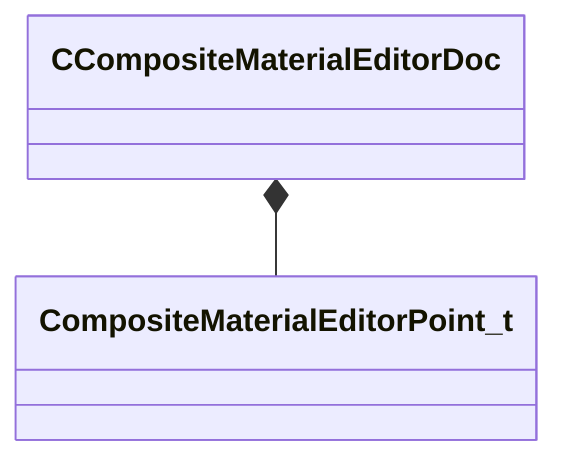

[Schemas](../../schemas.md) / [compositematerialslib](../compositematerialslib.md) / CCompositeMaterialEditorDoc

# CCompositeMaterialEditorDoc

**Kind:** class · **Size:** 56 bytes (`0x38`) · **Align:** 8 · **Module:** compositematerialslib

**Relationships:**

## Memory layout

3 fields (3 declared here, 0 inherited). Offsets are absolute from the object base.

| Offset | Field | Type | From | Annotations |
|--------|-------|------|------|-------------|
| `0x8` | `m_nVersion` | int32 |  |  |
| `0x10` | `m_Points` | CUtlVector< [CompositeMaterialEditorPoint_t](../compositematerialslib/CompositeMaterialEditorPoint_t.md) > |  |  |
| `0x28` | `m_KVthumbnail` | KeyValues3 |  |  |

KV3 class defaults

<pre>{
	&quot;_class&quot;: &quot;CCompositeMaterialEditorDoc&quot;,
	&quot;m_nVersion&quot;: 1,
	&quot;m_Points&quot;:
	[
	],
	&quot;m_KVthumbnail&quot;: null
}</pre>

