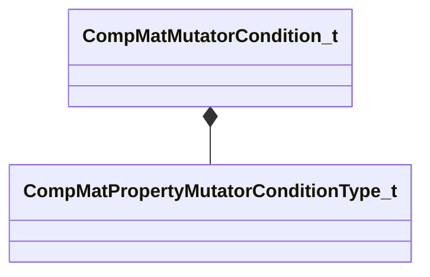

[Schemas](../../schemas.md) / [compositematerialslib](../compositematerialslib.md) / CompMatMutatorCondition_t

# CompMatMutatorCondition_t

**Kind:** class · **Size:** 40 bytes (`0x28`) · **Align:** 8 · **Module:** compositematerialslib

**Metadata:** `MPropertyElementNameFn`

**Relationships:**

## Memory layout

5 fields (5 declared here, 0 inherited). Offsets are absolute from the object base.

| Offset | Field | Type | From | Annotations |
|--------|-------|------|------|-------------|
| `0x0` | `m_nMutatorCondition` | [CompMatPropertyMutatorConditionType_t](../compositematerialslib/CompMatPropertyMutatorConditionType_t.md) |  | `MPropertyAutoRebuildOnChange` `MPropertyFriendlyName Condition` |
| `0x8` | `m_strMutatorConditionContainerName` | CUtlString |  | `MPropertyAttrStateCallback` `MPropertyFriendlyName Container Name` |
| `0x10` | `m_strMutatorConditionContainerVarName` | CUtlString |  | `MPropertyAttrStateCallback` `MPropertyFriendlyName Variable Name` |
| `0x18` | `m_strMutatorConditionContainerVarValue` | CUtlString |  | `MPropertyAttrStateCallback` `MPropertyFriendlyName Variable Value` |
| `0x20` | `m_bPassWhenTrue` | bool |  | `MPropertyFriendlyName Pass when True` |

KV3 class defaults

<pre>{
	&quot;m_nMutatorCondition&quot;: &quot;COMP_MAT_MUTATOR_CONDITION_INPUT_CONTAINER_EXISTS&quot;,
	&quot;m_strMutatorConditionContainerName&quot;: &quot;&quot;,
	&quot;m_strMutatorConditionContainerVarName&quot;: &quot;&quot;,
	&quot;m_strMutatorConditionContainerVarValue&quot;: &quot;&quot;,
	&quot;m_bPassWhenTrue&quot;: true
}</pre>

