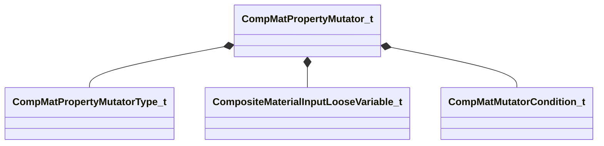

[Schemas](../../schemas.md) / [compositematerialslib](../compositematerialslib.md) / CompMatPropertyMutator_t

# CompMatPropertyMutator_t

> Source: **Build 25000182** · 2026-08-28 · `windows-x86_64` · schema `0.10.0`

**Kind:** class · **Size:** 912 bytes (`0x390`) · **Align:** 8 · **Module:** compositematerialslib

**Metadata:** `MPropertyElementNameFn`

**Relationships:**

## Memory layout

29 fields (29 declared here, 0 inherited). Offsets are absolute from the object base.

| Offset | Field | Type | From | Annotations |
|--------|-------|------|------|-------------|
| `0x0` | `m_bEnabled` | bool |  | `MPropertyAutoRebuildOnChange` `MPropertyFriendlyName Enabled` |
| `0x4` | `m_nMutatorCommandType` | [CompMatPropertyMutatorType_t](../compositematerialslib/CompMatPropertyMutatorType_t.md) |  | `MPropertyAttrStateCallback` `MPropertyAutoRebuildOnChange` `MPropertyFriendlyName Mutator Command` |
| `0x8` | `m_strInitWith_Container` | CUtlString |  | `MPropertyAttrStateCallback` `MPropertyFriendlyName Container to Init With` |
| `0x10` | `m_strCopyProperty_InputContainerSrc` | CUtlString |  | `MPropertyAttrStateCallback` `MPropertyFriendlyName Input Container` |
| `0x18` | `m_strCopyProperty_InputContainerProperty` | CUtlString |  | `MPropertyAttrStateCallback` `MPropertyFriendlyName Input Container Property` |
| `0x20` | `m_strCopyProperty_TargetProperty` | CUtlString |  | `MPropertyAttrStateCallback` `MPropertyFriendlyName Target Property` |
| `0x28` | `m_strRandomRollInputVars_SeedInputVar` | CUtlString |  | `MPropertyAttrStateCallback` `MPropertyFriendlyName Seed Input Var` |
| `0x30` | `m_vecRandomRollInputVars_InputVarsToRoll` | CUtlVector< CUtlString > |  | `MPropertyAttrStateCallback` `MPropertyFriendlyName Input Vars` |
| `0x48` | `m_strCopyMatchingKeys_InputContainerSrc` | CUtlString |  | `MPropertyAttrStateCallback` `MPropertyFriendlyName Input Container` |
| `0x50` | `m_strCopyKeysWithSuffix_InputContainerSrc` | CUtlString |  | `MPropertyAttrStateCallback` `MPropertyFriendlyName Input Container` |
| `0x58` | `m_strCopyKeysWithSuffix_FindSuffix` | CUtlString |  | `MPropertyAttrStateCallback` `MPropertyFriendlyName Find Suffix` |
| `0x60` | `m_strCopyKeysWithSuffix_ReplaceSuffix` | CUtlString |  | `MPropertyAttrStateCallback` `MPropertyFriendlyName Replace Suffix` |
| `0x68` | `m_nSetValue_Value` | [CompositeMaterialInputLooseVariable_t](../compositematerialslib/CompositeMaterialInputLooseVariable_t.md) |  | `MPropertyAttrStateCallback` `MPropertyFriendlyName Value` |
| `0x2f0` | `m_strGenerateTexture_TargetParam` | CUtlString |  | `MPropertyAttrStateCallback` `MPropertyFriendlyName Target Texture Param` |
| `0x2f8` | `m_strGenerateTexture_InitialContainer` | CUtlString |  | `MPropertyAttrStateCallback` `MPropertyFriendlyName Initial Container` |
| `0x300` | `m_nResolution` | int32 |  | `MPropertyAttrStateCallback` `MPropertyFriendlyName Resolution` |
| `0x304` | `m_bIsScratchTarget` | bool |  | `MPropertyAttrStateCallback` `MPropertyAutoRebuildOnChange` `MPropertyFriendlyName Scratch Target` |
| `0x308` | `m_strCompressionFormat` | CUtlString |  | `MPropertyAttrStateCallback` `MPropertyFriendlyName Compression Format` |
| `0x310` | `m_bSplatDebugInfo` | bool |  | `MPropertyAttrStateCallback` `MPropertyAutoRebuildOnChange` `MPropertyFriendlyName Splat Debug info on Texture` |
| `0x311` | `m_bCaptureInRenderDoc` | bool |  | `MPropertyAttrStateCallback` `MPropertyAutoRebuildOnChange` `MPropertyFriendlyName Capture in RenderDoc` |
| `0x318` | `m_vecTexGenInstructions` | CUtlVector< [CompMatPropertyMutator_t](../compositematerialslib/CompMatPropertyMutator_t.md) > |  | `MPropertyAttrStateCallback` `MPropertyFriendlyName Texture Generation Instructions` |
| `0x330` | `m_vecConditionalMutators` | CUtlVector< [CompMatPropertyMutator_t](../compositematerialslib/CompMatPropertyMutator_t.md) > |  | `MPropertyAttrStateCallback` `MPropertyFriendlyName Mutators` |
| `0x348` | `m_strPopInputQueue_Container` | CUtlString |  | `MPropertyAttrStateCallback` `MPropertyFriendlyName Container to Pop` |
| `0x350` | `m_strDrawText_InputContainerSrc` | CUtlString |  | `MPropertyAttrStateCallback` `MPropertyFriendlyName Input Container` |
| `0x358` | `m_strDrawText_InputContainerProperty` | CUtlString |  | `MPropertyAttrStateCallback` `MPropertyFriendlyName Input Container Property` |
| `0x360` | `m_vecDrawText_Position` | Vector2D |  | `MPropertyAttrStateCallback` `MPropertyFriendlyName Text Position` |
| `0x368` | `m_colDrawText_Color` | Color |  | `MPropertyAttrStateCallback` `MPropertyFriendlyName Text Color` |
| `0x370` | `m_strDrawText_Font` | CUtlString |  | `MPropertyAttrStateCallback` `MPropertyFriendlyName Font` |
| `0x378` | `m_vecConditions` | CUtlVector< [CompMatMutatorCondition_t](../compositematerialslib/CompMatMutatorCondition_t.md) > |  | `MPropertyAttrStateCallback` `MPropertyFriendlyName Conditions` |

KV3 class defaults

<pre>{
	&quot;m_bEnabled&quot;: true,
	&quot;m_nMutatorCommandType&quot;: &quot;COMP_MAT_PROPERTY_MUTATOR_SET_VALUE&quot;,
	&quot;m_strInitWith_Container&quot;: &quot;&quot;,
	&quot;m_strCopyProperty_InputContainerSrc&quot;: &quot;&quot;,
	&quot;m_strCopyProperty_InputContainerProperty&quot;: &quot;&quot;,
	&quot;m_strCopyProperty_TargetProperty&quot;: &quot;&quot;,
	&quot;m_strRandomRollInputVars_SeedInputVar&quot;: &quot;&quot;,
	&quot;m_vecRandomRollInputVars_InputVarsToRoll&quot;:
	[
	],
	&quot;m_strCopyMatchingKeys_InputContainerSrc&quot;: &quot;&quot;,
	&quot;m_strCopyKeysWithSuffix_InputContainerSrc&quot;: &quot;&quot;,
	&quot;m_strCopyKeysWithSuffix_FindSuffix&quot;: &quot;&quot;,
	&quot;m_strCopyKeysWithSuffix_ReplaceSuffix&quot;: &quot;&quot;,
	&quot;m_nSetValue_Value&quot;:
	{
		&quot;m_strName&quot;: &quot;&quot;,
		&quot;m_bExposeExternally&quot;: false,
		&quot;m_strExposedFriendlyName&quot;: &quot;&quot;,
		&quot;m_strExposedFriendlyGroupName&quot;: &quot;&quot;,
		&quot;m_bExposedVariableIsFixedRange&quot;: false,
		&quot;m_strExposedVisibleWhenTrue&quot;: &quot;&quot;,
		&quot;m_strExposedHiddenWhenTrue&quot;: &quot;&quot;,
		&quot;m_strExposedValueList&quot;: &quot;&quot;,
		&quot;m_nVariableType&quot;: &quot;LOOSE_VARIABLE_TYPE_FLOAT1&quot;,
		&quot;m_bValueBoolean&quot;: false,
		&quot;m_nValueIntX&quot;: 0,
		&quot;m_nValueIntY&quot;: 0,
		&quot;m_nValueIntZ&quot;: 0,
		&quot;m_nValueIntW&quot;: 0,
		&quot;m_bHasFloatBounds&quot;: false,
		&quot;m_flValueFloatX&quot;: 0.000000,
		&quot;m_flValueFloatX_Min&quot;: 0.000000,
		&quot;m_flValueFloatX_Max&quot;: 1.000000,
		&quot;m_flValueFloatY&quot;: 0.000000,
		&quot;m_flValueFloatY_Min&quot;: 0.000000,
		&quot;m_flValueFloatY_Max&quot;: 1.000000,
		&quot;m_flValueFloatZ&quot;: 0.000000,
		&quot;m_flValueFloatZ_Min&quot;: 0.000000,
		&quot;m_flValueFloatZ_Max&quot;: 1.000000,
		&quot;m_flValueFloatW&quot;: 0.000000,
		&quot;m_flValueFloatW_Min&quot;: 0.000000,
		&quot;m_flValueFloatW_Max&quot;: 1.000000,
		&quot;m_cValueColor4&quot;:
		[
			0,
			0,
			0,
			0
		],
		&quot;m_nValueSystemVar&quot;: &quot;COMPMATSYSVAR_COMPOSITETIME&quot;,
		&quot;m_strResourceMaterial&quot;: &quot;&quot;,
		&quot;m_strTextureContentAssetPath&quot;: &quot;&quot;,
		&quot;m_strTextureRuntimeResourcePath&quot;: &quot;&quot;,
		&quot;m_strTextureCompilationVtexTemplate&quot;: &quot;&quot;,
		&quot;m_nTextureType&quot;: &quot;INPUT_TEXTURE_TYPE_DEFAULT&quot;,
		&quot;m_strString&quot;: &quot;&quot;,
		&quot;m_strPanoramaPanelPath&quot;: &quot;&quot;,
		&quot;m_nPanoramaRenderRes&quot;: 512
	},
	&quot;m_strGenerateTexture_TargetParam&quot;: &quot;&quot;,
	&quot;m_strGenerateTexture_InitialContainer&quot;: &quot;&quot;,
	&quot;m_nResolution&quot;: 256,
	&quot;m_bIsScratchTarget&quot;: false,
	&quot;m_strCompressionFormat&quot;: &quot;&quot;,
	&quot;m_bSplatDebugInfo&quot;: false,
	&quot;m_bCaptureInRenderDoc&quot;: false,
	&quot;m_vecTexGenInstructions&quot;:
	[
	],
	&quot;m_vecConditionalMutators&quot;:
	[
	],
	&quot;m_strPopInputQueue_Container&quot;: &quot;&quot;,
	&quot;m_strDrawText_InputContainerSrc&quot;: &quot;&quot;,
	&quot;m_strDrawText_InputContainerProperty&quot;: &quot;&quot;,
	&quot;m_vecDrawText_Position&quot;:
	[
		0.000000,
		0.000000
	],
	&quot;m_colDrawText_Color&quot;:
	[
		255,
		255,
		255
	],
	&quot;m_strDrawText_Font&quot;: &quot;Times New Roman&quot;,
	&quot;m_vecConditions&quot;:
	[
	]
}</pre>

