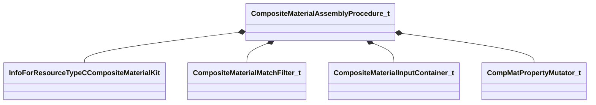

[Schemas](../../schemas.md) / [compositematerialslib](../compositematerialslib.md) / CompositeMaterialAssemblyProcedure_t

# CompositeMaterialAssemblyProcedure_t

**Kind:** class · **Size:** 96 bytes (`0x60`) · **Align:** 8 · **Module:** compositematerialslib

**Metadata:** `MPropertyElementNameFn`

**Relationships:**

## Memory layout

4 fields (4 declared here, 0 inherited). Offsets are absolute from the object base.

| Offset | Field | Type | From | Annotations |
|--------|-------|------|------|-------------|
| `0x0` | `m_vecCompMatIncludes` | CUtlVector< CResourceNameTyped< CWeakHandle< [InfoForResourceTypeCCompositeMaterialKit](../resourcesystem/InfoForResourceTypeCCompositeMaterialKit.md) > > > |  | `MPropertyFriendlyName Includes` |
| `0x18` | `m_vecMatchFilters` | CUtlVector< [CompositeMaterialMatchFilter_t](../compositematerialslib/CompositeMaterialMatchFilter_t.md) > |  | `MPropertyFriendlyName Match Filters` |
| `0x30` | `m_vecCompositeInputContainers` | CUtlVector< [CompositeMaterialInputContainer_t](../compositematerialslib/CompositeMaterialInputContainer_t.md) > |  | `MPropertyFriendlyName Composite Inputs` |
| `0x48` | `m_vecPropertyMutators` | CUtlVector< [CompMatPropertyMutator_t](../compositematerialslib/CompMatPropertyMutator_t.md) > |  | `MPropertyFriendlyName Property Mutators` |

KV3 class defaults

<pre>{
	&quot;m_vecCompMatIncludes&quot;:
	[
	],
	&quot;m_vecMatchFilters&quot;:
	[
	],
	&quot;m_vecCompositeInputContainers&quot;:
	[
	],
	&quot;m_vecPropertyMutators&quot;:
	[
	]
}</pre>

