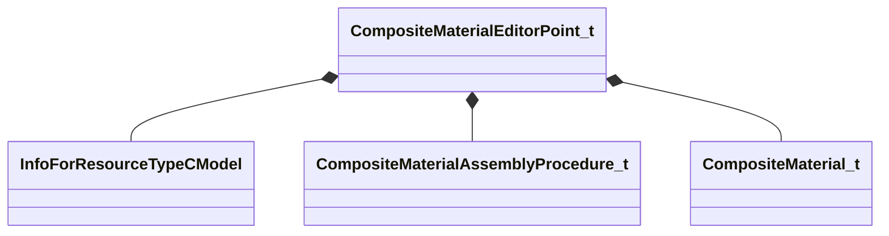

[Schemas](../../schemas.md) / [compositematerialslib](../compositematerialslib.md) / CompositeMaterialEditorPoint_t

# CompositeMaterialEditorPoint_t

> Source: **Build 25000182** · 2026-08-28 · `windows-x86_64` · schema `0.10.0`

**Kind:** class · **Size:** 536 bytes (`0x218`) · **Align:** 8 · **Module:** compositematerialslib

**Relationships:**

## Memory layout

8 fields (8 declared here, 0 inherited). Offsets are absolute from the object base.

| Offset | Field | Type | From | Annotations |
|--------|-------|------|------|-------------|
| `0x0` | `m_ModelName` | CResourceNameTyped< CWeakHandle< [InfoForResourceTypeCModel](../resourcesystem/InfoForResourceTypeCModel.md) > > |  | `MPropertyFriendlyName Target Model` `MPropertyGroupName Preview Model` |
| `0xe0` | `m_nSequenceIndex` | int32 |  | `MPropertyFriendlyName Animation` `MPropertyGroupName Preview Model` |
| `0xe4` | `m_flCycle` | float32 |  | `MPropertyAttributeRange 0.0 1.0` `MPropertyFriendlyName Animation Cycle` `MPropertyGroupName Preview Model` |
| `0xe8` | `m_KVModelStateChoices` | KeyValues3 |  | `MPropertyAttributeEditor CompositeMaterialUserModelStateSetting` `MPropertyFriendlyName Model Preview State` `MPropertyGroupName Preview Model` |
| `0xf8` | `m_bEnableChildModel` | bool |  | `MPropertyAutoRebuildOnChange` `MPropertyFriendlyName Enable Child Model` `MPropertyGroupName Preview Model` |
| `0x100` | `m_ChildModelName` | CResourceNameTyped< CWeakHandle< [InfoForResourceTypeCModel](../resourcesystem/InfoForResourceTypeCModel.md) > > |  | `MPropertyAttrStateCallback` `MPropertyFriendlyName Child Model` `MPropertyGroupName Preview Model` |
| `0x1e0` | `m_vecCompositeMaterialAssemblyProcedures` | CUtlVector< [CompositeMaterialAssemblyProcedure_t](../compositematerialslib/CompositeMaterialAssemblyProcedure_t.md) > |  | `MPropertyFriendlyName Composite Material Assembly Procedures` `MPropertyGroupName Composite Material Assembly` |
| `0x1f8` | `m_vecCompositeMaterials` | CUtlVector< [CompositeMaterial_t](../compositematerialslib/CompositeMaterial_t.md) > |  | `MPropertyFriendlyName Generated Composite Materials` |

KV3 class defaults

<pre>{
	&quot;m_ModelName&quot;: &quot;&quot;,
	&quot;m_nSequenceIndex&quot;: 0,
	&quot;m_flCycle&quot;: 0.000000,
	&quot;m_KVModelStateChoices&quot;: null,
	&quot;m_bEnableChildModel&quot;: false,
	&quot;m_ChildModelName&quot;: &quot;&quot;,
	&quot;m_vecCompositeMaterialAssemblyProcedures&quot;:
	[
	]
}</pre>

