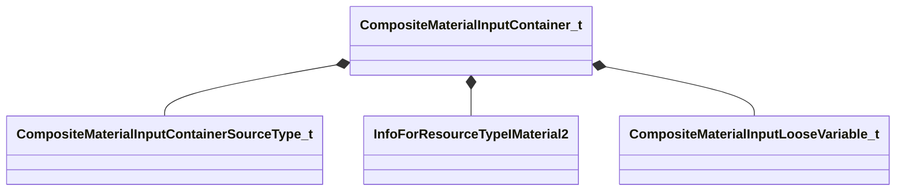

[Schemas](../../schemas.md) / [compositematerialslib](../compositematerialslib.md) / CompositeMaterialInputContainer_t

# CompositeMaterialInputContainer_t

> Source: **Build 25000182** · 2026-08-28 · `windows-x86_64` · schema `0.10.0`

**Kind:** class · **Size:** 312 bytes (`0x138`) · **Align:** 8 · **Module:** compositematerialslib

**Metadata:** `MPropertyElementNameFn`

**Relationships:**

## Memory layout

8 fields (8 declared here, 0 inherited). Offsets are absolute from the object base.

| Offset | Field | Type | From | Annotations |
|--------|-------|------|------|-------------|
| `0x0` | `m_bEnabled` | bool |  | `MPropertyAutoRebuildOnChange` `MPropertyFriendlyName Enabled` |
| `0x4` | `m_nCompositeMaterialInputContainerSourceType` | [CompositeMaterialInputContainerSourceType_t](../compositematerialslib/CompositeMaterialInputContainerSourceType_t.md) |  | `MPropertyAttrStateCallback` `MPropertyAutoRebuildOnChange` `MPropertyFriendlyName Input Container Source` |
| `0x8` | `m_strSpecificContainerMaterial` | CResourceNameTyped< CWeakHandle< [InfoForResourceTypeIMaterial2](../resourcesystem/InfoForResourceTypeIMaterial2.md) > > |  | `MPropertyAttrStateCallback` `MPropertyFriendlyName Specific Material` |
| `0xe8` | `m_strAttrName` | CUtlString |  | `MPropertyAttrStateCallback` `MPropertyFriendlyName Attribute Name` |
| `0xf0` | `m_strAlias` | CUtlString |  | `MPropertyAttrStateCallback` `MPropertyFriendlyName Alias` |
| `0xf8` | `m_vecLooseVariables` | CUtlVector< [CompositeMaterialInputLooseVariable_t](../compositematerialslib/CompositeMaterialInputLooseVariable_t.md) > |  | `MPropertyAttrStateCallback` `MPropertyFriendlyName Variables` |
| `0x110` | `m_strAttrNameForVar` | CUtlString |  | `MPropertyAttrStateCallback` `MPropertyFriendlyName Attribute Name` |
| `0x118` | `m_bExposeExternally` | bool |  | `MPropertyAttrStateCallback` `MPropertyFriendlyName Expose Externally` |

KV3 class defaults

<pre>{
	&quot;m_bEnabled&quot;: true,
	&quot;m_nCompositeMaterialInputContainerSourceType&quot;: &quot;CONTAINER_SOURCE_TYPE_TARGET_MATERIAL&quot;,
	&quot;m_strSpecificContainerMaterial&quot;: &quot;&quot;,
	&quot;m_strAttrName&quot;: &quot;&quot;,
	&quot;m_strAlias&quot;: &quot;&quot;,
	&quot;m_vecLooseVariables&quot;:
	[
	],
	&quot;m_strAttrNameForVar&quot;: &quot;&quot;,
	&quot;m_bExposeExternally&quot;: false
}</pre>

