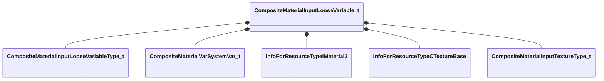

[Schemas](../../schemas.md) / [compositematerialslib](../compositematerialslib.md) / CompositeMaterialInputLooseVariable_t

# CompositeMaterialInputLooseVariable_t

> Source: **Build 25000182** · 2026-08-28 · `windows-x86_64` · schema `0.10.0`

**Kind:** class · **Size:** 648 bytes (`0x288`) · **Align:** 8 · **Module:** compositematerialslib

**Metadata:** `MPropertyElementNameFn`

**Relationships:**

## Memory layout

37 fields (37 declared here, 0 inherited). Offsets are absolute from the object base.

| Offset | Field | Type | From | Annotations |
|--------|-------|------|------|-------------|
| `0x0` | `m_strName` | CUtlString |  | `MPropertyAttrStateCallback` `MPropertyFriendlyName Name` |
| `0x8` | `m_bExposeExternally` | bool |  | `MPropertyAutoRebuildOnChange` `MPropertyFriendlyName Expose Externally` |
| `0x10` | `m_strExposedFriendlyName` | CUtlString |  | `MPropertyAttrStateCallback` `MPropertyFriendlyName Exposed Friendly Name` |
| `0x18` | `m_strExposedFriendlyGroupName` | CUtlString |  | `MPropertyAttrStateCallback` `MPropertyFriendlyName Exposed Friendly Group` |
| `0x20` | `m_bExposedVariableIsFixedRange` | bool |  | `MPropertyAttrStateCallback` `MPropertyFriendlyName Exposed Fixed Range` |
| `0x28` | `m_strExposedVisibleWhenTrue` | CUtlString |  | `MPropertyAttrStateCallback` `MPropertyFriendlyName Exposed SetVisible When True` |
| `0x30` | `m_strExposedHiddenWhenTrue` | CUtlString |  | `MPropertyAttrStateCallback` `MPropertyFriendlyName Exposed SetHidden When True` |
| `0x38` | `m_strExposedValueList` | CUtlString |  | `MPropertyAttrStateCallback` `MPropertyFriendlyName Exposed Value List` |
| `0x40` | `m_nVariableType` | [CompositeMaterialInputLooseVariableType_t](../compositematerialslib/CompositeMaterialInputLooseVariableType_t.md) |  | `MPropertyAutoRebuildOnChange` `MPropertyFriendlyName Type` |
| `0x44` | `m_bValueBoolean` | bool |  | `MPropertyAttrStateCallback` `MPropertyFriendlyName Value` |
| `0x48` | `m_nValueIntX` | int32 |  | `MPropertyAttrStateCallback` `MPropertyAttributeRange 0 255` `MPropertyFriendlyName X Value` |
| `0x4c` | `m_nValueIntY` | int32 |  | `MPropertyAttrStateCallback` `MPropertyAttributeRange 0 255` `MPropertyFriendlyName Y Value` |
| `0x50` | `m_nValueIntZ` | int32 |  | `MPropertyAttrStateCallback` `MPropertyAttributeRange 0 255` `MPropertyFriendlyName Z Value` |
| `0x54` | `m_nValueIntW` | int32 |  | `MPropertyAttrStateCallback` `MPropertyAttributeRange 0 255` `MPropertyFriendlyName W Value` |
| `0x58` | `m_bHasFloatBounds` | bool |  | `MPropertyAttrStateCallback` `MPropertyFriendlyName Specify Min/Max` |
| `0x5c` | `m_flValueFloatX` | float32 |  | `MPropertyAttrStateCallback` `MPropertyAttributeRange 0.0 1.0` `MPropertyFriendlyName X Value` |
| `0x60` | `m_flValueFloatX_Min` | float32 |  | `MPropertyAttrStateCallback` `MPropertyFriendlyName X Min` |
| `0x64` | `m_flValueFloatX_Max` | float32 |  | `MPropertyAttrStateCallback` `MPropertyFriendlyName X Max` |
| `0x68` | `m_flValueFloatY` | float32 |  | `MPropertyAttrStateCallback` `MPropertyAttributeRange 0.0 1.0` `MPropertyFriendlyName Y Value` |
| `0x6c` | `m_flValueFloatY_Min` | float32 |  | `MPropertyAttrStateCallback` `MPropertyFriendlyName Y Min` |
| `0x70` | `m_flValueFloatY_Max` | float32 |  | `MPropertyAttrStateCallback` `MPropertyFriendlyName Y Max` |
| `0x74` | `m_flValueFloatZ` | float32 |  | `MPropertyAttrStateCallback` `MPropertyAttributeRange 0.0 1.0` `MPropertyFriendlyName Z Value` |
| `0x78` | `m_flValueFloatZ_Min` | float32 |  | `MPropertyAttrStateCallback` `MPropertyFriendlyName Z Min` |
| `0x7c` | `m_flValueFloatZ_Max` | float32 |  | `MPropertyAttrStateCallback` `MPropertyFriendlyName Z Max` |
| `0x80` | `m_flValueFloatW` | float32 |  | `MPropertyAttrStateCallback` `MPropertyAttributeRange 0.0 1.0` `MPropertyFriendlyName W Value` |
| `0x84` | `m_flValueFloatW_Min` | float32 |  | `MPropertyAttrStateCallback` `MPropertyFriendlyName W Min` |
| `0x88` | `m_flValueFloatW_Max` | float32 |  | `MPropertyAttrStateCallback` `MPropertyFriendlyName W Max` |
| `0x8c` | `m_cValueColor4` | Color |  | `MPropertyAttrStateCallback` `MPropertyFriendlyName Value` |
| `0x90` | `m_nValueSystemVar` | [CompositeMaterialVarSystemVar_t](../compositematerialslib/CompositeMaterialVarSystemVar_t.md) |  | `MPropertyAttrStateCallback` `MPropertyFriendlyName Value` |
| `0x98` | `m_strResourceMaterial` | CResourceNameTyped< CWeakHandle< [InfoForResourceTypeIMaterial2](../resourcesystem/InfoForResourceTypeIMaterial2.md) > > |  | `MPropertyAttrStateCallback` `MPropertyFriendlyName Material` |
| `0x178` | `m_strTextureContentAssetPath` | CUtlString |  | `MPropertyAttrStateCallback` `MPropertyAttributeEditor AssetBrowse( jpg, png, psd, tga )` `MPropertyFriendlyName Texture` |
| `0x180` | `m_strTextureRuntimeResourcePath` | CResourceNameTyped< CWeakHandle< [InfoForResourceTypeCTextureBase](../resourcesystem/InfoForResourceTypeCTextureBase.md) > > |  | `MPropertyHideField` |
| `0x260` | `m_strTextureCompilationVtexTemplate` | CUtlString |  | `MPropertyHideField` |
| `0x268` | `m_nTextureType` | [CompositeMaterialInputTextureType_t](../compositematerialslib/CompositeMaterialInputTextureType_t.md) |  | `MPropertyAttrStateCallback` `MPropertyFriendlyName Texture Type` |
| `0x270` | `m_strString` | CUtlString |  | `MPropertyAttrStateCallback` `MPropertyFriendlyName String` |
| `0x278` | `m_strPanoramaPanelPath` | CUtlString |  | `MPropertyAttrStateCallback` `MPropertyFriendlyName Layout XML` |
| `0x280` | `m_nPanoramaRenderRes` | int32 |  | `MPropertyAttrStateCallback` `MPropertyFriendlyName Render Resolution` |

KV3 class defaults

<pre>{
	&quot;m_strName&quot;: &quot;&quot;,
	&quot;m_bExposeExternally&quot;: false,
	&quot;m_strExposedFriendlyName&quot;: &quot;&quot;,
	&quot;m_strExposedFriendlyGroupName&quot;: &quot;&quot;,
	&quot;m_bExposedVariableIsFixedRange&quot;: false,
	&quot;m_strExposedVisibleWhenTrue&quot;: &quot;&quot;,
	&quot;m_strExposedHiddenWhenTrue&quot;: &quot;&quot;,
	&quot;m_strExposedValueList&quot;: &quot;&quot;,
	&quot;m_nVariableType&quot;: &quot;LOOSE_VARIABLE_TYPE_FLOAT1&quot;,
	&quot;m_bValueBoolean&quot;: false,
	&quot;m_nValueIntX&quot;: 0,
	&quot;m_nValueIntY&quot;: 0,
	&quot;m_nValueIntZ&quot;: 0,
	&quot;m_nValueIntW&quot;: 0,
	&quot;m_bHasFloatBounds&quot;: false,
	&quot;m_flValueFloatX&quot;: 0.000000,
	&quot;m_flValueFloatX_Min&quot;: 0.000000,
	&quot;m_flValueFloatX_Max&quot;: 1.000000,
	&quot;m_flValueFloatY&quot;: 0.000000,
	&quot;m_flValueFloatY_Min&quot;: 0.000000,
	&quot;m_flValueFloatY_Max&quot;: 1.000000,
	&quot;m_flValueFloatZ&quot;: 0.000000,
	&quot;m_flValueFloatZ_Min&quot;: 0.000000,
	&quot;m_flValueFloatZ_Max&quot;: 1.000000,
	&quot;m_flValueFloatW&quot;: 0.000000,
	&quot;m_flValueFloatW_Min&quot;: 0.000000,
	&quot;m_flValueFloatW_Max&quot;: 1.000000,
	&quot;m_cValueColor4&quot;:
	[
		0,
		0,
		0,
		0
	],
	&quot;m_nValueSystemVar&quot;: &quot;COMPMATSYSVAR_COMPOSITETIME&quot;,
	&quot;m_strResourceMaterial&quot;: &quot;&quot;,
	&quot;m_strTextureContentAssetPath&quot;: &quot;&quot;,
	&quot;m_strTextureRuntimeResourcePath&quot;: &quot;&quot;,
	&quot;m_strTextureCompilationVtexTemplate&quot;: &quot;&quot;,
	&quot;m_nTextureType&quot;: &quot;INPUT_TEXTURE_TYPE_DEFAULT&quot;,
	&quot;m_strString&quot;: &quot;&quot;,
	&quot;m_strPanoramaPanelPath&quot;: &quot;&quot;,
	&quot;m_nPanoramaRenderRes&quot;: 512
}</pre>

