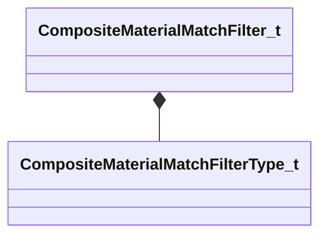

[Schemas](../../schemas.md) / [compositematerialslib](../compositematerialslib.md) / CompositeMaterialMatchFilter_t

# CompositeMaterialMatchFilter_t

**Kind:** class · **Size:** 32 bytes (`0x20`) · **Align:** 8 · **Module:** compositematerialslib

**Metadata:** `MPropertyElementNameFn`

**Relationships:**

## Memory layout

4 fields (4 declared here, 0 inherited). Offsets are absolute from the object base.

| Offset | Field | Type | From | Annotations |
|--------|-------|------|------|-------------|
| `0x0` | `m_nCompositeMaterialMatchFilterType` | [CompositeMaterialMatchFilterType_t](../!GlobalTypes/CompositeMaterialMatchFilterType_t.md) |  | `MPropertyFriendlyName Match Type` |
| `0x8` | `m_strMatchFilter` | CUtlString |  | `MPropertyFriendlyName Name` |
| `0x10` | `m_strMatchValue` | CUtlString |  | `MPropertyAttrStateCallback` `MPropertyFriendlyName Value` |
| `0x18` | `m_bPassWhenTrue` | bool |  | `MPropertyFriendlyName Pass when True` |

KV3 class defaults

<pre>{
	&quot;m_nCompositeMaterialMatchFilterType&quot;: &quot;MATCH_FILTER_MATERIAL_ATTRIBUTE_EXISTS&quot;,
	&quot;m_strMatchFilter&quot;: &quot;composite_inputs&quot;,
	&quot;m_strMatchValue&quot;: &quot;&quot;,
	&quot;m_bPassWhenTrue&quot;: true
}</pre>

