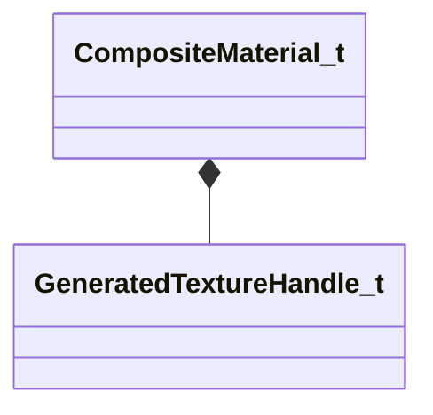

[Schemas](../../schemas.md) / [compositematerialslib](../compositematerialslib.md) / CompositeMaterial_t

# CompositeMaterial_t

**Kind:** class · **Size:** 160 bytes (`0xa0`) · **Align:** 255 · **Module:** compositematerialslib

**Metadata:** `MPropertyElementNameFn`

**Relationships:**

## Memory layout

4 fields (4 declared here, 0 inherited). Offsets are absolute from the object base.

| Offset | Field | Type | From | Annotations |
|--------|-------|------|------|-------------|
| `0x8` | `m_TargetKVs` | KeyValues3 |  | `MPropertyAttributeEditor CompositeMaterialKVInspector` `MPropertyGroupName Target Material` |
| `0x18` | `m_PreGenerationKVs` | KeyValues3 |  | `MPropertyAttributeEditor CompositeMaterialKVInspector` `MPropertyGroupName Pre-Generated Output Material` |
| `0x58` | `m_FinalKVs` | KeyValues3 |  | `MPropertyAttributeEditor CompositeMaterialKVInspector` `MPropertyGroupName Generated Composite Material` |
| `0x80` | `m_vecGeneratedTextures` | CUtlVector< [GeneratedTextureHandle_t](../compositematerialslib/GeneratedTextureHandle_t.md) > |  | `MPropertyFriendlyName Generated Textures` |
