# Module: engine2

[📊 View UML Diagram](../diagrams/engine2.md)

| Name | Kind | Bases | Fields |
|------|------|-------|--------|
| [EngineLoopState_t](#engineloopstate_t) | class |  | 4 |
| [EventAdvanceTick_t](#eventadvancetick_t) | class | EventSimulate_t | 4 |
| [EventAppShutdown_t](#eventappshutdown_t) | class |  | 1 |
| [EventBugBugComplete_t](#eventbugbugcomplete_t) | class |  | 1 |
| [EventBugBug_t](#eventbugbug_t) | class |  | 0 |
| [EventClientAdvanceNonRenderedFrame_t](#eventclientadvancenonrenderedframe_t) | class |  | 0 |
| [EventClientAdvanceTick_t](#eventclientadvancetick_t) | class | EventAdvanceTick_t | 0 |
| [EventClientFrameSimulate_t](#eventclientframesimulate_t) | class |  | 4 |
| [EventClientOutput_t](#eventclientoutput_t) | class |  | 5 |
| [EventClientPauseSimulate_t](#eventclientpausesimulate_t) | class | EventSimulate_t | 0 |
| [EventClientPollInput_t](#eventclientpollinput_t) | class |  | 2 |
| [EventClientPollNetworking_t](#eventclientpollnetworking_t) | class |  | 1 |
| [EventClientPostAdvanceTick_t](#eventclientpostadvancetick_t) | class | EventPostAdvanceTick_t | 0 |
| [EventClientPostOutput_t](#eventclientpostoutput_t) | class |  | 5 |
| [EventClientPostSimulate_t](#eventclientpostsimulate_t) | class | EventSimulate_t | 0 |
| [EventClientPreOutputParallelWithServer_t](#eventclientpreoutputparallelwithserver_t) | class | EventClientPreOutput_t | 0 |
| [EventClientPreOutput_t](#eventclientpreoutput_t) | class |  | 6 |
| [EventClientPreSimulate_t](#eventclientpresimulate_t) | class | EventSimulate_t | 0 |
| [EventClientProcessGameInput_t](#eventclientprocessgameinput_t) | class |  | 3 |
| [EventClientProcessInput_t](#eventclientprocessinput_t) | class |  | 4 |
| [EventClientProcessNetworking_t](#eventclientprocessnetworking_t) | class |  | 1 |
| [EventClientSceneSystemThreadStateChange_t](#eventclientscenesystemthreadstatechange_t) | class |  | 1 |
| [EventClientSimulate_t](#eventclientsimulate_t) | class | EventSimulate_t | 0 |
| [EventFrameBoundary_t](#eventframeboundary_t) | class |  | 1 |
| [EventModInitialized_t](#eventmodinitialized_t) | class |  | 0 |
| [EventPostAdvanceTick_t](#eventpostadvancetick_t) | class | EventSimulate_t | 4 |
| [EventPostDataUpdate_t](#eventpostdataupdate_t) | class |  | 1 |
| [EventPreDataUpdate_t](#eventpredataupdate_t) | class |  | 1 |
| [EventProfileStorageAvailable_t](#eventprofilestorageavailable_t) | class |  | 1 |
| [EventServerAdvanceTick_t](#eventserveradvancetick_t) | class | EventAdvanceTick_t | 0 |
| [EventServerBeginAsyncPostTickWork_t](#eventserverbeginasyncposttickwork_t) | class |  | 1 |
| [EventServerBeginSimulate_t](#eventserverbeginsimulate_t) | class | EventSimulate_t | 0 |
| [EventServerEndAsyncPostTickWork_t](#eventserverendasyncposttickwork_t) | class |  | 0 |
| [EventServerEndSimulate_t](#eventserverendsimulate_t) | class |  | 1 |
| [EventServerPollNetworking_t](#eventserverpollnetworking_t) | class | EventSimulate_t | 0 |
| [EventServerPostAdvanceTick_t](#eventserverpostadvancetick_t) | class | EventPostAdvanceTick_t | 1 |
| [EventServerPostSimulate_t](#eventserverpostsimulate_t) | class | EventSimulate_t | 1 |
| [EventServerProcessNetworking_t](#eventserverprocessnetworking_t) | class | EventSimulate_t | 0 |
| [EventSetTime_t](#eventsettime_t) | class |  | 8 |
| [EventSimpleLoopFrameUpdate_t](#eventsimpleloopframeupdate_t) | class |  | 3 |
| [EventSimulate_t](#eventsimulate_t) | class |  | 3 |
| [EventSplitScreenStateChanged_t](#eventsplitscreenstatechanged_t) | class |  | 0 |

---

### EngineLoopState_t

**Fields:**

| Name | Type | Annotations |
|------|------|-------------|
| `m_nPlatWindowWidth` | int32 |  |
| `m_nPlatWindowHeight` | int32 |  |
| `m_nRenderWidth` | int32 |  |
| `m_nRenderHeight` | int32 |  |

### EventAdvanceTick_t

**Inherits from:** [EventSimulate_t](engine2.md#eventsimulate_t)

**Derived by:** [EventClientAdvanceTick_t](engine2.md#eventclientadvancetick_t), [EventServerAdvanceTick_t](engine2.md#eventserveradvancetick_t)

**Relationships:**

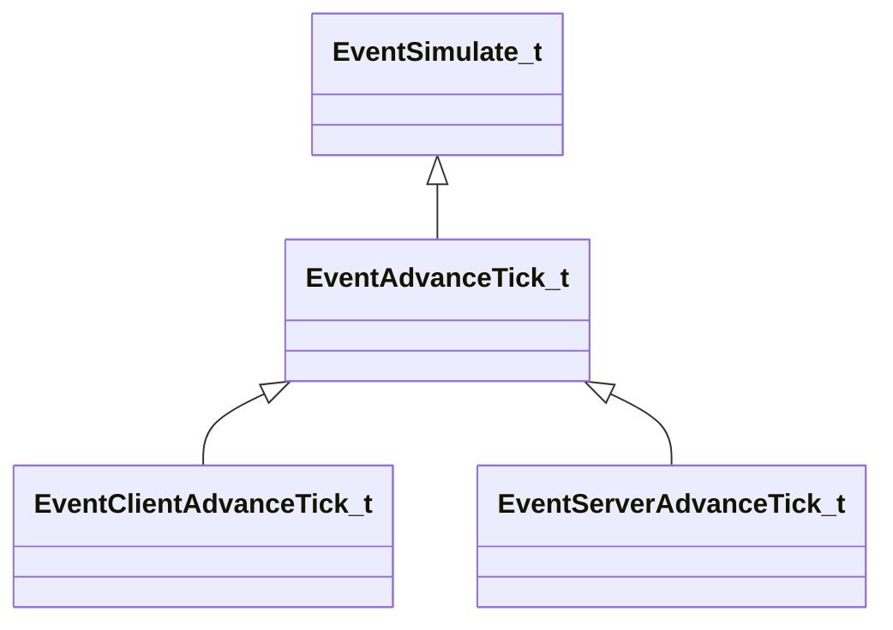

**Fields:**

| Name | Type | Annotations |
|------|------|-------------|
| `m_nCurrentTick` | int32 |  |
| `m_nCurrentTickThisFrame` | int32 |  |
| `m_nTotalTicksThisFrame` | int32 |  |
| `m_nTotalTicks` | int32 |  |

### EventAppShutdown_t

**Fields:**

| Name | Type | Annotations |
|------|------|-------------|
| `m_nDummy0` | int32 |  |

### EventBugBugComplete_t

**Relationships:**

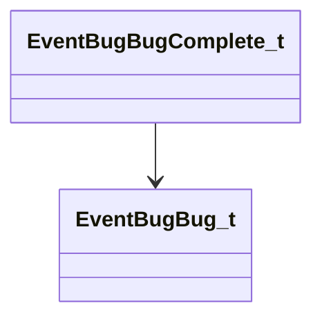

**Fields:**

| Name | Type | Annotations |
|------|------|-------------|
| `m_pPayload` | [EventBugBug_t](../schemas/engine2.md#eventbugbug_t)* |  |

### EventBugBug_t

### EventClientAdvanceNonRenderedFrame_t

### EventClientAdvanceTick_t

**Inherits from:** [EventAdvanceTick_t](engine2.md#eventadvancetick_t)

**Relationships:**

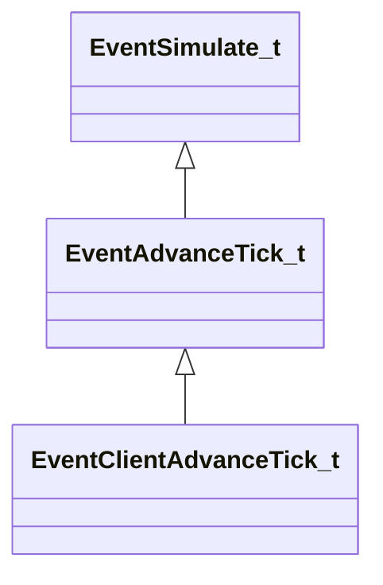

### EventClientFrameSimulate_t

**Relationships:**

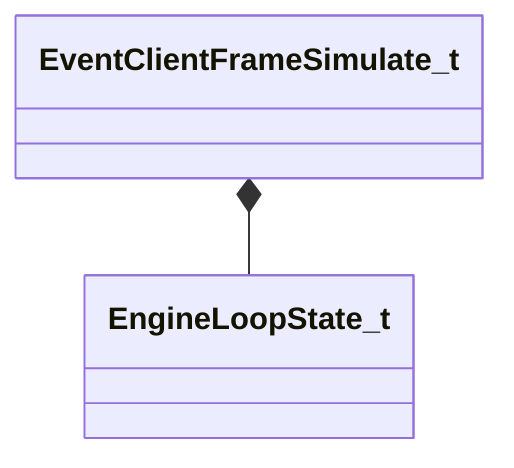

**Fields:**

| Name | Type | Annotations |
|------|------|-------------|
| `m_LoopState` | [EngineLoopState_t](../schemas/engine2.md#engineloopstate_t) |  |
| `m_flRealTime` | float32 |  |
| `m_flFrameTime` | float32 |  |
| `m_bScheduleSendTickPacket` | bool |  |

### EventClientOutput_t

**Relationships:**

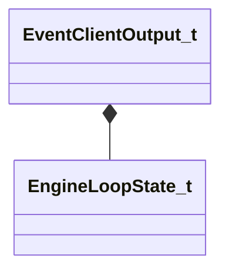

**Fields:**

| Name | Type | Annotations |
|------|------|-------------|
| `m_LoopState` | [EngineLoopState_t](../schemas/engine2.md#engineloopstate_t) |  |
| `m_flRenderTime` | float32 |  |
| `m_flRealTime` | float32 |  |
| `m_flRenderFrameTimeUnbounded` | float32 |  |
| `m_bRenderOnly` | bool |  |

### EventClientPauseSimulate_t

**Inherits from:** [EventSimulate_t](engine2.md#eventsimulate_t)

**Relationships:**

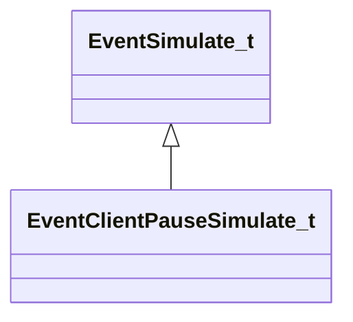

### EventClientPollInput_t

**Relationships:**

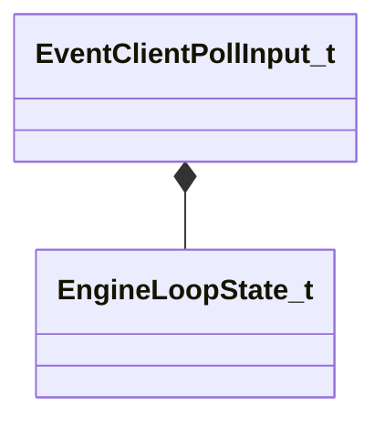

**Fields:**

| Name | Type | Annotations |
|------|------|-------------|
| `m_LoopState` | [EngineLoopState_t](../schemas/engine2.md#engineloopstate_t) |  |
| `m_flRealTime` | float32 |  |

### EventClientPollNetworking_t

**Fields:**

| Name | Type | Annotations |
|------|------|-------------|
| `m_nTickCount` | int32 |  |

### EventClientPostAdvanceTick_t

**Inherits from:** [EventPostAdvanceTick_t](engine2.md#eventpostadvancetick_t)

**Relationships:**

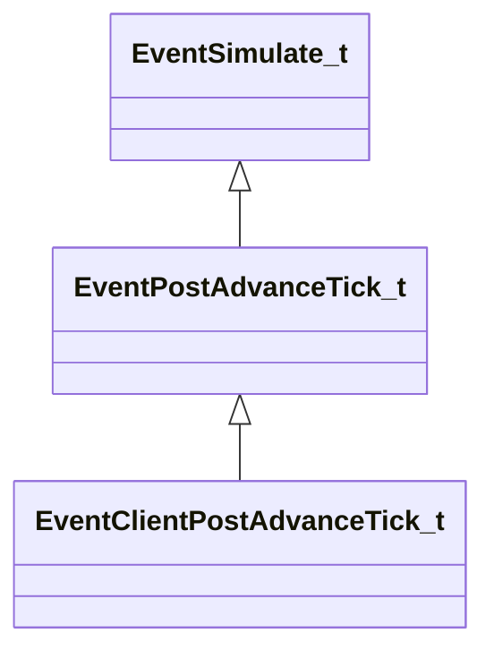

### EventClientPostOutput_t

**Relationships:**

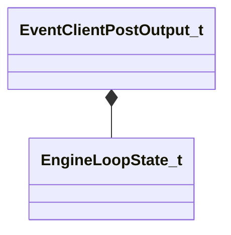

**Fields:**

| Name | Type | Annotations |
|------|------|-------------|
| `m_LoopState` | [EngineLoopState_t](../schemas/engine2.md#engineloopstate_t) |  |
| `m_flRenderTime` | float64 |  |
| `m_flRenderFrameTime` | float32 |  |
| `m_flRenderFrameTimeUnbounded` | float32 |  |
| `m_bRenderOnly` | bool |  |

### EventClientPostSimulate_t

**Inherits from:** [EventSimulate_t](engine2.md#eventsimulate_t)

**Relationships:**

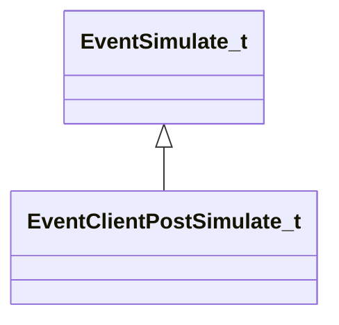

### EventClientPreOutputParallelWithServer_t

**Inherits from:** [EventClientPreOutput_t](engine2.md#eventclientpreoutput_t)

**Relationships:**

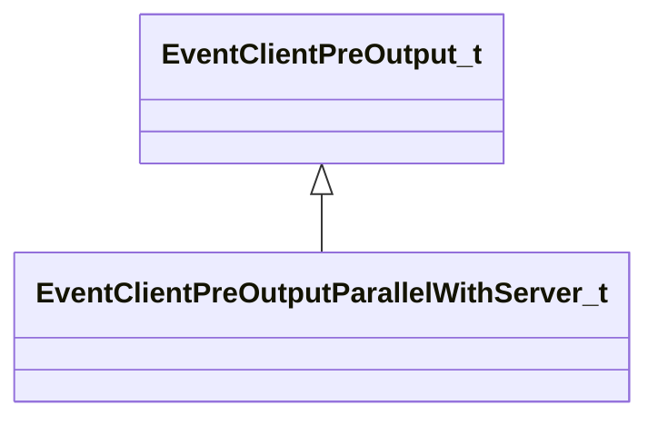

### EventClientPreOutput_t

**Derived by:** [EventClientPreOutputParallelWithServer_t](engine2.md#eventclientpreoutputparallelwithserver_t)

**Relationships:**

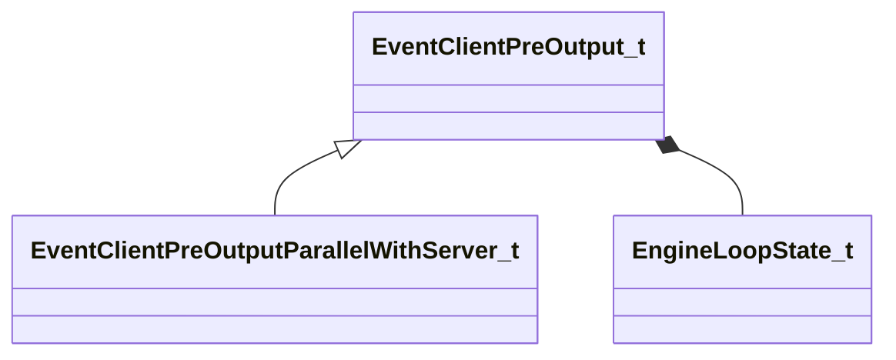

**Fields:**

| Name | Type | Annotations |
|------|------|-------------|
| `m_LoopState` | [EngineLoopState_t](../schemas/engine2.md#engineloopstate_t) |  |
| `m_flRenderTime` | float64 |  |
| `m_flRenderFrameTime` | float64 |  |
| `m_flRenderFrameTimeUnbounded` | float64 |  |
| `m_flRealTime` | float32 |  |
| `m_bRenderOnly` | bool |  |

### EventClientPreSimulate_t

**Inherits from:** [EventSimulate_t](engine2.md#eventsimulate_t)

**Relationships:**

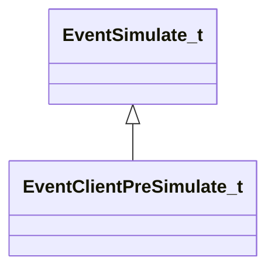

### EventClientProcessGameInput_t

**Relationships:**

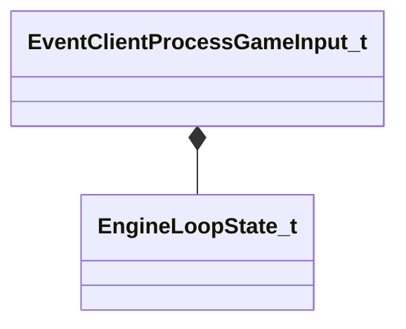

**Fields:**

| Name | Type | Annotations |
|------|------|-------------|
| `m_LoopState` | [EngineLoopState_t](../schemas/engine2.md#engineloopstate_t) |  |
| `m_flRealTime` | float32 |  |
| `m_flFrameTime` | float32 |  |

### EventClientProcessInput_t

**Relationships:**

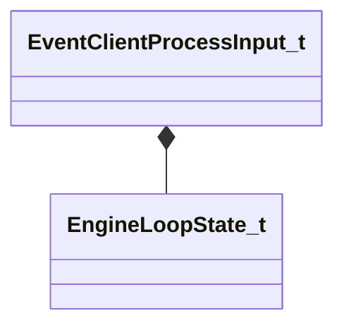

**Fields:**

| Name | Type | Annotations |
|------|------|-------------|
| `m_LoopState` | [EngineLoopState_t](../schemas/engine2.md#engineloopstate_t) |  |
| `m_flRealTime` | float32 |  |
| `m_flTickInterval` | float32 |  |
| `m_flTickStartTime` | float64 |  |

### EventClientProcessNetworking_t

**Fields:**

| Name | Type | Annotations |
|------|------|-------------|
| `m_nTickCount` | int32 |  |

### EventClientSceneSystemThreadStateChange_t

**Fields:**

| Name | Type | Annotations |
|------|------|-------------|
| `m_bThreadsActive` | bool |  |

### EventClientSimulate_t

**Inherits from:** [EventSimulate_t](engine2.md#eventsimulate_t)

**Relationships:**

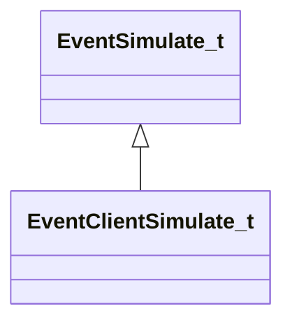

### EventFrameBoundary_t

**Fields:**

| Name | Type | Annotations |
|------|------|-------------|
| `m_flFrameTime` | float32 |  |

### EventModInitialized_t

### EventPostAdvanceTick_t

**Inherits from:** [EventSimulate_t](engine2.md#eventsimulate_t)

**Derived by:** [EventClientPostAdvanceTick_t](engine2.md#eventclientpostadvancetick_t), [EventServerPostAdvanceTick_t](engine2.md#eventserverpostadvancetick_t)

**Relationships:**

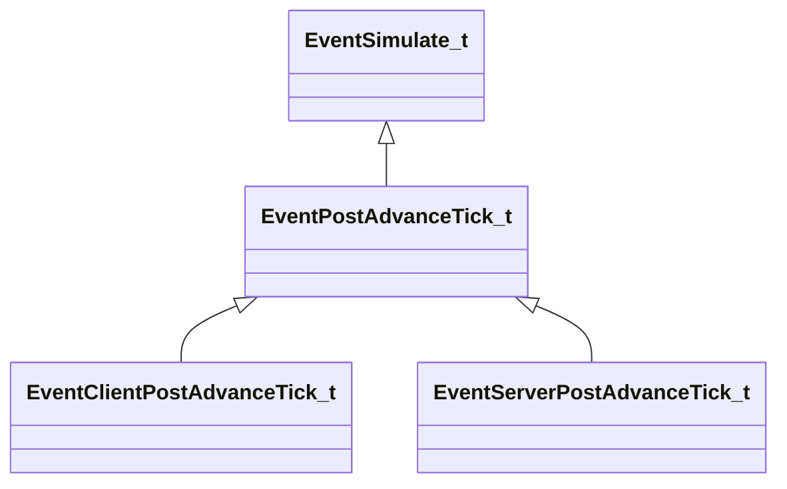

**Fields:**

| Name | Type | Annotations |
|------|------|-------------|
| `m_nCurrentTick` | int32 |  |
| `m_nCurrentTickThisFrame` | int32 |  |
| `m_nTotalTicksThisFrame` | int32 |  |
| `m_nTotalTicks` | int32 |  |

### EventPostDataUpdate_t

**Fields:**

| Name | Type | Annotations |
|------|------|-------------|
| `m_nCount` | int32 |  |

### EventPreDataUpdate_t

**Fields:**

| Name | Type | Annotations |
|------|------|-------------|
| `m_nCount` | int32 |  |

### EventProfileStorageAvailable_t

**Fields:**

| Name | Type | Annotations |
|------|------|-------------|
| `m_nSplitScreenSlot` | CSplitScreenSlot |  |

### EventServerAdvanceTick_t

**Inherits from:** [EventAdvanceTick_t](engine2.md#eventadvancetick_t)

**Relationships:**

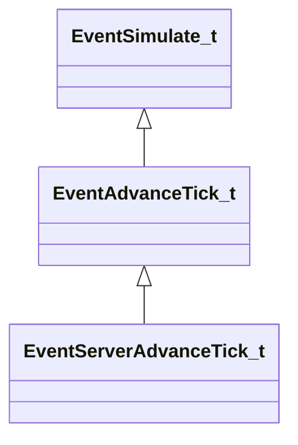

### EventServerBeginAsyncPostTickWork_t

**Fields:**

| Name | Type | Annotations |
|------|------|-------------|
| `m_bIsOncePerFrameAsyncWorkPhase` | bool |  |

### EventServerBeginSimulate_t

**Inherits from:** [EventSimulate_t](engine2.md#eventsimulate_t)

**Relationships:**

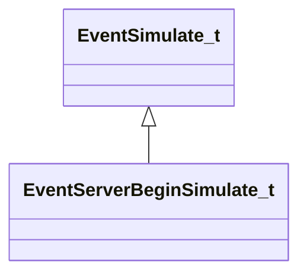

### EventServerEndAsyncPostTickWork_t

### EventServerEndSimulate_t

**Fields:**

| Name | Type | Annotations |
|------|------|-------------|
| `m_bLastTick` | bool |  |

### EventServerPollNetworking_t

**Inherits from:** [EventSimulate_t](engine2.md#eventsimulate_t)

**Relationships:**

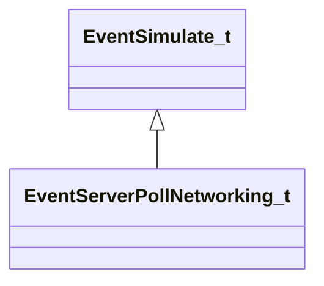

### EventServerPostAdvanceTick_t

**Inherits from:** [EventPostAdvanceTick_t](engine2.md#eventpostadvancetick_t)

**Relationships:**

```mermaid
classDiagram
    EventPostAdvanceTick_t <|-- EventServerPostAdvanceTick_t
    EventSimulate_t <|-- EventPostAdvanceTick_t
```

**Fields:**

| Name | Type | Annotations |
|------|------|-------------|
| `m_bLastTickBeforeClientUpdate` | bool |  |

### EventServerPostSimulate_t

**Inherits from:** [EventSimulate_t](engine2.md#eventsimulate_t)

**Relationships:**

```mermaid
classDiagram
    EventSimulate_t <|-- EventServerPostSimulate_t
```

**Fields:**

| Name | Type | Annotations |
|------|------|-------------|
| `m_bLastTickBeforeClientUpdate` | bool |  |

### EventServerProcessNetworking_t

**Inherits from:** [EventSimulate_t](engine2.md#eventsimulate_t)

**Relationships:**

```mermaid
classDiagram
    EventSimulate_t <|-- EventServerProcessNetworking_t
```

### EventSetTime_t

**Relationships:**

```mermaid
classDiagram
    EventSetTime_t *-- EngineLoopState_t
```

**Fields:**

| Name | Type | Annotations |
|------|------|-------------|
| `m_LoopState` | [EngineLoopState_t](../schemas/engine2.md#engineloopstate_t) |  |
| `m_nClientOutputFrames` | int32 |  |
| `m_flRealTime` | float64 |  |
| `m_flRenderTime` | float64 |  |
| `m_flRenderFrameTime` | float64 |  |
| `m_flRenderFrameTimeUnbounded` | float64 |  |
| `m_flRenderFrameTimeUnscaled` | float64 |  |
| `m_flTickRemainder` | float64 |  |

### EventSimpleLoopFrameUpdate_t

**Relationships:**

```mermaid
classDiagram
    EventSimpleLoopFrameUpdate_t *-- EngineLoopState_t
```

**Fields:**

| Name | Type | Annotations |
|------|------|-------------|
| `m_LoopState` | [EngineLoopState_t](../schemas/engine2.md#engineloopstate_t) |  |
| `m_flRealTime` | float32 |  |
| `m_flFrameTime` | float32 |  |

### EventSimulate_t

**Derived by:** [EventAdvanceTick_t](engine2.md#eventadvancetick_t), [EventClientPauseSimulate_t](engine2.md#eventclientpausesimulate_t), [EventClientPostSimulate_t](engine2.md#eventclientpostsimulate_t), [EventClientPreSimulate_t](engine2.md#eventclientpresimulate_t), [EventClientSimulate_t](engine2.md#eventclientsimulate_t), [EventPostAdvanceTick_t](engine2.md#eventpostadvancetick_t), [EventServerBeginSimulate_t](engine2.md#eventserverbeginsimulate_t), [EventServerPollNetworking_t](engine2.md#eventserverpollnetworking_t), [EventServerPostSimulate_t](engine2.md#eventserverpostsimulate_t), [EventServerProcessNetworking_t](engine2.md#eventserverprocessnetworking_t)

**Relationships:**

```mermaid
classDiagram
    EventSimulate_t <|-- EventAdvanceTick_t
    EventSimulate_t <|-- EventClientPauseSimulate_t
    EventSimulate_t <|-- EventClientPostSimulate_t
    EventSimulate_t <|-- EventClientPreSimulate_t
    EventSimulate_t <|-- EventClientSimulate_t
    EventSimulate_t <|-- EventPostAdvanceTick_t
    EventSimulate_t <|-- EventServerBeginSimulate_t
    EventSimulate_t <|-- EventServerPollNetworking_t
    EventSimulate_t <|-- EventServerPostSimulate_t
    EventSimulate_t <|-- EventServerProcessNetworking_t
    EventSimulate_t *-- EngineLoopState_t
```

**Fields:**

| Name | Type | Annotations |
|------|------|-------------|
| `m_LoopState` | [EngineLoopState_t](../schemas/engine2.md#engineloopstate_t) |  |
| `m_bFirstTick` | bool |  |
| `m_bLastTick` | bool |  |

### EventSplitScreenStateChanged_t
