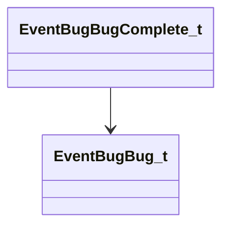

[Schemas](../../schemas.md) / [engine2](../engine2.md) / EventBugBugComplete_t

# EventBugBugComplete_t

> Source: **Build 25000182** · 2026-08-28 · `windows-x86_64` · schema `0.10.0`

**Kind:** class · **Size:** 8 bytes (`0x8`) · **Align:** n/a (unspecified) · **Module:** engine2

**Relationships:**

## Memory layout

1 field (1 declared here, 0 inherited). Offsets are absolute from the object base.

| Offset | Field | Type | From | Annotations |
|--------|-------|------|------|-------------|
| `0x0` | `m_pPayload` | [EventBugBug_t](../engine2/EventBugBug_t.md)* |  |  |
