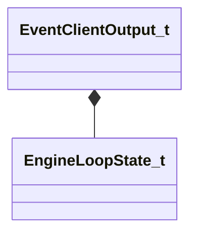

[Schemas](../../schemas.md) / [engine2](../engine2.md) / EventClientOutput_t

# EventClientOutput_t

**Kind:** class · **Size:** 56 bytes (`0x38`) · **Align:** 255 · **Module:** engine2

**Relationships:**

## Memory layout

5 fields (5 declared here, 0 inherited). Offsets are absolute from the object base.

| Offset | Field | Type | From | Annotations |
|--------|-------|------|------|-------------|
| `0x0` | `m_LoopState` | [EngineLoopState_t](../engine2/EngineLoopState_t.md) |  |  |
| `0x28` | `m_flRenderTime` | float32 |  |  |
| `0x2c` | `m_flRealTime` | float32 |  |  |
| `0x30` | `m_flRenderFrameTimeUnbounded` | float32 |  |  |
| `0x34` | `m_bRenderOnly` | bool |  |  |
