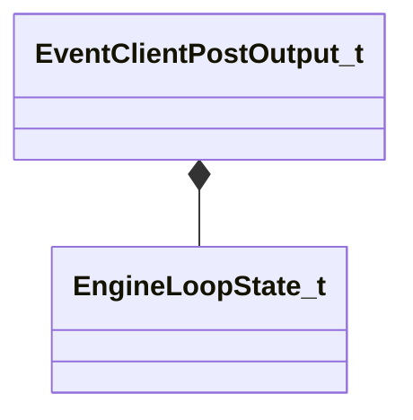

[Schemas](../../schemas.md) / [engine2](../engine2.md) / EventClientPostOutput_t

# EventClientPostOutput_t

> Source: **Build 25000182** · 2026-08-28 · `windows-x86_64` · schema `0.10.0`

**Kind:** class · **Size:** 64 bytes (`0x40`) · **Align:** n/a (unspecified) · **Module:** engine2

**Relationships:**

## Memory layout

5 fields (5 declared here, 0 inherited). Offsets are absolute from the object base.

| Offset | Field | Type | From | Annotations |
|--------|-------|------|------|-------------|
| `0x0` | `m_LoopState` | [EngineLoopState_t](../engine2/EngineLoopState_t.md) |  |  |
| `0x28` | `m_flRenderTime` | float64 |  |  |
| `0x30` | `m_flRenderFrameTime` | float32 |  |  |
| `0x34` | `m_flRenderFrameTimeUnbounded` | float32 |  |  |
| `0x38` | `m_bRenderOnly` | bool |  |  |
