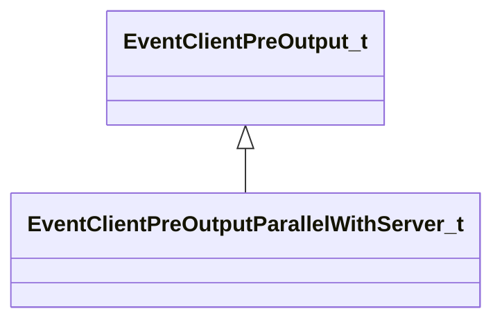

[Schemas](../../schemas.md) / [engine2](../engine2.md) / EventClientPreOutputParallelWithServer_t

# EventClientPreOutputParallelWithServer_t

> Source: **Build 25000182** · 2026-08-28 · `windows-x86_64` · schema `0.10.0`

**Kind:** class · **Size:** 72 bytes (`0x48`) · **Align:** n/a (unspecified) · **Module:** engine2

**Inherits from:** [EventClientPreOutput_t](../engine2/EventClientPreOutput_t.md)

**Relationships:**

## Memory layout

6 fields (0 declared here, 6 inherited). Offsets are absolute from the object base.

| Offset | Field | Type | From | Annotations |
|--------|-------|------|------|-------------|
| `0x0` | `m_LoopState` | [EngineLoopState_t](../engine2/EngineLoopState_t.md) | [EventClientPreOutput_t](../engine2/EventClientPreOutput_t.md) |  |
| `0x28` | `m_flRenderTime` | float64 | [EventClientPreOutput_t](../engine2/EventClientPreOutput_t.md) |  |
| `0x30` | `m_flRenderFrameTime` | float64 | [EventClientPreOutput_t](../engine2/EventClientPreOutput_t.md) |  |
| `0x38` | `m_flRenderFrameTimeUnbounded` | float64 | [EventClientPreOutput_t](../engine2/EventClientPreOutput_t.md) |  |
| `0x40` | `m_flRealTime` | float32 | [EventClientPreOutput_t](../engine2/EventClientPreOutput_t.md) |  |
| `0x44` | `m_bRenderOnly` | bool | [EventClientPreOutput_t](../engine2/EventClientPreOutput_t.md) |  |
