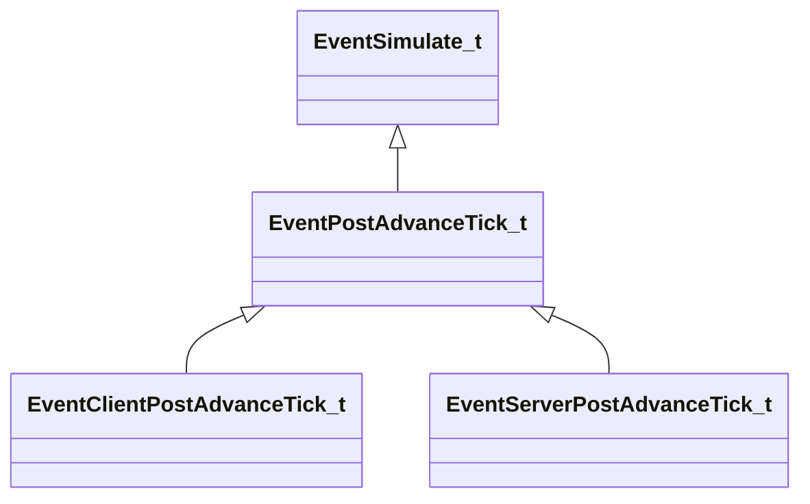

[Schemas](../../schemas.md) / [engine2](../engine2.md) / EventPostAdvanceTick_t

# EventPostAdvanceTick_t

**Kind:** class · **Size:** 64 bytes (`0x40`) · **Align:** 255 · **Module:** engine2

**Inherits from:** [EventSimulate_t](../engine2/EventSimulate_t.md)

**Derived by:** [EventClientPostAdvanceTick_t](../engine2/EventClientPostAdvanceTick_t.md), [EventServerPostAdvanceTick_t](../engine2/EventServerPostAdvanceTick_t.md)

**Relationships:**

## Memory layout

7 fields (4 declared here, 3 inherited). Offsets are absolute from the object base.

| Offset | Field | Type | From | Annotations |
|--------|-------|------|------|-------------|
| `0x0` | `m_LoopState` | [EngineLoopState_t](../engine2/EngineLoopState_t.md) | [EventSimulate_t](../engine2/EventSimulate_t.md) |  |
| `0x28` | `m_bFirstTick` | bool | [EventSimulate_t](../engine2/EventSimulate_t.md) |  |
| `0x29` | `m_bLastTick` | bool | [EventSimulate_t](../engine2/EventSimulate_t.md) |  |
| `0x30` | `m_nCurrentTick` | int32 |  |  |
| `0x34` | `m_nCurrentTickThisFrame` | int32 |  |  |
| `0x38` | `m_nTotalTicksThisFrame` | int32 |  |  |
| `0x3c` | `m_nTotalTicks` | int32 |  |  |
