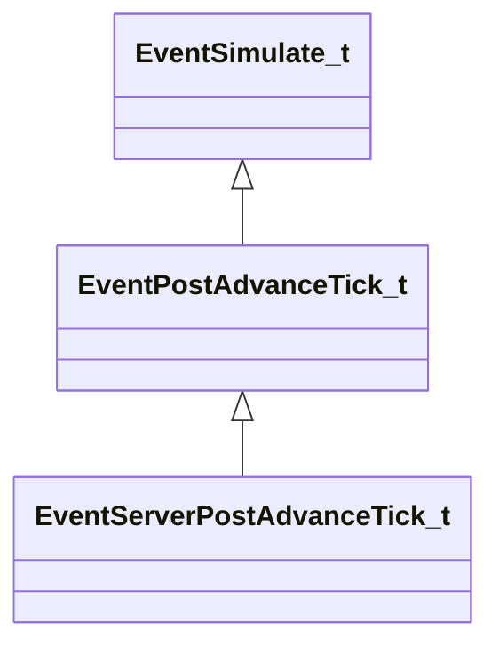

[Schemas](../../schemas.md) / [engine2](../engine2.md) / EventServerPostAdvanceTick_t

# EventServerPostAdvanceTick_t

**Kind:** class · **Size:** 72 bytes (`0x48`) · **Align:** 255 · **Module:** engine2

**Inherits from:** [EventPostAdvanceTick_t](../engine2/EventPostAdvanceTick_t.md)

**Relationships:**

## Memory layout

8 fields (1 declared here, 7 inherited). Offsets are absolute from the object base.

| Offset | Field | Type | From | Annotations |
|--------|-------|------|------|-------------|
| `0x0` | `m_LoopState` | [EngineLoopState_t](../engine2/EngineLoopState_t.md) | [EventSimulate_t](../engine2/EventSimulate_t.md) |  |
| `0x28` | `m_bFirstTick` | bool | [EventSimulate_t](../engine2/EventSimulate_t.md) |  |
| `0x29` | `m_bLastTick` | bool | [EventSimulate_t](../engine2/EventSimulate_t.md) |  |
| `0x30` | `m_nCurrentTick` | int32 | [EventPostAdvanceTick_t](../engine2/EventPostAdvanceTick_t.md) |  |
| `0x34` | `m_nCurrentTickThisFrame` | int32 | [EventPostAdvanceTick_t](../engine2/EventPostAdvanceTick_t.md) |  |
| `0x38` | `m_nTotalTicksThisFrame` | int32 | [EventPostAdvanceTick_t](../engine2/EventPostAdvanceTick_t.md) |  |
| `0x3c` | `m_nTotalTicks` | int32 | [EventPostAdvanceTick_t](../engine2/EventPostAdvanceTick_t.md) |  |
| `0x40` | `m_bLastTickBeforeClientUpdate` | bool |  |  |
