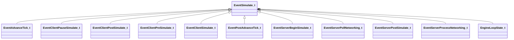

[Schemas](../../schemas.md) / [engine2](../engine2.md) / EventSimulate_t

# EventSimulate_t

> Source: **Build 25000182** · 2026-08-28 · `windows-x86_64` · schema `0.10.0`

**Kind:** class · **Size:** 48 bytes (`0x30`) · **Align:** n/a (unspecified) · **Module:** engine2

**Derived by:** [EventAdvanceTick_t](../engine2/EventAdvanceTick_t.md), [EventClientPauseSimulate_t](../engine2/EventClientPauseSimulate_t.md), [EventClientPostSimulate_t](../engine2/EventClientPostSimulate_t.md), [EventClientPreSimulate_t](../engine2/EventClientPreSimulate_t.md), [EventClientSimulate_t](../engine2/EventClientSimulate_t.md), [EventPostAdvanceTick_t](../engine2/EventPostAdvanceTick_t.md), [EventServerBeginSimulate_t](../engine2/EventServerBeginSimulate_t.md), [EventServerPollNetworking_t](../engine2/EventServerPollNetworking_t.md), [EventServerPostSimulate_t](../engine2/EventServerPostSimulate_t.md), [EventServerProcessNetworking_t](../engine2/EventServerProcessNetworking_t.md)

**Relationships:**

## Memory layout

3 fields (3 declared here, 0 inherited). Offsets are absolute from the object base.

| Offset | Field | Type | From | Annotations |
|--------|-------|------|------|-------------|
| `0x0` | `m_LoopState` | [EngineLoopState_t](../engine2/EngineLoopState_t.md) |  |  |
| `0x28` | `m_bFirstTick` | bool |  |  |
| `0x29` | `m_bLastTick` | bool |  |  |
