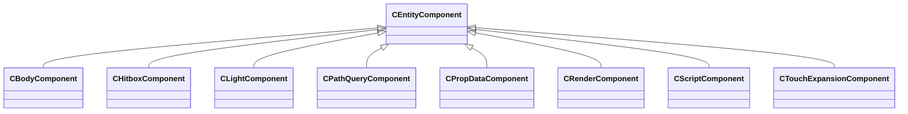
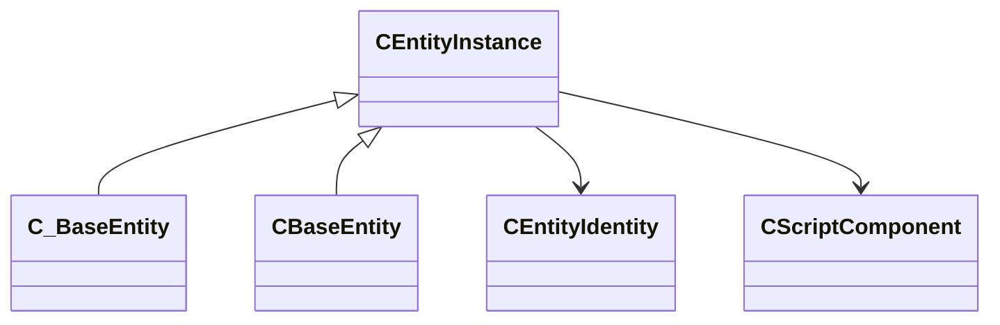
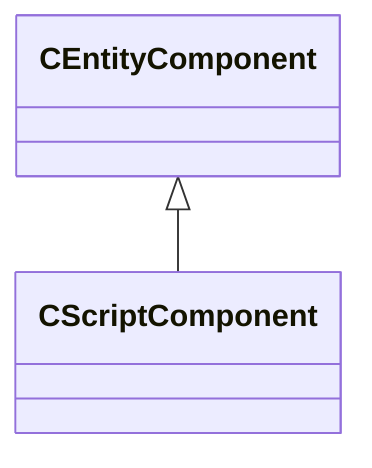

# Module: entity2

[📊 View UML Diagram](../diagrams/entity2.md)

| Name | Kind | Bases | Fields |
|------|------|-------|--------|
| [CEntityComponent](#centitycomponent) | class |  | 0 |
| [CEntityIdentity](#centityidentity) | class |  | 12 |
| [CEntityInstance](#centityinstance) | class |  | 3 |
| [CScriptComponent](#cscriptcomponent) | class | CEntityComponent | 1 |

---

### CEntityComponent

**Derived by:** [CBodyComponent](client.md#cbodycomponent), [CHitboxComponent](client.md#chitboxcomponent), [CLightComponent](client.md#clightcomponent), [CPathQueryComponent](client.md#cpathquerycomponent), [CPropDataComponent](client.md#cpropdatacomponent), [CRenderComponent](client.md#crendercomponent), [CScriptComponent](entity2.md#cscriptcomponent), [CTouchExpansionComponent](server.md#ctouchexpansioncomponent)

**Relationships:**

### CEntityIdentity

**Metadata:** `MGetKV3ClassDefaults`

**Fields:**

| Name | Type | Annotations |
|------|------|-------------|
| `m_nameStringTableIndex` | int32 | `MNotSaved` |
| `m_name` | CUtlSymbolLarge |  |
| `m_designerName` | CUtlSymbolLarge | `MNotSaved` |
| `m_flags` | uint32 | `MNotSaved` |
| `m_worldGroupId` | WorldGroupId_t | `MNotSaved` |
| `m_fDataObjectTypes` | uint32 | `MNotSaved` |
| `m_PathIndex` | ChangeAccessorFieldPathIndex_t | `MNotSaved` |
| `m_pAttributes` | CEntityAttributeTable* |  |
| `m_pPrev` | [CEntityIdentity](../schemas/entity2.md#centityidentity)* | `MNotSaved` |
| `m_pNext` | [CEntityIdentity](../schemas/entity2.md#centityidentity)* | `MNotSaved` |
| `m_pPrevByClass` | [CEntityIdentity](../schemas/entity2.md#centityidentity)* | `MNotSaved` |
| `m_pNextByClass` | [CEntityIdentity](../schemas/entity2.md#centityidentity)* | `MNotSaved` |

### CEntityInstance

**Derived by:** [CBaseEntity](server.md#cbaseentity), [C_BaseEntity](client.md#c_baseentity)

**Relationships:**

**Fields:**

| Name | Type | Annotations |
|------|------|-------------|
| `m_iszPrivateVScripts` | CUtlSymbolLarge |  |
| `m_pEntity` | [CEntityIdentity](../schemas/entity2.md#centityidentity)* |  |
| `m_CScriptComponent` | [CScriptComponent](../schemas/entity2.md#cscriptcomponent)* |  |

### CScriptComponent

**Inherits from:** [CEntityComponent](entity2.md#centitycomponent)

**Metadata:** `MGetKV3ClassDefaults`

**Relationships:**

**Fields:**

| Name | Type | Annotations |
|------|------|-------------|
| `m_scriptClassName` | CUtlSymbolLarge | `MNotSaved` |
