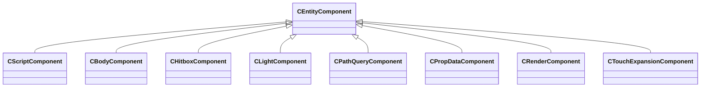

[Schemas](../../schemas.md) / [entity2](../entity2.md) / CEntityComponent

# CEntityComponent

> Source: **Build 25000182** · 2026-08-28 · `windows-x86_64` · schema `0.10.0`

**Kind:** class · **Size:** 8 bytes (`0x8`) · **Align:** n/a (unspecified) · **Module:** entity2

**Derived by:** [CBodyComponent](../client/CBodyComponent.md), [CBodyComponent](../client/CBodyComponent.md), [CHitboxComponent](../client/CHitboxComponent.md), [CHitboxComponent](../client/CHitboxComponent.md), [CLightComponent](../client/CLightComponent.md), [CLightComponent](../client/CLightComponent.md), [CPathQueryComponent](../client/CPathQueryComponent.md), [CPathQueryComponent](../client/CPathQueryComponent.md), [CPropDataComponent](../client/CPropDataComponent.md), [CPropDataComponent](../client/CPropDataComponent.md), [CRenderComponent](../client/CRenderComponent.md), [CRenderComponent](../client/CRenderComponent.md), [CScriptComponent](../entity2/CScriptComponent.md), [CTouchExpansionComponent](../server/CTouchExpansionComponent.md)

**Relationships:**

## Memory layout

No schema-visible fields (8 bytes of opaque storage).
