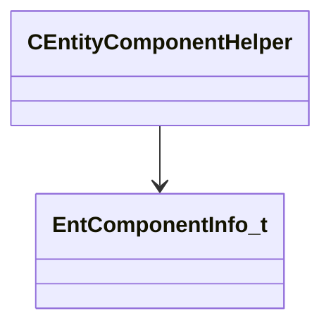

[Schemas](../../schemas.md) / [entity2](../entity2.md) / CEntityComponentHelper

# CEntityComponentHelper

> Source: **Build 25000182** · 2026-08-28 · `windows-x86_64` · schema `0.10.0`

**Kind:** class · **Size:** 40 bytes (`0x28`) · **Align:** n/a (unspecified) · **Module:** entity2

**Relationships:**

## Memory layout

4 fields (4 declared here, 0 inherited). Offsets are absolute from the object base.

| Offset | Field | Type | From | Annotations |
|--------|-------|------|------|-------------|
| `0x8` | `m_flags` | uint32 |  |  |
| `0x10` | `m_pInfo` | [EntComponentInfo_t](../entity2/EntComponentInfo_t.md)* |  |  |
| `0x18` | `m_nPriority` | int32 |  |  |
| `0x20` | `m_pNext` | [CEntityComponentHelper](../entity2/CEntityComponentHelper.md)* |  |  |
