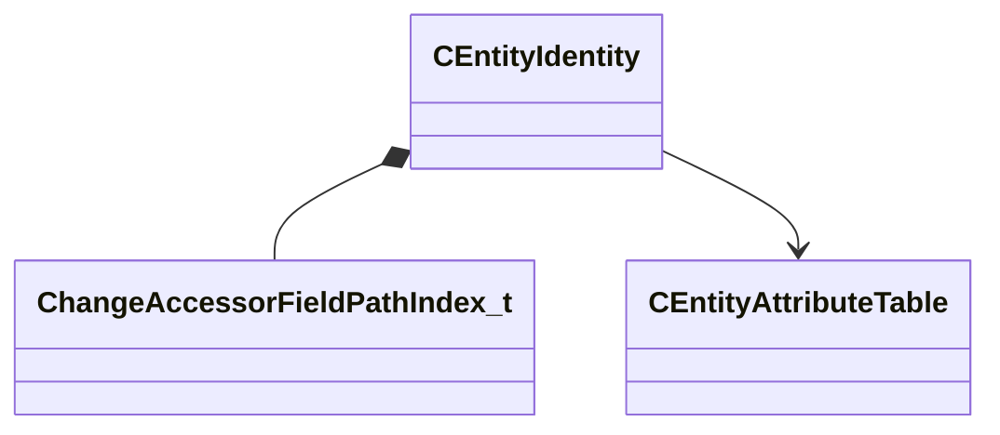

[Schemas](../../schemas.md) / [entity2](../entity2.md) / CEntityIdentity

# CEntityIdentity

> Source: **Build 25000182** · 2026-08-28 · `windows-x86_64` · schema `0.10.0`

**Kind:** class · **Size:** 112 bytes (`0x70`) · **Align:** n/a (unspecified) · **Module:** entity2

**Relationships:**

## Memory layout

12 fields (12 declared here, 0 inherited). Offsets are absolute from the object base.

| Offset | Field | Type | From | Annotations |
|--------|-------|------|------|-------------|
| `0x14` | `m_nameStringTableIndex` | int32 |  | `MNotSaved` |
| `0x18` | `m_name` | CUtlSymbolLarge |  |  |
| `0x20` | `m_designerName` | CUtlSymbolLarge |  | `MNotSaved` |
| `0x30` | `m_flags` | uint32 |  | `MNotSaved` |
| `0x38` | `m_worldGroupId` | WorldGroupId_t |  | `MNotSaved` |
| `0x3c` | `m_fDataObjectTypes` | uint32 |  | `MNotSaved` |
| `0x40` | `m_PathIndex` | [ChangeAccessorFieldPathIndex_t](../networksystem/ChangeAccessorFieldPathIndex_t.md) |  | `MNotSaved` |
| `0x48` | `m_pAttributes` | [CEntityAttributeTable](../entity2/CEntityAttributeTable.md)* |  |  |
| `0x50` | `m_pPrev` | [CEntityIdentity](../entity2/CEntityIdentity.md)* |  | `MNotSaved` |
| `0x58` | `m_pNext` | [CEntityIdentity](../entity2/CEntityIdentity.md)* |  | `MNotSaved` |
| `0x60` | `m_pPrevByClass` | [CEntityIdentity](../entity2/CEntityIdentity.md)* |  | `MNotSaved` |
| `0x68` | `m_pNextByClass` | [CEntityIdentity](../entity2/CEntityIdentity.md)* |  | `MNotSaved` |
