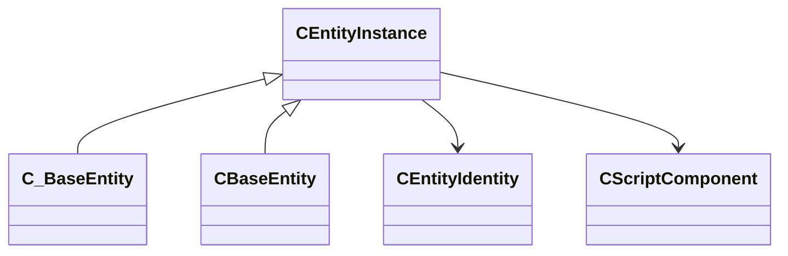

[Schemas](../../schemas.md) / [entity2](../entity2.md) / CEntityInstance

# CEntityInstance

> Source: **Build 25000182** · 2026-08-28 · `windows-x86_64` · schema `0.10.0`

Root of the entity class hierarchy (server and client).  Everything that has an entity handle ultimately derives from this.

**Kind:** class · **Size:** 48 bytes (`0x30`) · **Align:** n/a (unspecified) · **Module:** entity2

**Derived by:** [CBaseEntity](../server/CBaseEntity.md), [C_BaseEntity](../client/C_BaseEntity.md)

**Relationships:**

## Memory layout

3 fields (3 declared here, 0 inherited). Offsets are absolute from the object base.

| Offset | Field | Type | From | Annotations |
|--------|-------|------|------|-------------|
| `0x8` | `m_iszPrivateVScripts` | CUtlSymbolLarge |  |  |
| `0x10` | `m_pEntity` | [CEntityIdentity](../entity2/CEntityIdentity.md)* |  | CEntityIdentity pointer: the entity's identity record (name, class, handle, flags). |
| `0x28` | `m_CScriptComponent` | [CScriptComponent](../entity2/CScriptComponent.md)* |  | VScript component attached to the entity, when scripted. |
