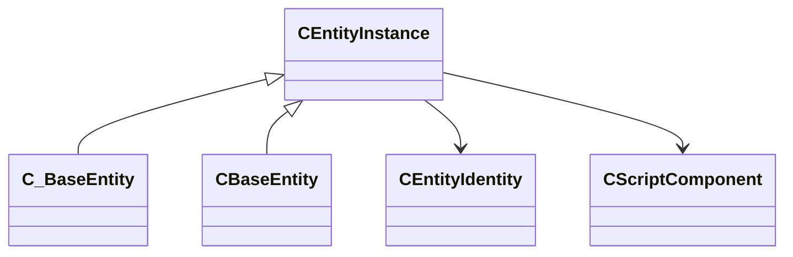

[Schemas](../../schemas.md) / [entity2](../entity2.md) / CEntityInstance

# CEntityInstance

**Kind:** class · **Size:** 48 bytes (`0x30`) · **Align:** 255 · **Module:** entity2

**Derived by:** [CBaseEntity](../server/CBaseEntity.md), [C_BaseEntity](../client/C_BaseEntity.md)

**Relationships:**

## Memory layout

3 fields (3 declared here, 0 inherited). Offsets are absolute from the object base.

| Offset | Field | Type | From | Annotations |
|--------|-------|------|------|-------------|
| `0x8` | `m_iszPrivateVScripts` | CUtlSymbolLarge |  |  |
| `0x10` | `m_pEntity` | [CEntityIdentity](../entity2/CEntityIdentity.md)* |  |  |
| `0x28` | `m_CScriptComponent` | [CScriptComponent](../entity2/CScriptComponent.md)* |  |  |
