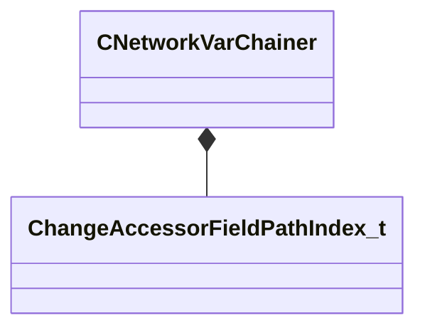

[Schemas](../../schemas.md) / [entity2](../entity2.md) / CNetworkVarChainer

# CNetworkVarChainer

> Source: **Build 25000182** · 2026-08-28 · `windows-x86_64` · schema `0.10.0`

**Kind:** class · **Size:** 40 bytes (`0x28`) · **Align:** n/a (unspecified) · **Module:** entity2

**Relationships:**

## Memory layout

1 field (1 declared here, 0 inherited). Offsets are absolute from the object base.

| Offset | Field | Type | From | Annotations |
|--------|-------|------|------|-------------|
| `0x20` | `m_PathIndex` | [ChangeAccessorFieldPathIndex_t](../networksystem/ChangeAccessorFieldPathIndex_t.md) |  |  |
