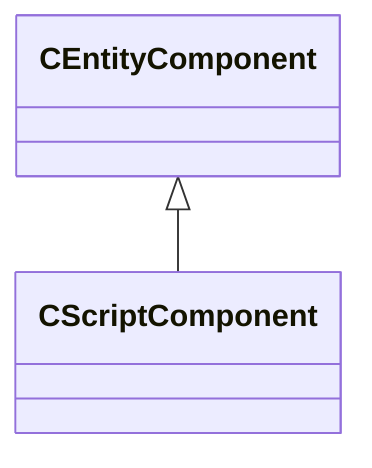

[Schemas](../../schemas.md) / [entity2](../entity2.md) / CScriptComponent

# CScriptComponent

> Source: **Build 25000182** · 2026-08-28 · `windows-x86_64` · schema `0.10.0`

**Kind:** class · **Size:** 56 bytes (`0x38`) · **Align:** 8 · **Module:** entity2

**Inherits from:** [CEntityComponent](../entity2/CEntityComponent.md)

**Relationships:**

## Memory layout

1 field (1 declared here, 0 inherited). Offsets are absolute from the object base.

| Offset | Field | Type | From | Annotations |
|--------|-------|------|------|-------------|
| `0x30` | `m_scriptClassName` | CUtlSymbolLarge |  | `MNotSaved` |

KV3 class defaults

<pre>{
	&quot;_class&quot;: &quot;CScriptComponent&quot;
}</pre>

