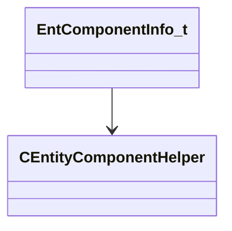

[Schemas](../../schemas.md) / [entity2](../entity2.md) / EntComponentInfo_t

# EntComponentInfo_t

**Kind:** class · **Size:** 104 bytes (`0x68`) · **Align:** 255 · **Module:** entity2

**Relationships:**

## Memory layout

7 fields (7 declared here, 0 inherited). Offsets are absolute from the object base.

| Offset | Field | Type | From | Annotations |
|--------|-------|------|------|-------------|
| `0x0` | `m_pName` | char* |  |  |
| `0x8` | `m_pCPPClassname` | char* |  |  |
| `0x10` | `m_pNetworkDataReferencedDescription` | char* |  |  |
| `0x18` | `m_pNetworkDataReferencedPtrPropDescription` | char* |  |  |
| `0x20` | `m_nRuntimeIndex` | int32 |  |  |
| `0x24` | `m_nFlags` | uint32 |  |  |
| `0x60` | `m_pBaseClassComponentHelper` | [CEntityComponentHelper](../entity2/CEntityComponentHelper.md)* |  |  |
