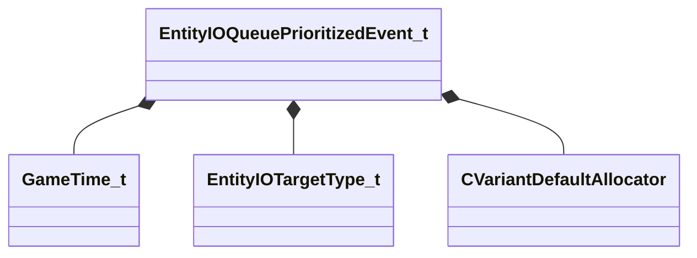

[Schemas](../../schemas.md) / [entity2](../entity2.md) / EntityIOQueuePrioritizedEvent_t

# EntityIOQueuePrioritizedEvent_t

**Kind:** class · **Size:** 112 bytes (`0x70`) · **Align:** 8 · **Module:** entity2

**Relationships:**

## Memory layout

8 fields (8 declared here, 0 inherited). Offsets are absolute from the object base.

| Offset | Field | Type | From | Annotations |
|--------|-------|------|------|-------------|
| `0x4` | `m_flFireTime` | [GameTime_t](../entity2/GameTime_t.md) |  |  |
| `0x8` | `m_targetType` | [EntityIOTargetType_t](../entity2/EntityIOTargetType_t.md) |  |  |
| `0x10` | `m_pTarget` | CUtlSymbolLarge |  |  |
| `0x18` | `m_pTargetInput` | CUtlSymbolLarge |  |  |
| `0x20` | `m_hActivator` | CEntityHandle |  |  |
| `0x24` | `m_hCaller` | CEntityHandle |  |  |
| `0x28` | `m_hEntTarget` | CEntityHandle |  |  |
| `0x30` | `m_variantValue` | CVariantBase< [CVariantDefaultAllocator](../entity2/CVariantDefaultAllocator.md) > |  | `MKV3TransferSaveOpsForField GetVariantSaveDataOps` |

KV3 class defaults

<pre>{
	&quot;m_flFireTime&quot;: null,
	&quot;m_targetType&quot;: 0,
	&quot;m_pTarget&quot;: &quot;&quot;,
	&quot;m_pTargetInput&quot;: &quot;&quot;,
	&quot;m_hActivator&quot;: null,
	&quot;m_hCaller&quot;: null,
	&quot;m_hEntTarget&quot;: null
}</pre>

