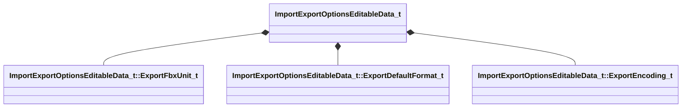

[Schemas](../../schemas.md) / [hammer](../hammer.md) / ImportExportOptionsEditableData_t

# ImportExportOptionsEditableData_t

> Source: **Build 25000182** · 2026-08-28 · `windows-x86_64` · schema `0.10.0`

**Kind:** class · **Size:** 16 bytes (`0x10`) · **Align:** n/a (unspecified) · **Module:** hammer

**Relationships:**

## Memory layout

6 fields (6 declared here, 0 inherited). Offsets are absolute from the object base.

| Offset | Field | Type | From | Annotations |
|--------|-------|------|------|-------------|
| `0x0` | `bExportProps` | bool |  | `MPropertyFriendlyName Export Props` |
| `0x1` | `bExportHidden` | bool |  | `MPropertyFriendlyName Export Hidden Objects` |
| `0x2` | `bExportFbxEmbedTextures` | bool |  | `MPropertyFriendlyName Export FBX Embed Textures From Content If Available` `MPropertySuppressField` |
| `0x4` | `nExportFbxUnit` | [ImportExportOptionsEditableData_t::ExportFbxUnit_t](../hammer/ImportExportOptionsEditableData_t.ExportFbxUnit_t.md) |  | `MPropertyFriendlyName Export Hammer Units To FBX Units` |
| `0x8` | `nExportDefaultFormat` | [ImportExportOptionsEditableData_t::ExportDefaultFormat_t](../hammer/ImportExportOptionsEditableData_t.ExportDefaultFormat_t.md) |  | `MPropertyFriendlyName Export Default Format` |
| `0xc` | `nExportEncoding` | [ImportExportOptionsEditableData_t::ExportEncoding_t](../hammer/ImportExportOptionsEditableData_t.ExportEncoding_t.md) |  | `MPropertyFriendlyName Export Encoding` |
