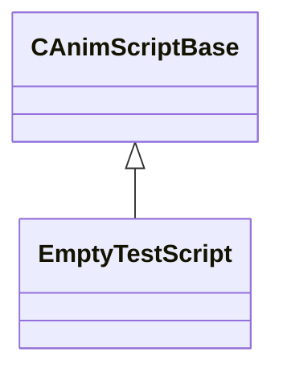

[Schemas](../../schemas.md) / [host](../host.md) / CAnimScriptBase

# CAnimScriptBase

**Kind:** class · **Size:** 16 bytes (`0x10`) · **Align:** 255 · **Module:** host

**Derived by:** [EmptyTestScript](../host/EmptyTestScript.md)

**Relationships:**

## Memory layout

1 fields (1 declared here, 0 inherited). Offsets are absolute from the object base.

| Offset | Field | Type | From | Annotations |
|--------|-------|------|------|-------------|
| `0x8` | `m_bIsValid` | bool |  |  |
