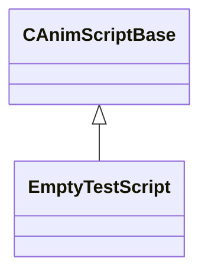

[Schemas](../../schemas.md) / [host](../host.md) / EmptyTestScript

# EmptyTestScript

> Source: **Build 25000182** · 2026-08-28 · `windows-x86_64` · schema `0.10.0`

**Kind:** class · **Size:** 32 bytes (`0x20`) · **Align:** n/a (unspecified) · **Module:** host

**Inherits from:** [CAnimScriptBase](../host/CAnimScriptBase.md)

**Relationships:**

## Memory layout

2 fields (1 declared here, 1 inherited). Offsets are absolute from the object base.

| Offset | Field | Type | From | Annotations |
|--------|-------|------|------|-------------|
| `0x8` | `m_bIsValid` | bool | [CAnimScriptBase](../host/CAnimScriptBase.md) |  |
| `0x10` | `m_hTest` | CAnimScriptParam< float32 > |  |  |
