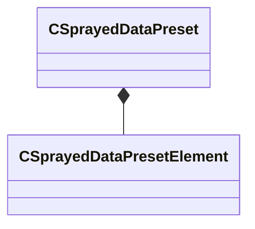
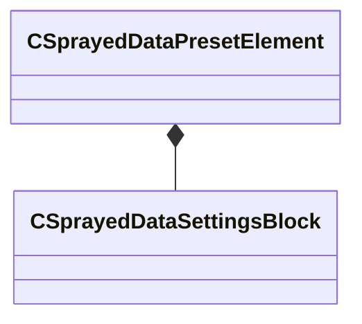

# Module: mapdoclib

[📊 View UML Diagram](../diagrams/mapdoclib.md)

| Name | Kind | Bases | Fields |
|------|------|-------|--------|
| [CSprayedDataPreset](#csprayeddatapreset) | class |  | 9 |
| [CSprayedDataPresetElement](#csprayeddatapresetelement) | class |  | 4 |
| [CSprayedDataSettingsBlock](#csprayeddatasettingsblock) | class |  | 13 |

---

### CSprayedDataPreset

**Metadata:** `MGetKV3ClassDefaults {
	"m_nCounterMin": 4,
	"m_nCounterMax": 4,
	"m_flSpacing": 64.000000,
	"m_flRadius": 128.000000,
	"m_flEraseAmount": 1.000000,
	"m_bConstantDensity": true,
	"m_bOnlyHitMeshes": false,
	"m_bRadialFalloff": true,
	"m_elements":
	[
	]
}`

**Relationships:**

**Fields:**

| Name | Type | Annotations |
|------|------|-------------|
| `m_nCounterMin` | int32 |  |
| `m_nCounterMax` | int32 |  |
| `m_flSpacing` | float32 |  |
| `m_flRadius` | float32 |  |
| `m_flEraseAmount` | float32 |  |
| `m_bConstantDensity` | bool |  |
| `m_bOnlyHitMeshes` | bool |  |
| `m_bRadialFalloff` | bool |  |
| `m_elements` | CUtlVector<[CSprayedDataPresetElement](../schemas/mapdoclib.md#csprayeddatapresetelement)> |  |

### CSprayedDataPresetElement

**Metadata:** `MGetKV3ClassDefaults {
	"m_assetName": "",
	"m_vBoundsMin":
	[
		340282346638528859811704183484516925440.000000,
		340282346638528859811704183484516925440.000000,
		340282346638528859811704183484516925440.000000
	],
	"m_vBoundsMax":
	[
		-340282346638528859811704183484516925440.000000,
		-340282346638528859811704183484516925440.000000,
		-340282346638528859811704183484516925440.000000
	],
	"m_settings":
	{
		"m_flMinDensity": 1.000000,
		"m_flMaxDensity": 1.000000,
		"m_flMinScale": 0.500000,
		"m_flMaxScale": 1.000000,
		"m_vMinAngle":
		[
			0.000000,
			0.000000,
			0.000000
		],
		"m_vMaxAngle":
		[
			0.000000,
			360.000000,
			0.000000
		],
		"m_vMinColor":
		[
			1.000000,
			1.000000,
			1.000000
		],
		"m_vMaxColor":
		[
			1.000000,
			1.000000,
			1.000000
		],
		"m_flSpacingMul": 1.000000,
		"m_flSlopeThreshold": 100000.000000,
		"m_vMasterDirection":
		[
			0.000000,
			0.000000,
			1.000000
		],
		"m_flMasterDirectionInfluence": 0.000000,
		"m_bEnabled": true
	}
}`

**Relationships:**

**Fields:**

| Name | Type | Annotations |
|------|------|-------------|
| `m_assetName` | CUtlString |  |
| `m_vBoundsMin` | Vector |  |
| `m_vBoundsMax` | Vector |  |
| `m_settings` | [CSprayedDataSettingsBlock](../schemas/mapdoclib.md#csprayeddatasettingsblock) |  |

### CSprayedDataSettingsBlock

**Metadata:** `MGetKV3ClassDefaults {
	"m_flMinDensity": 1.000000,
	"m_flMaxDensity": 1.000000,
	"m_flMinScale": 0.500000,
	"m_flMaxScale": 1.000000,
	"m_vMinAngle":
	[
		0.000000,
		0.000000,
		0.000000
	],
	"m_vMaxAngle":
	[
		0.000000,
		360.000000,
		0.000000
	],
	"m_vMinColor":
	[
		1.000000,
		1.000000,
		1.000000
	],
	"m_vMaxColor":
	[
		1.000000,
		1.000000,
		1.000000
	],
	"m_flSpacingMul": 1.000000,
	"m_flSlopeThreshold": 100000.000000,
	"m_vMasterDirection":
	[
		0.000000,
		0.000000,
		1.000000
	],
	"m_flMasterDirectionInfluence": 0.000000,
	"m_bEnabled": true
}`

**Fields:**

| Name | Type | Annotations |
|------|------|-------------|
| `m_flMinDensity` | float32 |  |
| `m_flMaxDensity` | float32 |  |
| `m_flMinScale` | float32 |  |
| `m_flMaxScale` | float32 |  |
| `m_vMinAngle` | QAngle |  |
| `m_vMaxAngle` | QAngle |  |
| `m_vMinColor` | Vector |  |
| `m_vMaxColor` | Vector |  |
| `m_flSpacingMul` | float32 |  |
| `m_flSlopeThreshold` | float32 |  |
| `m_vMasterDirection` | Vector |  |
| `m_flMasterDirectionInfluence` | float32 |  |
| `m_bEnabled` | bool |  |
