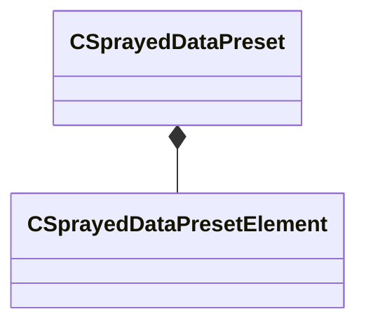
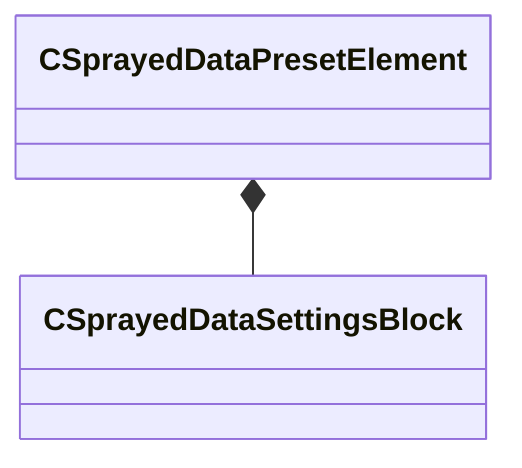

# Module: mapdoclib

[📊 View UML Diagram](../diagrams/mapdoclib.md)

| Name | Kind | Bases | Fields |
|------|------|-------|--------|
| [CSprayedDataPreset](#csprayeddatapreset) | class |  | 9 |
| [CSprayedDataPresetElement](#csprayeddatapresetelement) | class |  | 4 |
| [CSprayedDataSettingsBlock](#csprayeddatasettingsblock) | class |  | 13 |

---

### CSprayedDataPreset

**Metadata:** `MGetKV3ClassDefaults`

**Relationships:**

```mermaid
classDiagram
    CSprayedDataPreset *-- CSprayedDataPresetElement
```

**Fields:**

| Name | Type | Annotations |
|------|------|-------------|
| `m_nCounterMin` | int32 |  |
| `m_nCounterMax` | int32 |  |
| `m_flSpacing` | float32 |  |
| `m_flRadius` | float32 |  |
| `m_flEraseAmount` | float32 |  |
| `m_bConstantDensity` | bool |  |
| `m_bOnlyHitMeshes` | bool |  |
| `m_bRadialFalloff` | bool |  |
| `m_elements` | CUtlVector< [CSprayedDataPresetElement](../schemas/mapdoclib.md#csprayeddatapresetelement) > |  |

### CSprayedDataPresetElement

**Metadata:** `MGetKV3ClassDefaults`

**Relationships:**

```mermaid
classDiagram
    CSprayedDataPresetElement *-- CSprayedDataSettingsBlock
```

**Fields:**

| Name | Type | Annotations |
|------|------|-------------|
| `m_assetName` | CUtlString |  |
| `m_vBoundsMin` | Vector |  |
| `m_vBoundsMax` | Vector |  |
| `m_settings` | [CSprayedDataSettingsBlock](../schemas/mapdoclib.md#csprayeddatasettingsblock) |  |

### CSprayedDataSettingsBlock

**Metadata:** `MGetKV3ClassDefaults`

**Fields:**

| Name | Type | Annotations |
|------|------|-------------|
| `m_flMinDensity` | float32 |  |
| `m_flMaxDensity` | float32 |  |
| `m_flMinScale` | float32 |  |
| `m_flMaxScale` | float32 |  |
| `m_vMinAngle` | QAngle |  |
| `m_vMaxAngle` | QAngle |  |
| `m_vMinColor` | Vector |  |
| `m_vMaxColor` | Vector |  |
| `m_flSpacingMul` | float32 |  |
| `m_flSlopeThreshold` | float32 |  |
| `m_vMasterDirection` | Vector |  |
| `m_flMasterDirectionInfluence` | float32 |  |
| `m_bEnabled` | bool |  |
