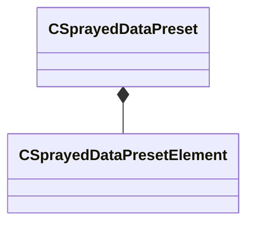

[Schemas](../../schemas.md) / [mapdoclib](../mapdoclib.md) / CSprayedDataPreset

# CSprayedDataPreset

> Source: **Build 25000182** · 2026-08-28 · `windows-x86_64` · schema `0.10.0`

**Kind:** class · **Size:** 48 bytes (`0x30`) · **Align:** 8 · **Module:** mapdoclib

**Relationships:**

## Memory layout

9 fields (9 declared here, 0 inherited). Offsets are absolute from the object base.

| Offset | Field | Type | From | Annotations |
|--------|-------|------|------|-------------|
| `0x0` | `m_nCounterMin` | int32 |  |  |
| `0x4` | `m_nCounterMax` | int32 |  |  |
| `0x8` | `m_flSpacing` | float32 |  |  |
| `0xc` | `m_flRadius` | float32 |  |  |
| `0x10` | `m_flEraseAmount` | float32 |  |  |
| `0x14` | `m_bConstantDensity` | bool |  |  |
| `0x15` | `m_bOnlyHitMeshes` | bool |  |  |
| `0x16` | `m_bRadialFalloff` | bool |  |  |
| `0x18` | `m_elements` | CUtlVector< [CSprayedDataPresetElement](../mapdoclib/CSprayedDataPresetElement.md) > |  |  |

KV3 class defaults

<pre>{
	&quot;m_nCounterMin&quot;: 4,
	&quot;m_nCounterMax&quot;: 4,
	&quot;m_flSpacing&quot;: 64.000000,
	&quot;m_flRadius&quot;: 128.000000,
	&quot;m_flEraseAmount&quot;: 1.000000,
	&quot;m_bConstantDensity&quot;: true,
	&quot;m_bOnlyHitMeshes&quot;: false,
	&quot;m_bRadialFalloff&quot;: true,
	&quot;m_elements&quot;:
	[
	]
}</pre>

