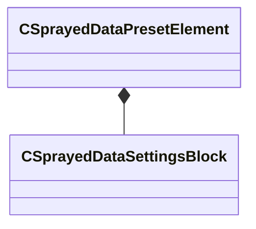

[Schemas](../../schemas.md) / [mapdoclib](../mapdoclib.md) / CSprayedDataPresetElement

# CSprayedDataPresetElement

**Kind:** class · **Size:** 144 bytes (`0x90`) · **Align:** 8 · **Module:** mapdoclib

**Relationships:**

## Memory layout

4 fields (4 declared here, 0 inherited). Offsets are absolute from the object base.

| Offset | Field | Type | From | Annotations |
|--------|-------|------|------|-------------|
| `0x0` | `m_assetName` | CUtlString |  |  |
| `0x18` | `m_vBoundsMin` | Vector |  |  |
| `0x24` | `m_vBoundsMax` | Vector |  |  |
| `0x30` | `m_settings` | [CSprayedDataSettingsBlock](../mapdoclib/CSprayedDataSettingsBlock.md) |  |  |

KV3 class defaults

<pre>{
	&quot;m_assetName&quot;: &quot;&quot;,
	&quot;m_vBoundsMin&quot;:
	[
		340282346638528859811704183484516925440.000000,
		340282346638528859811704183484516925440.000000,
		340282346638528859811704183484516925440.000000
	],
	&quot;m_vBoundsMax&quot;:
	[
		-340282346638528859811704183484516925440.000000,
		-340282346638528859811704183484516925440.000000,
		-340282346638528859811704183484516925440.000000
	],
	&quot;m_settings&quot;:
	{
		&quot;m_flMinDensity&quot;: 1.000000,
		&quot;m_flMaxDensity&quot;: 1.000000,
		&quot;m_flMinScale&quot;: 0.500000,
		&quot;m_flMaxScale&quot;: 1.000000,
		&quot;m_vMinAngle&quot;:
		[
			0.000000,
			0.000000,
			0.000000
		],
		&quot;m_vMaxAngle&quot;:
		[
			0.000000,
			360.000000,
			0.000000
		],
		&quot;m_vMinColor&quot;:
		[
			1.000000,
			1.000000,
			1.000000
		],
		&quot;m_vMaxColor&quot;:
		[
			1.000000,
			1.000000,
			1.000000
		],
		&quot;m_flSpacingMul&quot;: 1.000000,
		&quot;m_flSlopeThreshold&quot;: 100000.000000,
		&quot;m_vMasterDirection&quot;:
		[
			0.000000,
			0.000000,
			1.000000
		],
		&quot;m_flMasterDirectionInfluence&quot;: 0.000000,
		&quot;m_bEnabled&quot;: true
	}
}</pre>

