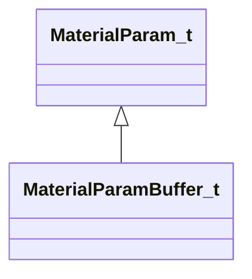
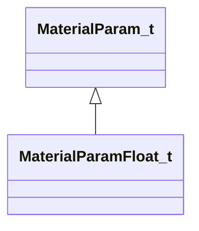
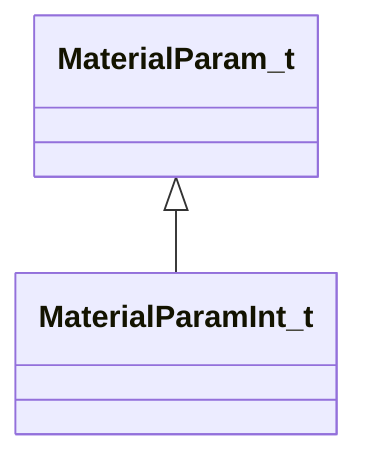
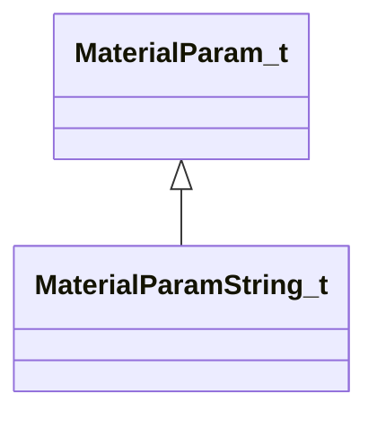
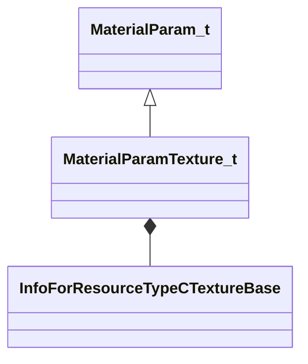
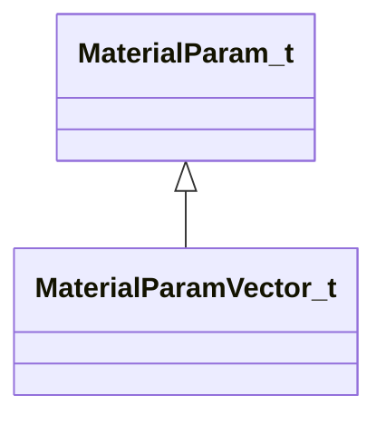
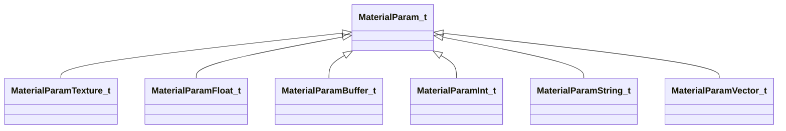
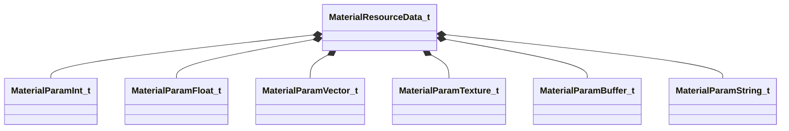
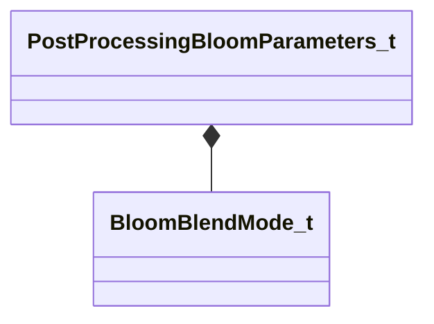
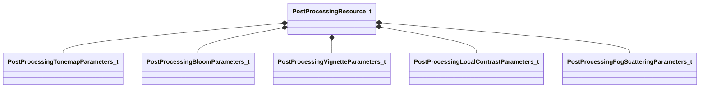

# Module: materialsystem2

[📊 View UML Diagram](../diagrams/materialsystem2.md)

| Name | Kind | Bases | Fields |
|------|------|-------|--------|
| [BloomBlendMode_t](#bloomblendmode_t) | enum |  | 3 |
| [HorizJustification_e](#horizjustification_e) | enum |  | 4 |
| [LayoutPositionType_e](#layoutpositiontype_e) | enum |  | 3 |
| [MaterialParamBuffer_t](#materialparambuffer_t) | class | MaterialParam_t | 1 |
| [MaterialParamFloat_t](#materialparamfloat_t) | class | MaterialParam_t | 1 |
| [MaterialParamInt_t](#materialparamint_t) | class | MaterialParam_t | 1 |
| [MaterialParamString_t](#materialparamstring_t) | class | MaterialParam_t | 1 |
| [MaterialParamTexture_t](#materialparamtexture_t) | class | MaterialParam_t | 1 |
| [MaterialParamVector_t](#materialparamvector_t) | class | MaterialParam_t | 1 |
| [MaterialParam_t](#materialparam_t) | class |  | 1 |
| [MaterialResourceData_t](#materialresourcedata_t) | class |  | 14 |
| [PostProcessingBloomParameters_t](#postprocessingbloomparameters_t) | class |  | 16 |
| [PostProcessingFogScatteringParameters_t](#postprocessingfogscatteringparameters_t) | class |  | 5 |
| [PostProcessingLocalContrastParameters_t](#postprocessinglocalcontrastparameters_t) | class |  | 5 |
| [PostProcessingResource_t](#postprocessingresource_t) | class |  | 13 |
| [PostProcessingTonemapParameters_t](#postprocessingtonemapparameters_t) | class |  | 15 |
| [PostProcessingVignetteParameters_t](#postprocessingvignetteparameters_t) | class |  | 6 |
| [VertJustification_e](#vertjustification_e) | enum |  | 4 |
| [ViewFadeMode_t](#viewfademode_t) | enum |  | 3 |

---

### BloomBlendMode_t

**Values:**

| Name | Value | Description |
|------|-------|-------------|
| `BLOOM_BLEND_ADD` | 0 |  |
| `BLOOM_BLEND_SCREEN` | 1 |  |
| `BLOOM_BLEND_BLUR` | 2 |  |

### HorizJustification_e

**Values:**

| Name | Value | Description |
|------|-------|-------------|
| `HORIZ_JUSTIFICATION_LEFT` | 0 |  |
| `HORIZ_JUSTIFICATION_CENTER` | 1 |  |
| `HORIZ_JUSTIFICATION_RIGHT` | 2 |  |
| `HORIZ_JUSTIFICATION_NONE` | 3 |  |

### LayoutPositionType_e

**Values:**

| Name | Value | Description |
|------|-------|-------------|
| `LAYOUTPOSITIONTYPE_VIEWPORT_RELATIVE` | 0 |  |
| `LAYOUTPOSITIONTYPE_FRACTIONAL` | 1 |  |
| `LAYOUTPOSITIONTYPE_NONE` | 2 |  |

### MaterialParamBuffer_t

**Inherits from:** [MaterialParam_t](materialsystem2.md#materialparam_t)

**Metadata:** `MGetKV3ClassDefaults {
	"m_name": "",
	"m_value": "[BINARY BLOB]"
}`

**Relationships:**

**Fields:**

| Name | Type | Annotations |
|------|------|-------------|
| `m_value` | CUtlBinaryBlock |  |

### MaterialParamFloat_t

**Inherits from:** [MaterialParam_t](materialsystem2.md#materialparam_t)

**Metadata:** `MGetKV3ClassDefaults {
	"m_name": "",
	"m_flValue": 0.000000
}`

**Relationships:**

**Fields:**

| Name | Type | Annotations |
|------|------|-------------|
| `m_flValue` | float32 |  |

### MaterialParamInt_t

**Inherits from:** [MaterialParam_t](materialsystem2.md#materialparam_t)

**Metadata:** `MGetKV3ClassDefaults {
	"m_name": "",
	"m_nValue": 0
}`

**Relationships:**

**Fields:**

| Name | Type | Annotations |
|------|------|-------------|
| `m_nValue` | int32 |  |

### MaterialParamString_t

**Inherits from:** [MaterialParam_t](materialsystem2.md#materialparam_t)

**Metadata:** `MGetKV3ClassDefaults {
	"m_name": "",
	"m_value": ""
}`

**Relationships:**

**Fields:**

| Name | Type | Annotations |
|------|------|-------------|
| `m_value` | CUtlString |  |

### MaterialParamTexture_t

**Inherits from:** [MaterialParam_t](materialsystem2.md#materialparam_t)

**Metadata:** `MGetKV3ClassDefaults {
	"m_name": "",
	"m_pValue": ""
}`

**Relationships:**

**Fields:**

| Name | Type | Annotations |
|------|------|-------------|
| `m_pValue` | CStrongHandle<[InfoForResourceTypeCTextureBase](../schemas/resourcesystem.md#infoforresourcetypectexturebase)> |  |

### MaterialParamVector_t

**Inherits from:** [MaterialParam_t](materialsystem2.md#materialparam_t)

**Metadata:** `MGetKV3ClassDefaults {
	"m_name": "",
	"m_value":
	[
		0.000000,
		0.000000,
		0.000000,
		0.000000
	]
}`

**Relationships:**

**Fields:**

| Name | Type | Annotations |
|------|------|-------------|
| `m_value` | Vector4D |  |

### MaterialParam_t

**Derived by:** [MaterialParamBuffer_t](materialsystem2.md#materialparambuffer_t), [MaterialParamFloat_t](materialsystem2.md#materialparamfloat_t), [MaterialParamInt_t](materialsystem2.md#materialparamint_t), [MaterialParamString_t](materialsystem2.md#materialparamstring_t), [MaterialParamTexture_t](materialsystem2.md#materialparamtexture_t), [MaterialParamVector_t](materialsystem2.md#materialparamvector_t)

**Metadata:** `MGetKV3ClassDefaults {
	"m_name": ""
}`

**Relationships:**

**Fields:**

| Name | Type | Annotations |
|------|------|-------------|
| `m_name` | CUtlString |  |

### MaterialResourceData_t

**Metadata:** `MGetKV3ClassDefaults {
	"m_materialName": "",
	"m_shaderName": "",
	"m_intParams":
	[
	],
	"m_floatParams":
	[
	],
	"m_vectorParams":
	[
	],
	"m_textureParams":
	[
	],
	"m_dynamicParams":
	[
	],
	"m_dynamicTextureParams":
	[
	],
	"m_intAttributes":
	[
	],
	"m_floatAttributes":
	[
	],
	"m_vectorAttributes":
	[
	],
	"m_textureAttributes":
	[
	],
	"m_stringAttributes":
	[
	],
	"m_renderAttributesUsed":
	[
	]
}`

**Relationships:**

**Fields:**

| Name | Type | Annotations |
|------|------|-------------|
| `m_materialName` | CUtlString |  |
| `m_shaderName` | CUtlString |  |
| `m_intParams` | CUtlVector<[MaterialParamInt_t](../schemas/materialsystem2.md#materialparamint_t)> |  |
| `m_floatParams` | CUtlVector<[MaterialParamFloat_t](../schemas/materialsystem2.md#materialparamfloat_t)> |  |
| `m_vectorParams` | CUtlVector<[MaterialParamVector_t](../schemas/materialsystem2.md#materialparamvector_t)> |  |
| `m_textureParams` | CUtlVector<[MaterialParamTexture_t](../schemas/materialsystem2.md#materialparamtexture_t)> |  |
| `m_dynamicParams` | CUtlVector<[MaterialParamBuffer_t](../schemas/materialsystem2.md#materialparambuffer_t)> |  |
| `m_dynamicTextureParams` | CUtlVector<[MaterialParamBuffer_t](../schemas/materialsystem2.md#materialparambuffer_t)> |  |
| `m_intAttributes` | CUtlVector<[MaterialParamInt_t](../schemas/materialsystem2.md#materialparamint_t)> |  |
| `m_floatAttributes` | CUtlVector<[MaterialParamFloat_t](../schemas/materialsystem2.md#materialparamfloat_t)> |  |
| `m_vectorAttributes` | CUtlVector<[MaterialParamVector_t](../schemas/materialsystem2.md#materialparamvector_t)> |  |
| `m_textureAttributes` | CUtlVector<[MaterialParamTexture_t](../schemas/materialsystem2.md#materialparamtexture_t)> |  |
| `m_stringAttributes` | CUtlVector<[MaterialParamString_t](../schemas/materialsystem2.md#materialparamstring_t)> |  |
| `m_renderAttributesUsed` | CUtlVector<CUtlString> |  |

### PostProcessingBloomParameters_t

**Metadata:** `MGetKV3ClassDefaults {
	"m_blendMode": "BLOOM_BLEND_ADD",
	"m_flBloomStrength": 2.000000,
	"m_flScreenBloomStrength": 1.000000,
	"m_flBlurBloomStrength": 1.000000,
	"m_flBloomThreshold": 0.000000,
	"m_flBloomThresholdWidth": 1.000000,
	"m_flSkyboxBloomStrength": 1.000000,
	"m_flBloomStartValue": 1.000000,
	"m_flComputeBloomStrength": 0.030000,
	"m_flComputeBloomThreshold": 1.000000,
	"m_flComputeBloomRadius": 0.600000,
	"m_flComputeBloomEffectsScale": 1.000000,
	"m_flComputeBloomLensDirtStrength": 0.000000,
	"m_flComputeBloomLensDirtBlackLevel": 0.100000,
	"m_flBlurWeight":
	[
		0.200000,
		0.200000,
		0.200000,
		0.200000,
		0.200000
	],
	"m_vBlurTint":
	[
		[
			1.000000,
			1.000000,
			1.000000
		],
		[
			1.000000,
			1.000000,
			1.000000
		],
		[
			1.000000,
			1.000000,
			1.000000
		],
		[
			1.000000,
			1.000000,
			1.000000
		],
		[
			1.000000,
			1.000000,
			1.000000
		]
	]
}`

**Relationships:**

**Fields:**

| Name | Type | Annotations |
|------|------|-------------|
| `m_blendMode` | [BloomBlendMode_t](../schemas/materialsystem2.md#bloomblendmode_t) |  |
| `m_flBloomStrength` | float32 |  |
| `m_flScreenBloomStrength` | float32 |  |
| `m_flBlurBloomStrength` | float32 |  |
| `m_flBloomThreshold` | float32 |  |
| `m_flBloomThresholdWidth` | float32 |  |
| `m_flSkyboxBloomStrength` | float32 |  |
| `m_flBloomStartValue` | float32 |  |
| `m_flComputeBloomStrength` | float32 |  |
| `m_flComputeBloomThreshold` | float32 |  |
| `m_flComputeBloomRadius` | float32 |  |
| `m_flComputeBloomEffectsScale` | float32 |  |
| `m_flComputeBloomLensDirtStrength` | float32 |  |
| `m_flComputeBloomLensDirtBlackLevel` | float32 |  |
| `m_flBlurWeight` | float32[5] |  |
| `m_vBlurTint` | Vector[5] |  |

### PostProcessingFogScatteringParameters_t

**Metadata:** `MGetKV3ClassDefaults {
	"m_fRadius": 0.750000,
	"m_fScale": 0.000000,
	"m_fCubemapScale": 1.000000,
	"m_fVolumetricScale": 1.000000,
	"m_fGradientScale": 1.000000
}`

**Fields:**

| Name | Type | Annotations |
|------|------|-------------|
| `m_fRadius` | float32 |  |
| `m_fScale` | float32 |  |
| `m_fCubemapScale` | float32 |  |
| `m_fVolumetricScale` | float32 |  |
| `m_fGradientScale` | float32 |  |

### PostProcessingLocalContrastParameters_t

**Metadata:** `MGetKV3ClassDefaults {
	"m_flLocalContrastStrength": 0.000000,
	"m_flLocalContrastEdgeStrength": 0.000000,
	"m_flLocalContrastVignetteStart": 0.000000,
	"m_flLocalContrastVignetteEnd": 0.000000,
	"m_flLocalContrastVignetteBlur": 0.000000
}`

**Fields:**

| Name | Type | Annotations |
|------|------|-------------|
| `m_flLocalContrastStrength` | float32 |  |
| `m_flLocalContrastEdgeStrength` | float32 |  |
| `m_flLocalContrastVignetteStart` | float32 |  |
| `m_flLocalContrastVignetteEnd` | float32 |  |
| `m_flLocalContrastVignetteBlur` | float32 |  |

### PostProcessingResource_t

**Metadata:** `MGetKV3ClassDefaults {
	"m_bHasTonemapParams": false,
	"m_toneMapParams":
	{
		"m_flExposureBias": 0.000000,
		"m_flShoulderStrength": 0.000000,
		"m_flLinearStrength": 0.000000,
		"m_flLinearAngle": 0.000000,
		"m_flToeStrength": 0.000000,
		"m_flToeNum": 0.000000,
		"m_flToeDenom": 0.000000,
		"m_flWhitePoint": 0.000000,
		"m_flLuminanceSource": 0.000000,
		"m_flExposureBiasShadows": 0.000000,
		"m_flExposureBiasHighlights": 0.000000,
		"m_flMinShadowLum": 0.000000,
		"m_flMaxShadowLum": 0.000000,
		"m_flMinHighlightLum": 0.000000,
		"m_flMaxHighlightLum": 0.000000
	},
	"m_bHasBloomParams": false,
	"m_bloomParams":
	{
		"m_blendMode": "BLOOM_BLEND_ADD",
		"m_flBloomStrength": 2.000000,
		"m_flScreenBloomStrength": 1.000000,
		"m_flBlurBloomStrength": 1.000000,
		"m_flBloomThreshold": 0.000000,
		"m_flBloomThresholdWidth": 1.000000,
		"m_flSkyboxBloomStrength": 1.000000,
		"m_flBloomStartValue": 1.000000,
		"m_flComputeBloomStrength": 0.030000,
		"m_flComputeBloomThreshold": 1.000000,
		"m_flComputeBloomRadius": 0.600000,
		"m_flComputeBloomEffectsScale": 1.000000,
		"m_flComputeBloomLensDirtStrength": 0.000000,
		"m_flComputeBloomLensDirtBlackLevel": 0.100000,
		"m_flBlurWeight":
		[
			0.200000,
			0.200000,
			0.200000,
			0.200000,
			0.200000
		],
		"m_vBlurTint":
		[
			[
				1.000000,
				1.000000,
				1.000000
			],
			[
				1.000000,
				1.000000,
				1.000000
			],
			[
				1.000000,
				1.000000,
				1.000000
			],
			[
				1.000000,
				1.000000,
				1.000000
			],
			[
				1.000000,
				1.000000,
				1.000000
			]
		]
	},
	"m_bHasVignetteParams": false,
	"m_vignetteParams":
	{
		"m_flVignetteStrength": 0.000000,
		"m_vCenter":
		[
			0.000000,
			0.000000
		],
		"m_flRadius": 0.500000,
		"m_flRoundness": 1.000000,
		"m_flFeather": 0.500000,
		"m_vColorTint":
		[
			1.000000,
			1.000000,
			1.000000
		]
	},
	"m_bHasLocalContrastParams": false,
	"m_localConstrastParams":
	{
		"m_flLocalContrastStrength": 0.000000,
		"m_flLocalContrastEdgeStrength": 0.000000,
		"m_flLocalContrastVignetteStart": 0.000000,
		"m_flLocalContrastVignetteEnd": 0.000000,
		"m_flLocalContrastVignetteBlur": 0.000000
	},
	"m_nColorCorrectionVolumeDim": 0,
	"m_colorCorrectionVolumeData": "[BINARY BLOB]",
	"m_bHasColorCorrection": true,
	"m_bHasFogScatteringParams": false,
	"m_fogScatteringParams":
	{
		"m_fRadius": 0.750000,
		"m_fScale": 0.000000,
		"m_fCubemapScale": 1.000000,
		"m_fVolumetricScale": 1.000000,
		"m_fGradientScale": 1.000000
	}
}`

**Relationships:**

**Fields:**

| Name | Type | Annotations |
|------|------|-------------|
| `m_bHasTonemapParams` | bool |  |
| `m_toneMapParams` | [PostProcessingTonemapParameters_t](../schemas/materialsystem2.md#postprocessingtonemapparameters_t) |  |
| `m_bHasBloomParams` | bool |  |
| `m_bloomParams` | [PostProcessingBloomParameters_t](../schemas/materialsystem2.md#postprocessingbloomparameters_t) |  |
| `m_bHasVignetteParams` | bool |  |
| `m_vignetteParams` | [PostProcessingVignetteParameters_t](../schemas/materialsystem2.md#postprocessingvignetteparameters_t) |  |
| `m_bHasLocalContrastParams` | bool |  |
| `m_localConstrastParams` | [PostProcessingLocalContrastParameters_t](../schemas/materialsystem2.md#postprocessinglocalcontrastparameters_t) |  |
| `m_nColorCorrectionVolumeDim` | int32 |  |
| `m_colorCorrectionVolumeData` | CUtlBinaryBlock |  |
| `m_bHasColorCorrection` | bool |  |
| `m_bHasFogScatteringParams` | bool |  |
| `m_fogScatteringParams` | [PostProcessingFogScatteringParameters_t](../schemas/materialsystem2.md#postprocessingfogscatteringparameters_t) |  |

### PostProcessingTonemapParameters_t

**Metadata:** `MGetKV3ClassDefaults {
	"m_flExposureBias": 0.000000,
	"m_flShoulderStrength": 0.000000,
	"m_flLinearStrength": 0.000000,
	"m_flLinearAngle": 0.000000,
	"m_flToeStrength": 0.000000,
	"m_flToeNum": 0.000000,
	"m_flToeDenom": 0.000000,
	"m_flWhitePoint": 0.000000,
	"m_flLuminanceSource": 0.000000,
	"m_flExposureBiasShadows": 0.000000,
	"m_flExposureBiasHighlights": 0.000000,
	"m_flMinShadowLum": 0.000000,
	"m_flMaxShadowLum": 0.000000,
	"m_flMinHighlightLum": 0.000000,
	"m_flMaxHighlightLum": 0.000000
}`

**Fields:**

| Name | Type | Annotations |
|------|------|-------------|
| `m_flExposureBias` | float32 |  |
| `m_flShoulderStrength` | float32 |  |
| `m_flLinearStrength` | float32 |  |
| `m_flLinearAngle` | float32 |  |
| `m_flToeStrength` | float32 |  |
| `m_flToeNum` | float32 |  |
| `m_flToeDenom` | float32 |  |
| `m_flWhitePoint` | float32 |  |
| `m_flLuminanceSource` | float32 |  |
| `m_flExposureBiasShadows` | float32 |  |
| `m_flExposureBiasHighlights` | float32 |  |
| `m_flMinShadowLum` | float32 |  |
| `m_flMaxShadowLum` | float32 |  |
| `m_flMinHighlightLum` | float32 |  |
| `m_flMaxHighlightLum` | float32 |  |

### PostProcessingVignetteParameters_t

**Metadata:** `MGetKV3ClassDefaults {
	"m_flVignetteStrength": 0.000000,
	"m_vCenter":
	[
		0.000000,
		0.000000
	],
	"m_flRadius": 0.500000,
	"m_flRoundness": 1.000000,
	"m_flFeather": 0.500000,
	"m_vColorTint":
	[
		1.000000,
		1.000000,
		1.000000
	]
}`

**Fields:**

| Name | Type | Annotations |
|------|------|-------------|
| `m_flVignetteStrength` | float32 |  |
| `m_vCenter` | Vector2D |  |
| `m_flRadius` | float32 |  |
| `m_flRoundness` | float32 |  |
| `m_flFeather` | float32 |  |
| `m_vColorTint` | Vector |  |

### VertJustification_e

**Values:**

| Name | Value | Description |
|------|-------|-------------|
| `VERT_JUSTIFICATION_TOP` | 0 |  |
| `VERT_JUSTIFICATION_CENTER` | 1 |  |
| `VERT_JUSTIFICATION_BOTTOM` | 2 |  |
| `VERT_JUSTIFICATION_NONE` | 3 |  |

### ViewFadeMode_t

**Values:**

| Name | Value | Description |
|------|-------|-------------|
| `VIEW_FADE_CONSTANT_COLOR` | 0 |  |
| `VIEW_FADE_MODULATE` | 1 |  |
| `VIEW_FADE_MOD2X` | 2 |  |
