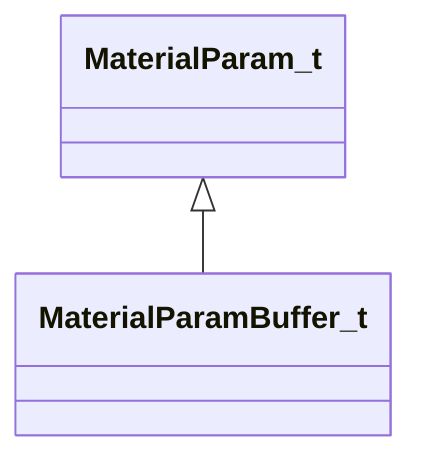
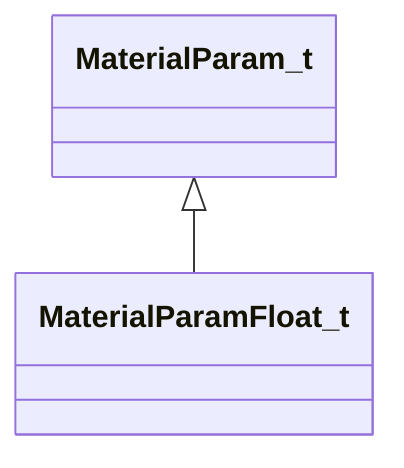
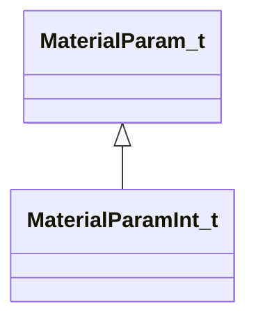
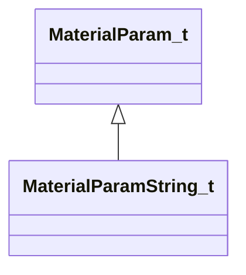
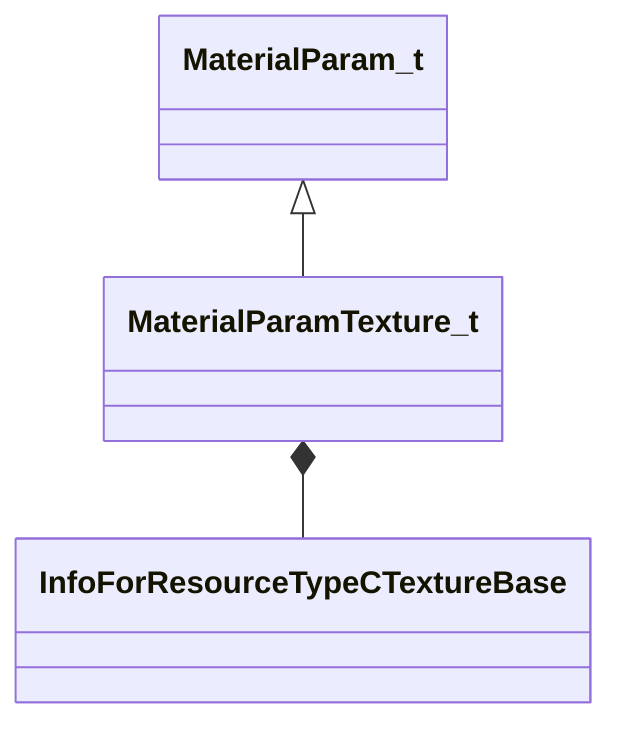
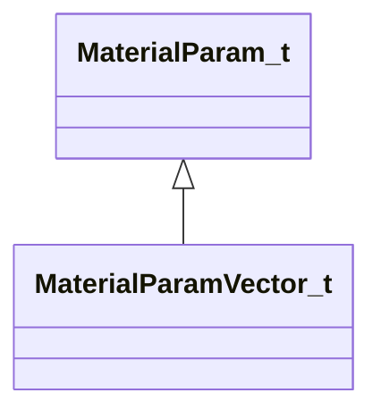
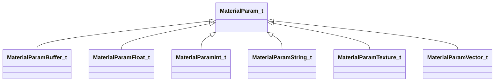
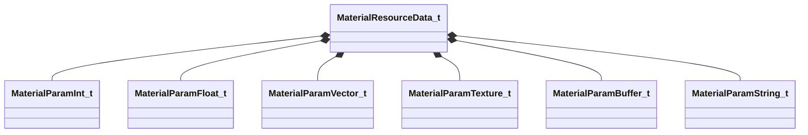
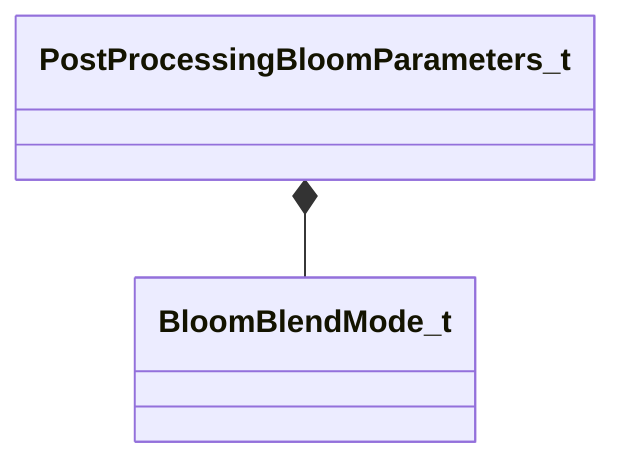
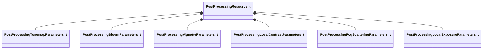

# Module: materialsystem2

[📊 View UML Diagram](../diagrams/materialsystem2.md)

| Name | Kind | Bases | Fields |
|------|------|-------|--------|
| [MaterialParamBuffer_t](#materialparambuffer_t) | class | MaterialParam_t | 1 |
| [MaterialParamFloat_t](#materialparamfloat_t) | class | MaterialParam_t | 1 |
| [MaterialParamInt_t](#materialparamint_t) | class | MaterialParam_t | 1 |
| [MaterialParamString_t](#materialparamstring_t) | class | MaterialParam_t | 1 |
| [MaterialParamTexture_t](#materialparamtexture_t) | class | MaterialParam_t | 1 |
| [MaterialParamVector_t](#materialparamvector_t) | class | MaterialParam_t | 1 |
| [MaterialParam_t](#materialparam_t) | class |  | 1 |
| [MaterialResourceData_t](#materialresourcedata_t) | class |  | 14 |
| [PostProcessingBloomParameters_t](#postprocessingbloomparameters_t) | class |  | 16 |
| [PostProcessingFogScatteringParameters_t](#postprocessingfogscatteringparameters_t) | class |  | 8 |
| [PostProcessingLocalContrastParameters_t](#postprocessinglocalcontrastparameters_t) | class |  | 5 |
| [PostProcessingLocalExposureParameters_t](#postprocessinglocalexposureparameters_t) | class |  | 4 |
| [PostProcessingResource_t](#postprocessingresource_t) | class |  | 15 |
| [PostProcessingTonemapParameters_t](#postprocessingtonemapparameters_t) | class |  | 15 |
| [PostProcessingVignetteParameters_t](#postprocessingvignetteparameters_t) | class |  | 6 |

---

### MaterialParamBuffer_t

**Inherits from:** [MaterialParam_t](materialsystem2.md#materialparam_t)

**Metadata:** `MGetKV3ClassDefaults`

**Relationships:**

```mermaid
classDiagram
    MaterialParam_t <|-- MaterialParamBuffer_t
```

**Fields:**

| Name | Type | Annotations |
|------|------|-------------|
| `m_value` | CUtlBinaryBlock |  |

### MaterialParamFloat_t

**Inherits from:** [MaterialParam_t](materialsystem2.md#materialparam_t)

**Metadata:** `MGetKV3ClassDefaults`

**Relationships:**

```mermaid
classDiagram
    MaterialParam_t <|-- MaterialParamFloat_t
```

**Fields:**

| Name | Type | Annotations |
|------|------|-------------|
| `m_flValue` | float32 |  |

### MaterialParamInt_t

**Inherits from:** [MaterialParam_t](materialsystem2.md#materialparam_t)

**Metadata:** `MGetKV3ClassDefaults`

**Relationships:**

```mermaid
classDiagram
    MaterialParam_t <|-- MaterialParamInt_t
```

**Fields:**

| Name | Type | Annotations |
|------|------|-------------|
| `m_nValue` | int32 |  |

### MaterialParamString_t

**Inherits from:** [MaterialParam_t](materialsystem2.md#materialparam_t)

**Metadata:** `MGetKV3ClassDefaults`

**Relationships:**

```mermaid
classDiagram
    MaterialParam_t <|-- MaterialParamString_t
```

**Fields:**

| Name | Type | Annotations |
|------|------|-------------|
| `m_value` | CUtlString |  |

### MaterialParamTexture_t

**Inherits from:** [MaterialParam_t](materialsystem2.md#materialparam_t)

**Metadata:** `MGetKV3ClassDefaults`

**Relationships:**

```mermaid
classDiagram
    MaterialParam_t <|-- MaterialParamTexture_t
    MaterialParamTexture_t *-- InfoForResourceTypeCTextureBase
```

**Fields:**

| Name | Type | Annotations |
|------|------|-------------|
| `m_pValue` | CStrongHandle< [InfoForResourceTypeCTextureBase](../schemas/resourcesystem.md#infoforresourcetypectexturebase) > |  |

### MaterialParamVector_t

**Inherits from:** [MaterialParam_t](materialsystem2.md#materialparam_t)

**Metadata:** `MGetKV3ClassDefaults`

**Relationships:**

```mermaid
classDiagram
    MaterialParam_t <|-- MaterialParamVector_t
```

**Fields:**

| Name | Type | Annotations |
|------|------|-------------|
| `m_value` | Vector4D |  |

### MaterialParam_t

**Derived by:** [MaterialParamBuffer_t](materialsystem2.md#materialparambuffer_t), [MaterialParamFloat_t](materialsystem2.md#materialparamfloat_t), [MaterialParamInt_t](materialsystem2.md#materialparamint_t), [MaterialParamString_t](materialsystem2.md#materialparamstring_t), [MaterialParamTexture_t](materialsystem2.md#materialparamtexture_t), [MaterialParamVector_t](materialsystem2.md#materialparamvector_t)

**Metadata:** `MGetKV3ClassDefaults`

**Relationships:**

```mermaid
classDiagram
    MaterialParam_t <|-- MaterialParamBuffer_t
    MaterialParam_t <|-- MaterialParamFloat_t
    MaterialParam_t <|-- MaterialParamInt_t
    MaterialParam_t <|-- MaterialParamString_t
    MaterialParam_t <|-- MaterialParamTexture_t
    MaterialParam_t <|-- MaterialParamVector_t
```

**Fields:**

| Name | Type | Annotations |
|------|------|-------------|
| `m_name` | CUtlString |  |

### MaterialResourceData_t

**Metadata:** `MGetKV3ClassDefaults`

**Relationships:**

```mermaid
classDiagram
    MaterialResourceData_t *-- MaterialParamInt_t
    MaterialResourceData_t *-- MaterialParamFloat_t
    MaterialResourceData_t *-- MaterialParamVector_t
    MaterialResourceData_t *-- MaterialParamTexture_t
    MaterialResourceData_t *-- MaterialParamBuffer_t
    MaterialResourceData_t *-- MaterialParamString_t
```

**Fields:**

| Name | Type | Annotations |
|------|------|-------------|
| `m_materialName` | CUtlString |  |
| `m_shaderName` | CUtlString |  |
| `m_intParams` | CUtlVector< [MaterialParamInt_t](../schemas/materialsystem2.md#materialparamint_t) > |  |
| `m_floatParams` | CUtlVector< [MaterialParamFloat_t](../schemas/materialsystem2.md#materialparamfloat_t) > |  |
| `m_vectorParams` | CUtlVector< [MaterialParamVector_t](../schemas/materialsystem2.md#materialparamvector_t) > |  |
| `m_textureParams` | CUtlVector< [MaterialParamTexture_t](../schemas/materialsystem2.md#materialparamtexture_t) > |  |
| `m_dynamicParams` | CUtlVector< [MaterialParamBuffer_t](../schemas/materialsystem2.md#materialparambuffer_t) > |  |
| `m_dynamicTextureParams` | CUtlVector< [MaterialParamBuffer_t](../schemas/materialsystem2.md#materialparambuffer_t) > |  |
| `m_intAttributes` | CUtlVector< [MaterialParamInt_t](../schemas/materialsystem2.md#materialparamint_t) > |  |
| `m_floatAttributes` | CUtlVector< [MaterialParamFloat_t](../schemas/materialsystem2.md#materialparamfloat_t) > |  |
| `m_vectorAttributes` | CUtlVector< [MaterialParamVector_t](../schemas/materialsystem2.md#materialparamvector_t) > |  |
| `m_textureAttributes` | CUtlVector< [MaterialParamTexture_t](../schemas/materialsystem2.md#materialparamtexture_t) > |  |
| `m_stringAttributes` | CUtlVector< [MaterialParamString_t](../schemas/materialsystem2.md#materialparamstring_t) > |  |
| `m_renderAttributesUsed` | CUtlVector< CUtlString > |  |

### PostProcessingBloomParameters_t

**Metadata:** `MGetKV3ClassDefaults`

**Relationships:**

```mermaid
classDiagram
    PostProcessingBloomParameters_t *-- BloomBlendMode_t
```

**Fields:**

| Name | Type | Annotations |
|------|------|-------------|
| `m_blendMode` | [BloomBlendMode_t](../schemas/!GlobalTypes.md#bloomblendmode_t) |  |
| `m_flBloomStrength` | float32 |  |
| `m_flScreenBloomStrength` | float32 |  |
| `m_flBlurBloomStrength` | float32 |  |
| `m_flBloomThreshold` | float32 |  |
| `m_flBloomThresholdWidth` | float32 |  |
| `m_flSkyboxBloomStrength` | float32 |  |
| `m_flBloomStartValue` | float32 |  |
| `m_flComputeBloomStrength` | float32 |  |
| `m_flComputeBloomThreshold` | float32 |  |
| `m_flComputeBloomRadius` | float32 |  |
| `m_flComputeBloomEffectsScale` | float32 |  |
| `m_flComputeBloomLensDirtStrength` | float32 |  |
| `m_flComputeBloomLensDirtBlackLevel` | float32 |  |
| `m_flBlurWeight` | float32[5] |  |
| `m_vBlurTint` | Vector[5] |  |

### PostProcessingFogScatteringParameters_t

**Metadata:** `MGetKV3ClassDefaults`

**Fields:**

| Name | Type | Annotations |
|------|------|-------------|
| `m_fRadius` | float32 |  |
| `m_fScale` | float32 |  |
| `m_fCubemapScale` | float32 |  |
| `m_fVolumetricScale` | float32 |  |
| `m_fGradientScale` | float32 |  |
| `m_fWaterScale` | float32 |  |
| `m_fWaterDensity` | float32 |  |
| `m_fWaterDepthBlurRadius` | float32 |  |

### PostProcessingLocalContrastParameters_t

**Metadata:** `MGetKV3ClassDefaults`

**Fields:**

| Name | Type | Annotations |
|------|------|-------------|
| `m_flLocalContrastStrength` | float32 |  |
| `m_flLocalContrastEdgeStrength` | float32 |  |
| `m_flLocalContrastVignetteStart` | float32 |  |
| `m_flLocalContrastVignetteEnd` | float32 |  |
| `m_flLocalContrastVignetteBlur` | float32 |  |

### PostProcessingLocalExposureParameters_t

**Metadata:** `MGetKV3ClassDefaults`

**Fields:**

| Name | Type | Annotations |
|------|------|-------------|
| `m_fShadowOffsetEV` | float32 |  |
| `m_fHighlightOffsetEV` | float32 |  |
| `m_fSigma` | float32 |  |
| `m_fBoostLocalContrast` | float32 |  |

### PostProcessingResource_t

**Metadata:** `MGetKV3ClassDefaults`

**Relationships:**

```mermaid
classDiagram
    PostProcessingResource_t *-- PostProcessingTonemapParameters_t
    PostProcessingResource_t *-- PostProcessingBloomParameters_t
    PostProcessingResource_t *-- PostProcessingVignetteParameters_t
    PostProcessingResource_t *-- PostProcessingLocalContrastParameters_t
    PostProcessingResource_t *-- PostProcessingFogScatteringParameters_t
    PostProcessingResource_t *-- PostProcessingLocalExposureParameters_t
```

**Fields:**

| Name | Type | Annotations |
|------|------|-------------|
| `m_bHasTonemapParams` | bool |  |
| `m_toneMapParams` | [PostProcessingTonemapParameters_t](../schemas/materialsystem2.md#postprocessingtonemapparameters_t) |  |
| `m_bHasBloomParams` | bool |  |
| `m_bloomParams` | [PostProcessingBloomParameters_t](../schemas/materialsystem2.md#postprocessingbloomparameters_t) |  |
| `m_bHasVignetteParams` | bool |  |
| `m_vignetteParams` | [PostProcessingVignetteParameters_t](../schemas/materialsystem2.md#postprocessingvignetteparameters_t) |  |
| `m_bHasLocalContrastParams` | bool |  |
| `m_localConstrastParams` | [PostProcessingLocalContrastParameters_t](../schemas/materialsystem2.md#postprocessinglocalcontrastparameters_t) |  |
| `m_nColorCorrectionVolumeDim` | int32 |  |
| `m_colorCorrectionVolumeData` | CUtlBinaryBlock |  |
| `m_bHasColorCorrection` | bool |  |
| `m_bHasFogScatteringParams` | bool |  |
| `m_fogScatteringParams` | [PostProcessingFogScatteringParameters_t](../schemas/materialsystem2.md#postprocessingfogscatteringparameters_t) |  |
| `m_bHasLocalExposureParams` | bool |  |
| `m_localExposureParams` | [PostProcessingLocalExposureParameters_t](../schemas/materialsystem2.md#postprocessinglocalexposureparameters_t) |  |

### PostProcessingTonemapParameters_t

**Metadata:** `MGetKV3ClassDefaults`

**Fields:**

| Name | Type | Annotations |
|------|------|-------------|
| `m_flExposureBias` | float32 |  |
| `m_flShoulderStrength` | float32 |  |
| `m_flLinearStrength` | float32 |  |
| `m_flLinearAngle` | float32 |  |
| `m_flToeStrength` | float32 |  |
| `m_flToeNum` | float32 |  |
| `m_flToeDenom` | float32 |  |
| `m_flWhitePoint` | float32 |  |
| `m_flLuminanceSource` | float32 |  |
| `m_flExposureBiasShadows` | float32 |  |
| `m_flExposureBiasHighlights` | float32 |  |
| `m_flMinShadowLum` | float32 |  |
| `m_flMaxShadowLum` | float32 |  |
| `m_flMinHighlightLum` | float32 |  |
| `m_flMaxHighlightLum` | float32 |  |

### PostProcessingVignetteParameters_t

**Metadata:** `MGetKV3ClassDefaults`

**Fields:**

| Name | Type | Annotations |
|------|------|-------------|
| `m_flVignetteStrength` | float32 |  |
| `m_vCenter` | Vector2D |  |
| `m_flRadius` | float32 |  |
| `m_flRoundness` | float32 |  |
| `m_flFeather` | float32 |  |
| `m_vColorTint` | Vector |  |
