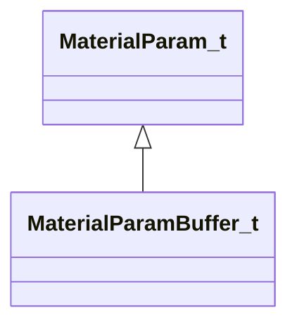

[Schemas](../../schemas.md) / [materialsystem2](../materialsystem2.md) / MaterialParamBuffer_t

# MaterialParamBuffer_t

**Kind:** class · **Size:** 24 bytes (`0x18`) · **Align:** 8 · **Module:** materialsystem2

**Inherits from:** [MaterialParam_t](../materialsystem2/MaterialParam_t.md)

**Relationships:**

## Memory layout

2 fields (1 declared here, 1 inherited). Offsets are absolute from the object base.

| Offset | Field | Type | From | Annotations |
|--------|-------|------|------|-------------|
| `0x0` | `m_name` | CUtlString | [MaterialParam_t](../materialsystem2/MaterialParam_t.md) |  |
| `0x8` | `m_value` | CUtlBinaryBlock |  |  |

KV3 class defaults

<pre>{
	&quot;m_name&quot;: &quot;&quot;,
	&quot;m_value&quot;: &quot;[BINARY BLOB]&quot;
}</pre>

