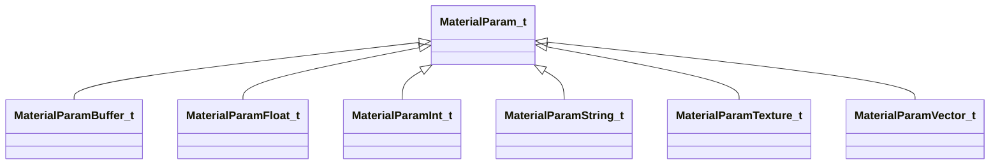

[Schemas](../../schemas.md) / [materialsystem2](../materialsystem2.md) / MaterialParam_t

# MaterialParam_t

> Source: **Build 25000182** · 2026-08-28 · `windows-x86_64` · schema `0.10.0`

**Kind:** class · **Size:** 8 bytes (`0x8`) · **Align:** 8 · **Module:** materialsystem2

**Derived by:** [MaterialParamBuffer_t](../materialsystem2/MaterialParamBuffer_t.md), [MaterialParamFloat_t](../materialsystem2/MaterialParamFloat_t.md), [MaterialParamInt_t](../materialsystem2/MaterialParamInt_t.md), [MaterialParamString_t](../materialsystem2/MaterialParamString_t.md), [MaterialParamTexture_t](../materialsystem2/MaterialParamTexture_t.md), [MaterialParamVector_t](../materialsystem2/MaterialParamVector_t.md)

**Relationships:**

## Memory layout

1 field (1 declared here, 0 inherited). Offsets are absolute from the object base.

| Offset | Field | Type | From | Annotations |
|--------|-------|------|------|-------------|
| `0x0` | `m_name` | CUtlString |  |  |

KV3 class defaults

<pre>{
	&quot;m_name&quot;: &quot;&quot;
}</pre>

