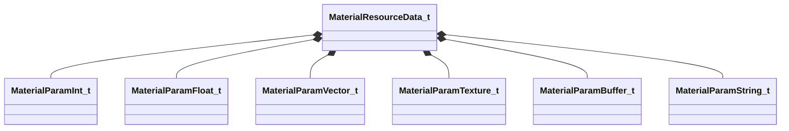

[Schemas](../../schemas.md) / [materialsystem2](../materialsystem2.md) / MaterialResourceData_t

# MaterialResourceData_t

**Kind:** class · **Size:** 304 bytes (`0x130`) · **Align:** 8 · **Module:** materialsystem2

**Relationships:**

## Memory layout

14 fields (14 declared here, 0 inherited). Offsets are absolute from the object base.

| Offset | Field | Type | From | Annotations |
|--------|-------|------|------|-------------|
| `0x0` | `m_materialName` | CUtlString |  |  |
| `0x8` | `m_shaderName` | CUtlString |  |  |
| `0x10` | `m_intParams` | CUtlVector< [MaterialParamInt_t](../materialsystem2/MaterialParamInt_t.md) > |  |  |
| `0x28` | `m_floatParams` | CUtlVector< [MaterialParamFloat_t](../materialsystem2/MaterialParamFloat_t.md) > |  |  |
| `0x40` | `m_vectorParams` | CUtlVector< [MaterialParamVector_t](../materialsystem2/MaterialParamVector_t.md) > |  |  |
| `0x58` | `m_textureParams` | CUtlVector< [MaterialParamTexture_t](../materialsystem2/MaterialParamTexture_t.md) > |  |  |
| `0x70` | `m_dynamicParams` | CUtlVector< [MaterialParamBuffer_t](../materialsystem2/MaterialParamBuffer_t.md) > |  |  |
| `0x88` | `m_dynamicTextureParams` | CUtlVector< [MaterialParamBuffer_t](../materialsystem2/MaterialParamBuffer_t.md) > |  |  |
| `0xa0` | `m_intAttributes` | CUtlVector< [MaterialParamInt_t](../materialsystem2/MaterialParamInt_t.md) > |  |  |
| `0xb8` | `m_floatAttributes` | CUtlVector< [MaterialParamFloat_t](../materialsystem2/MaterialParamFloat_t.md) > |  |  |
| `0xd0` | `m_vectorAttributes` | CUtlVector< [MaterialParamVector_t](../materialsystem2/MaterialParamVector_t.md) > |  |  |
| `0xe8` | `m_textureAttributes` | CUtlVector< [MaterialParamTexture_t](../materialsystem2/MaterialParamTexture_t.md) > |  |  |
| `0x100` | `m_stringAttributes` | CUtlVector< [MaterialParamString_t](../materialsystem2/MaterialParamString_t.md) > |  |  |
| `0x118` | `m_renderAttributesUsed` | CUtlVector< CUtlString > |  |  |

KV3 class defaults

<pre>{
	&quot;m_materialName&quot;: &quot;&quot;,
	&quot;m_shaderName&quot;: &quot;&quot;,
	&quot;m_intParams&quot;:
	[
	],
	&quot;m_floatParams&quot;:
	[
	],
	&quot;m_vectorParams&quot;:
	[
	],
	&quot;m_textureParams&quot;:
	[
	],
	&quot;m_dynamicParams&quot;:
	[
	],
	&quot;m_dynamicTextureParams&quot;:
	[
	],
	&quot;m_intAttributes&quot;:
	[
	],
	&quot;m_floatAttributes&quot;:
	[
	],
	&quot;m_vectorAttributes&quot;:
	[
	],
	&quot;m_textureAttributes&quot;:
	[
	],
	&quot;m_stringAttributes&quot;:
	[
	],
	&quot;m_renderAttributesUsed&quot;:
	[
	]
}</pre>

