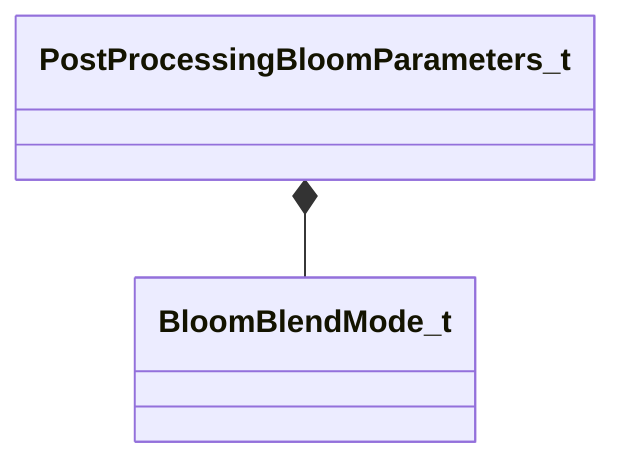

[Schemas](../../schemas.md) / [materialsystem2](../materialsystem2.md) / PostProcessingBloomParameters_t

# PostProcessingBloomParameters_t

**Kind:** class · **Size:** 136 bytes (`0x88`) · **Align:** 4 · **Module:** materialsystem2

**Relationships:**

## Memory layout

16 fields (16 declared here, 0 inherited). Offsets are absolute from the object base.

| Offset | Field | Type | From | Annotations |
|--------|-------|------|------|-------------|
| `0x0` | `m_blendMode` | [BloomBlendMode_t](../materialsystem2/BloomBlendMode_t.md) |  |  |
| `0x4` | `m_flBloomStrength` | float32 |  |  |
| `0x8` | `m_flScreenBloomStrength` | float32 |  |  |
| `0xc` | `m_flBlurBloomStrength` | float32 |  |  |
| `0x10` | `m_flBloomThreshold` | float32 |  |  |
| `0x14` | `m_flBloomThresholdWidth` | float32 |  |  |
| `0x18` | `m_flSkyboxBloomStrength` | float32 |  |  |
| `0x1c` | `m_flBloomStartValue` | float32 |  |  |
| `0x20` | `m_flComputeBloomStrength` | float32 |  |  |
| `0x24` | `m_flComputeBloomThreshold` | float32 |  |  |
| `0x28` | `m_flComputeBloomRadius` | float32 |  |  |
| `0x2c` | `m_flComputeBloomEffectsScale` | float32 |  |  |
| `0x30` | `m_flComputeBloomLensDirtStrength` | float32 |  |  |
| `0x34` | `m_flComputeBloomLensDirtBlackLevel` | float32 |  |  |
| `0x38` | `m_flBlurWeight` | float32[5] |  |  |
| `0x4c` | `m_vBlurTint` | Vector[5] |  |  |

KV3 class defaults

<pre>{
	&quot;m_blendMode&quot;: &quot;BLOOM_BLEND_ADD&quot;,
	&quot;m_flBloomStrength&quot;: 2.000000,
	&quot;m_flScreenBloomStrength&quot;: 1.000000,
	&quot;m_flBlurBloomStrength&quot;: 1.000000,
	&quot;m_flBloomThreshold&quot;: 0.000000,
	&quot;m_flBloomThresholdWidth&quot;: 1.000000,
	&quot;m_flSkyboxBloomStrength&quot;: 1.000000,
	&quot;m_flBloomStartValue&quot;: 1.000000,
	&quot;m_flComputeBloomStrength&quot;: 0.030000,
	&quot;m_flComputeBloomThreshold&quot;: 1.000000,
	&quot;m_flComputeBloomRadius&quot;: 0.600000,
	&quot;m_flComputeBloomEffectsScale&quot;: 1.000000,
	&quot;m_flComputeBloomLensDirtStrength&quot;: 0.000000,
	&quot;m_flComputeBloomLensDirtBlackLevel&quot;: 0.100000,
	&quot;m_flBlurWeight&quot;:
	[
		0.200000,
		0.200000,
		0.200000,
		0.200000,
		0.200000
	],
	&quot;m_vBlurTint&quot;:
	[
		[
			1.000000,
			1.000000,
			1.000000
		],
		[
			1.000000,
			1.000000,
			1.000000
		],
		[
			1.000000,
			1.000000,
			1.000000
		],
		[
			1.000000,
			1.000000,
			1.000000
		],
		[
			1.000000,
			1.000000,
			1.000000
		]
	]
}</pre>

