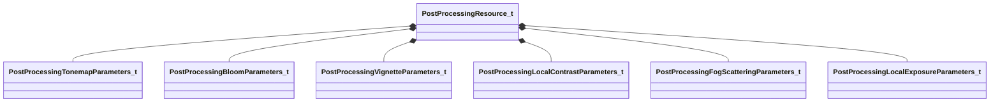

[Schemas](../../schemas.md) / [materialsystem2](../materialsystem2.md) / PostProcessingResource_t

# PostProcessingResource_t

**Kind:** class · **Size:** 344 bytes (`0x158`) · **Align:** 8 · **Module:** materialsystem2

**Relationships:**

## Memory layout

15 fields (15 declared here, 0 inherited). Offsets are absolute from the object base.

| Offset | Field | Type | From | Annotations |
|--------|-------|------|------|-------------|
| `0x0` | `m_bHasTonemapParams` | bool |  |  |
| `0x4` | `m_toneMapParams` | [PostProcessingTonemapParameters_t](../materialsystem2/PostProcessingTonemapParameters_t.md) |  |  |
| `0x40` | `m_bHasBloomParams` | bool |  |  |
| `0x44` | `m_bloomParams` | [PostProcessingBloomParameters_t](../materialsystem2/PostProcessingBloomParameters_t.md) |  |  |
| `0xcc` | `m_bHasVignetteParams` | bool |  |  |
| `0xd0` | `m_vignetteParams` | [PostProcessingVignetteParameters_t](../materialsystem2/PostProcessingVignetteParameters_t.md) |  |  |
| `0xf4` | `m_bHasLocalContrastParams` | bool |  |  |
| `0xf8` | `m_localConstrastParams` | [PostProcessingLocalContrastParameters_t](../materialsystem2/PostProcessingLocalContrastParameters_t.md) |  |  |
| `0x10c` | `m_nColorCorrectionVolumeDim` | int32 |  |  |
| `0x110` | `m_colorCorrectionVolumeData` | CUtlBinaryBlock |  |  |
| `0x120` | `m_bHasColorCorrection` | bool |  |  |
| `0x121` | `m_bHasFogScatteringParams` | bool |  |  |
| `0x124` | `m_fogScatteringParams` | [PostProcessingFogScatteringParameters_t](../materialsystem2/PostProcessingFogScatteringParameters_t.md) |  |  |
| `0x144` | `m_bHasLocalExposureParams` | bool |  |  |
| `0x148` | `m_localExposureParams` | [PostProcessingLocalExposureParameters_t](../materialsystem2/PostProcessingLocalExposureParameters_t.md) |  |  |

KV3 class defaults

<pre>{
	&quot;m_bHasTonemapParams&quot;: false,
	&quot;m_toneMapParams&quot;:
	{
		&quot;m_flExposureBias&quot;: 0.000000,
		&quot;m_flShoulderStrength&quot;: 0.000000,
		&quot;m_flLinearStrength&quot;: 0.000000,
		&quot;m_flLinearAngle&quot;: 0.000000,
		&quot;m_flToeStrength&quot;: 0.000000,
		&quot;m_flToeNum&quot;: 0.000000,
		&quot;m_flToeDenom&quot;: 0.000000,
		&quot;m_flWhitePoint&quot;: 0.000000,
		&quot;m_flLuminanceSource&quot;: 0.000000,
		&quot;m_flExposureBiasShadows&quot;: 0.000000,
		&quot;m_flExposureBiasHighlights&quot;: 0.000000,
		&quot;m_flMinShadowLum&quot;: 0.000000,
		&quot;m_flMaxShadowLum&quot;: 0.000000,
		&quot;m_flMinHighlightLum&quot;: 0.000000,
		&quot;m_flMaxHighlightLum&quot;: 0.000000
	},
	&quot;m_bHasBloomParams&quot;: false,
	&quot;m_bloomParams&quot;:
	{
		&quot;m_blendMode&quot;: &quot;BLOOM_BLEND_ADD&quot;,
		&quot;m_flBloomStrength&quot;: 2.000000,
		&quot;m_flScreenBloomStrength&quot;: 1.000000,
		&quot;m_flBlurBloomStrength&quot;: 1.000000,
		&quot;m_flBloomThreshold&quot;: 0.000000,
		&quot;m_flBloomThresholdWidth&quot;: 1.000000,
		&quot;m_flSkyboxBloomStrength&quot;: 1.000000,
		&quot;m_flBloomStartValue&quot;: 1.000000,
		&quot;m_flComputeBloomStrength&quot;: 0.030000,
		&quot;m_flComputeBloomThreshold&quot;: 1.000000,
		&quot;m_flComputeBloomRadius&quot;: 0.600000,
		&quot;m_flComputeBloomEffectsScale&quot;: 1.000000,
		&quot;m_flComputeBloomLensDirtStrength&quot;: 0.000000,
		&quot;m_flComputeBloomLensDirtBlackLevel&quot;: 0.100000,
		&quot;m_flBlurWeight&quot;:
		[
			0.200000,
			0.200000,
			0.200000,
			0.200000,
			0.200000
		],
		&quot;m_vBlurTint&quot;:
		[
			[
				1.000000,
				1.000000,
				1.000000
			],
			[
				1.000000,
				1.000000,
				1.000000
			],
			[
				1.000000,
				1.000000,
				1.000000
			],
			[
				1.000000,
				1.000000,
				1.000000
			],
			[
				1.000000,
				1.000000,
				1.000000
			]
		]
	},
	&quot;m_bHasVignetteParams&quot;: false,
	&quot;m_vignetteParams&quot;:
	{
		&quot;m_flVignetteStrength&quot;: 0.000000,
		&quot;m_vCenter&quot;:
		[
			0.000000,
			0.000000
		],
		&quot;m_flRadius&quot;: 0.500000,
		&quot;m_flRoundness&quot;: 1.000000,
		&quot;m_flFeather&quot;: 0.500000,
		&quot;m_vColorTint&quot;:
		[
			1.000000,
			1.000000,
			1.000000
		]
	},
	&quot;m_bHasLocalContrastParams&quot;: false,
	&quot;m_localConstrastParams&quot;:
	{
		&quot;m_flLocalContrastStrength&quot;: 0.000000,
		&quot;m_flLocalContrastEdgeStrength&quot;: 0.000000,
		&quot;m_flLocalContrastVignetteStart&quot;: 0.000000,
		&quot;m_flLocalContrastVignetteEnd&quot;: 0.000000,
		&quot;m_flLocalContrastVignetteBlur&quot;: 0.000000
	},
	&quot;m_nColorCorrectionVolumeDim&quot;: 0,
	&quot;m_colorCorrectionVolumeData&quot;: &quot;[BINARY BLOB]&quot;,
	&quot;m_bHasColorCorrection&quot;: true,
	&quot;m_bHasFogScatteringParams&quot;: false,
	&quot;m_fogScatteringParams&quot;:
	{
		&quot;m_fRadius&quot;: 0.750000,
		&quot;m_fScale&quot;: 0.000000,
		&quot;m_fCubemapScale&quot;: 1.000000,
		&quot;m_fVolumetricScale&quot;: 1.000000,
		&quot;m_fGradientScale&quot;: 1.000000,
		&quot;m_fWaterScale&quot;: 0.000000,
		&quot;m_fWaterDensity&quot;: 0.000000,
		&quot;m_fWaterDepthBlurRadius&quot;: 0.000000
	},
	&quot;m_bHasLocalExposureParams&quot;: false,
	&quot;m_localExposureParams&quot;:
	{
		&quot;m_fShadowOffsetEV&quot;: 0.000000,
		&quot;m_fHighlightOffsetEV&quot;: 0.000000,
		&quot;m_fSigma&quot;: 0.500000,
		&quot;m_fBoostLocalContrast&quot;: 0.000000
	}
}</pre>

