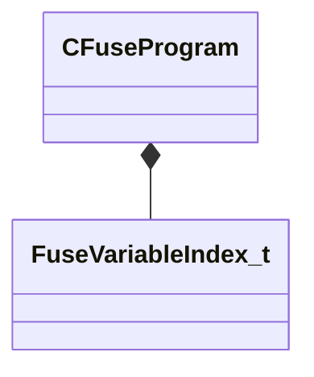
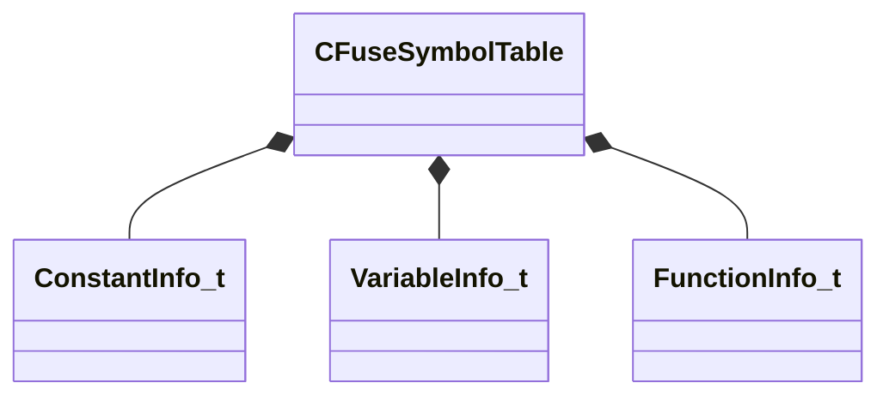
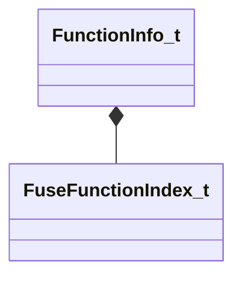
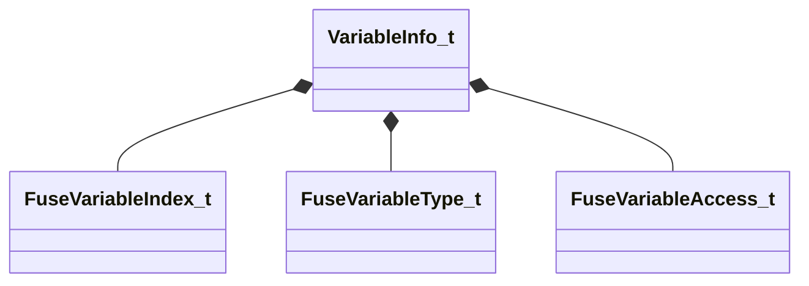

# Module: mathlib_extended

[📊 View UML Diagram](../diagrams/mathlib_extended.md)

| Name | Kind | Bases | Fields |
|------|------|-------|--------|
| [AABB_t](#aabb_t) | class |  | 2 |
| [CFuseProgram](#cfuseprogram) | class |  | 4 |
| [CFuseSymbolTable](#cfusesymboltable) | class |  | 6 |
| [ConstantInfo_t](#constantinfo_t) | class |  | 3 |
| [FourQuaternions](#fourquaternions) | class |  | 4 |
| [FunctionInfo_t](#functioninfo_t) | class |  | 5 |
| [FuseFunctionIndex_t](#fusefunctionindex_t) | class |  | 1 |
| [FuseVariableAccess_t](#fusevariableaccess_t) | enum |  | 2 |
| [FuseVariableIndex_t](#fusevariableindex_t) | class |  | 1 |
| [FuseVariableType_t](#fusevariabletype_t) | enum |  | 9 |
| [PackedAABB_t](#packedaabb_t) | class |  | 2 |
| [VariableInfo_t](#variableinfo_t) | class |  | 6 |

---

### AABB_t

**Fields:**

| Name | Type | Annotations |
|------|------|-------------|
| `m_vMinBounds` | Vector |  |
| `m_vMaxBounds` | Vector |  |

### CFuseProgram

**Metadata:** `MGetKV3ClassDefaults {
	"m_programBuffer":
	[
	],
	"m_variablesRead":
	[
	],
	"m_variablesWritten":
	[
	],
	"m_nMaxTempVarsUsed": 0
}`

**Relationships:**

**Fields:**

| Name | Type | Annotations |
|------|------|-------------|
| `m_programBuffer` | CUtlVector<uint8> |  |
| `m_variablesRead` | CUtlVector<[FuseVariableIndex_t](../schemas/mathlib_extended.md#fusevariableindex_t)> |  |
| `m_variablesWritten` | CUtlVector<[FuseVariableIndex_t](../schemas/mathlib_extended.md#fusevariableindex_t)> |  |
| `m_nMaxTempVarsUsed` | int32 |  |

### CFuseSymbolTable

**Metadata:** `MGetKV3ClassDefaults {
	"m_constants":
	[
	],
	"m_variables":
	[
	],
	"m_functions":
	[
	],
	"m_constantMap":
	{
	},
	"m_variableMap":
	{
	},
	"m_functionMap":
	{
	}
}`

**Relationships:**

**Fields:**

| Name | Type | Annotations |
|------|------|-------------|
| `m_constants` | CUtlVector<[ConstantInfo_t](../schemas/mathlib_extended.md#constantinfo_t)> |  |
| `m_variables` | CUtlVector<[VariableInfo_t](../schemas/mathlib_extended.md#variableinfo_t)> |  |
| `m_functions` | CUtlVector<[FunctionInfo_t](../schemas/mathlib_extended.md#functioninfo_t)> |  |
| `m_constantMap` | CUtlHashtable<CUtlStringToken,int32> |  |
| `m_variableMap` | CUtlHashtable<CUtlStringToken,int32> |  |
| `m_functionMap` | CUtlHashtable<CUtlStringToken,int32> |  |

### ConstantInfo_t

**Metadata:** `MGetKV3ClassDefaults {
	"m_name": "",
	"m_nameToken": "",
	"m_flValue": 0.000000
}`

**Fields:**

| Name | Type | Annotations |
|------|------|-------------|
| `m_name` | CUtlString |  |
| `m_nameToken` | CUtlStringToken |  |
| `m_flValue` | float32 |  |

### FourQuaternions

**Fields:**

| Name | Type | Annotations |
|------|------|-------------|
| `x` | fltx4 |  |
| `y` | fltx4 |  |
| `z` | fltx4 |  |
| `w` | fltx4 |  |

### FunctionInfo_t

**Metadata:** `MGetKV3ClassDefaults {
	"m_name": "",
	"m_nameToken": "",
	"m_nParamCount": 0,
	"m_nIndex": 65535,
	"m_bIsPure": false
}`

**Relationships:**

**Fields:**

| Name | Type | Annotations |
|------|------|-------------|
| `m_name` | CUtlString |  |
| `m_nameToken` | CUtlStringToken |  |
| `m_nParamCount` | int32 |  |
| `m_nIndex` | [FuseFunctionIndex_t](../schemas/mathlib_extended.md#fusefunctionindex_t) |  |
| `m_bIsPure` | bool |  |

### FuseFunctionIndex_t

**Metadata:** `MIsBoxedIntegerType`

**Fields:**

| Name | Type | Annotations |
|------|------|-------------|
| `m_Value` | uint16 |  |

### FuseVariableAccess_t

**Values:**

| Name | Value | Description |
|------|-------|-------------|
| `WRITABLE` | 0 |  |
| `READ_ONLY` | 1 |  |

### FuseVariableIndex_t

**Metadata:** `MIsBoxedIntegerType`

**Fields:**

| Name | Type | Annotations |
|------|------|-------------|
| `m_Value` | uint16 |  |

### FuseVariableType_t

**Values:**

| Name | Value | Description |
|------|-------|-------------|
| `INVALID` | 0 |  |
| `BOOL` | 1 |  |
| `INT8` | 2 |  |
| `INT16` | 3 |  |
| `INT32` | 4 |  |
| `UINT8` | 5 |  |
| `UINT16` | 6 |  |
| `UINT32` | 7 |  |
| `FLOAT32` | 8 |  |

### PackedAABB_t

**Fields:**

| Name | Type | Annotations |
|------|------|-------------|
| `m_nPackedMin` | uint32 |  |
| `m_nPackedMax` | uint32 |  |

### VariableInfo_t

**Metadata:** `MGetKV3ClassDefaults {
	"m_name": "",
	"m_nameToken": "",
	"m_nIndex": 65535,
	"m_nNumComponents": 1,
	"m_eVarType": "INVALID",
	"m_eAccess": "WRITABLE"
}`

**Relationships:**

**Fields:**

| Name | Type | Annotations |
|------|------|-------------|
| `m_name` | CUtlString |  |
| `m_nameToken` | CUtlStringToken |  |
| `m_nIndex` | [FuseVariableIndex_t](../schemas/mathlib_extended.md#fusevariableindex_t) |  |
| `m_nNumComponents` | uint8 |  |
| `m_eVarType` | [FuseVariableType_t](../schemas/mathlib_extended.md#fusevariabletype_t) |  |
| `m_eAccess` | [FuseVariableAccess_t](../schemas/mathlib_extended.md#fusevariableaccess_t) |  |
