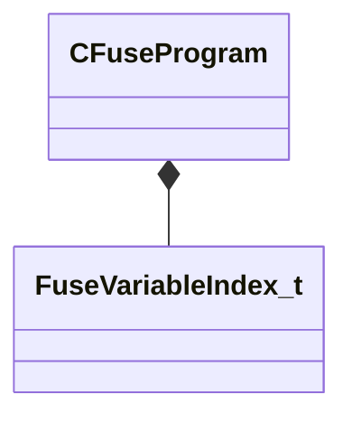
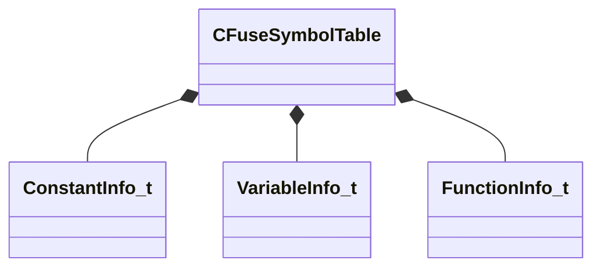
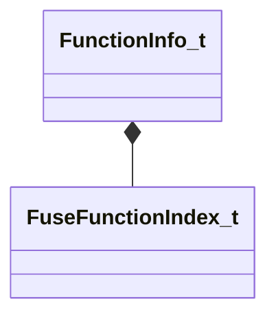
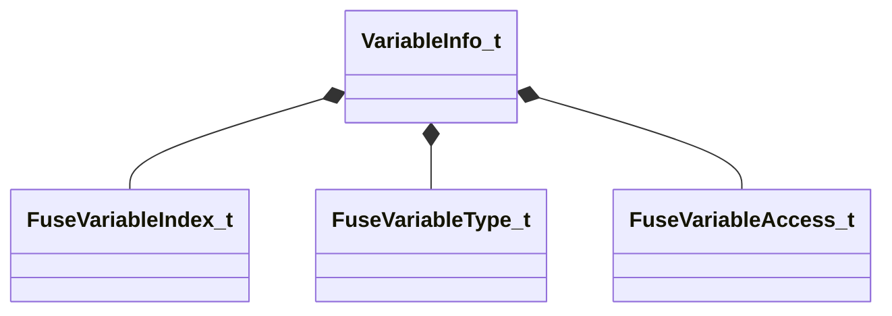

# Module: mathlib_extended

[📊 View UML Diagram](../diagrams/mathlib_extended.md)

| Name | Kind | Bases | Fields |
|------|------|-------|--------|
| [AABBWS_t](#aabbws_t) | class |  | 2 |
| [AABB_t](#aabb_t) | class |  | 2 |
| [CFuseProgram](#cfuseprogram) | class |  | 4 |
| [CFuseSymbolTable](#cfusesymboltable) | class |  | 6 |
| [ConstantInfo_t](#constantinfo_t) | class |  | 3 |
| [FourQuaternions](#fourquaternions) | class |  | 4 |
| [FunctionInfo_t](#functioninfo_t) | class |  | 5 |
| [FuseFunctionIndex_t](#fusefunctionindex_t) | class |  | 1 |
| [FuseVariableIndex_t](#fusevariableindex_t) | class |  | 1 |
| [PackedAABB_t](#packedaabb_t) | class |  | 2 |
| [VariableInfo_t](#variableinfo_t) | class |  | 6 |

---

### AABBWS_t

**Fields:**

| Name | Type | Annotations |
|------|------|-------------|
| `m_vMinBounds` | VectorWS |  |
| `m_vMaxBounds` | VectorWS |  |

### AABB_t

**Fields:**

| Name | Type | Annotations |
|------|------|-------------|
| `m_vMinBounds` | Vector |  |
| `m_vMaxBounds` | Vector |  |

### CFuseProgram

**Metadata:** `MGetKV3ClassDefaults`

**Relationships:**

```mermaid
classDiagram
    CFuseProgram *-- FuseVariableIndex_t
```

**Fields:**

| Name | Type | Annotations |
|------|------|-------------|
| `m_programBuffer` | CUtlVector< uint8 > |  |
| `m_variablesRead` | CUtlVector< [FuseVariableIndex_t](../schemas/mathlib_extended.md#fusevariableindex_t) > |  |
| `m_variablesWritten` | CUtlVector< [FuseVariableIndex_t](../schemas/mathlib_extended.md#fusevariableindex_t) > |  |
| `m_nMaxTempVarsUsed` | int32 |  |

### CFuseSymbolTable

**Metadata:** `MGetKV3ClassDefaults`

**Relationships:**

```mermaid
classDiagram
    CFuseSymbolTable *-- ConstantInfo_t
    CFuseSymbolTable *-- VariableInfo_t
    CFuseSymbolTable *-- FunctionInfo_t
```

**Fields:**

| Name | Type | Annotations |
|------|------|-------------|
| `m_constants` | CUtlVector< [ConstantInfo_t](../schemas/mathlib_extended.md#constantinfo_t) > |  |
| `m_variables` | CUtlVector< [VariableInfo_t](../schemas/mathlib_extended.md#variableinfo_t) > |  |
| `m_functions` | CUtlVector< [FunctionInfo_t](../schemas/mathlib_extended.md#functioninfo_t) > |  |
| `m_constantMap` | CUtlHashtable< CUtlStringToken, int32 > |  |
| `m_variableMap` | CUtlHashtable< CUtlStringToken, int32 > |  |
| `m_functionMap` | CUtlHashtable< CUtlStringToken, int32 > |  |

### ConstantInfo_t

**Metadata:** `MGetKV3ClassDefaults`

**Fields:**

| Name | Type | Annotations |
|------|------|-------------|
| `m_name` | CUtlString |  |
| `m_nameToken` | CUtlStringToken |  |
| `m_flValue` | float32 |  |

### FourQuaternions

**Fields:**

| Name | Type | Annotations |
|------|------|-------------|
| `x` | fltx4 |  |
| `y` | fltx4 |  |
| `z` | fltx4 |  |
| `w` | fltx4 |  |

### FunctionInfo_t

**Metadata:** `MGetKV3ClassDefaults`

**Relationships:**

```mermaid
classDiagram
    FunctionInfo_t *-- FuseFunctionIndex_t
```

**Fields:**

| Name | Type | Annotations |
|------|------|-------------|
| `m_name` | CUtlString |  |
| `m_nameToken` | CUtlStringToken |  |
| `m_nParamCount` | int32 |  |
| `m_nIndex` | [FuseFunctionIndex_t](../schemas/mathlib_extended.md#fusefunctionindex_t) |  |
| `m_bIsPure` | bool |  |

### FuseFunctionIndex_t

**Metadata:** `MIsBoxedIntegerType`

**Fields:**

| Name | Type | Annotations |
|------|------|-------------|
| `m_Value` | uint16 |  |

### FuseVariableIndex_t

**Metadata:** `MIsBoxedIntegerType`

**Fields:**

| Name | Type | Annotations |
|------|------|-------------|
| `m_Value` | uint16 |  |

### PackedAABB_t

**Fields:**

| Name | Type | Annotations |
|------|------|-------------|
| `m_nPackedMin` | uint32 |  |
| `m_nPackedMax` | uint32 |  |

### VariableInfo_t

**Metadata:** `MGetKV3ClassDefaults`

**Relationships:**

```mermaid
classDiagram
    VariableInfo_t *-- FuseVariableIndex_t
    VariableInfo_t *-- FuseVariableType_t
    VariableInfo_t *-- FuseVariableAccess_t
```

**Fields:**

| Name | Type | Annotations |
|------|------|-------------|
| `m_name` | CUtlString |  |
| `m_nameToken` | CUtlStringToken |  |
| `m_nIndex` | [FuseVariableIndex_t](../schemas/mathlib_extended.md#fusevariableindex_t) |  |
| `m_nNumComponents` | uint8 |  |
| `m_eVarType` | [FuseVariableType_t](../schemas/!GlobalTypes.md#fusevariabletype_t) |  |
| `m_eAccess` | [FuseVariableAccess_t](../schemas/!GlobalTypes.md#fusevariableaccess_t) |  |
