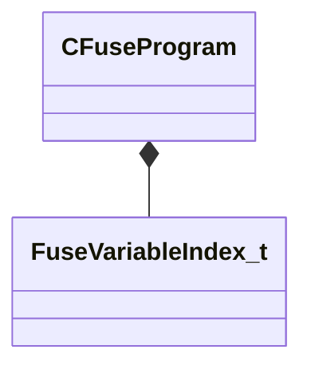

[Schemas](../../schemas.md) / [mathlib_extended](../mathlib_extended.md) / CFuseProgram

# CFuseProgram

> Source: **Build 25000182** · 2026-08-28 · `windows-x86_64` · schema `0.10.0`

**Kind:** class · **Size:** 80 bytes (`0x50`) · **Align:** 8 · **Module:** mathlib_extended

**Relationships:**

## Memory layout

4 fields (4 declared here, 0 inherited). Offsets are absolute from the object base.

| Offset | Field | Type | From | Annotations |
|--------|-------|------|------|-------------|
| `0x0` | `m_programBuffer` | CUtlVector< uint8 > |  |  |
| `0x18` | `m_variablesRead` | CUtlVector< [FuseVariableIndex_t](../mathlib_extended/FuseVariableIndex_t.md) > |  |  |
| `0x30` | `m_variablesWritten` | CUtlVector< [FuseVariableIndex_t](../mathlib_extended/FuseVariableIndex_t.md) > |  |  |
| `0x48` | `m_nMaxTempVarsUsed` | int32 |  |  |

KV3 class defaults

<pre>{
	&quot;m_programBuffer&quot;:
	[
	],
	&quot;m_variablesRead&quot;:
	[
	],
	&quot;m_variablesWritten&quot;:
	[
	],
	&quot;m_nMaxTempVarsUsed&quot;: 0
}</pre>

