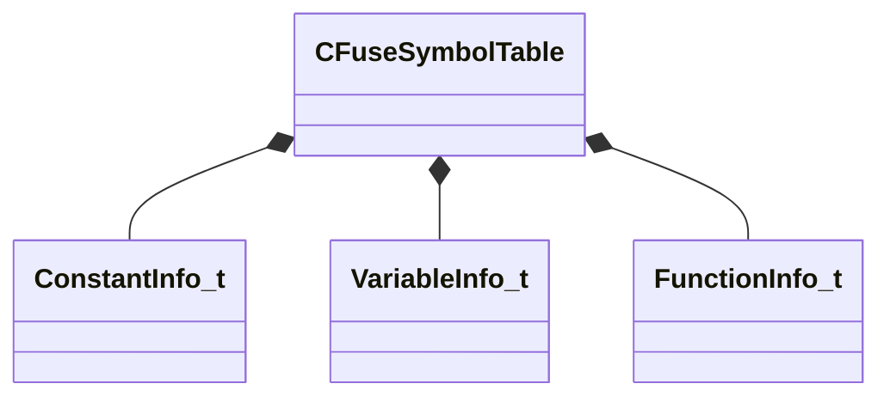

[Schemas](../../schemas.md) / [mathlib_extended](../mathlib_extended.md) / CFuseSymbolTable

# CFuseSymbolTable

> Source: **Build 25000182** · 2026-08-28 · `windows-x86_64` · schema `0.10.0`

**Kind:** class · **Size:** 176 bytes (`0xb0`) · **Align:** 8 · **Module:** mathlib_extended

**Relationships:**

## Memory layout

6 fields (6 declared here, 0 inherited). Offsets are absolute from the object base.

| Offset | Field | Type | From | Annotations |
|--------|-------|------|------|-------------|
| `0x0` | `m_constants` | CUtlVector< [ConstantInfo_t](../mathlib_extended/ConstantInfo_t.md) > |  |  |
| `0x18` | `m_variables` | CUtlVector< [VariableInfo_t](../mathlib_extended/VariableInfo_t.md) > |  |  |
| `0x30` | `m_functions` | CUtlVector< [FunctionInfo_t](../mathlib_extended/FunctionInfo_t.md) > |  |  |
| `0x48` | `m_constantMap` | CUtlHashtable< CUtlStringToken, int32 > |  |  |
| `0x68` | `m_variableMap` | CUtlHashtable< CUtlStringToken, int32 > |  |  |
| `0x88` | `m_functionMap` | CUtlHashtable< CUtlStringToken, int32 > |  |  |

KV3 class defaults

<pre>{
	&quot;m_constants&quot;:
	[
	],
	&quot;m_variables&quot;:
	[
	],
	&quot;m_functions&quot;:
	[
	],
	&quot;m_constantMap&quot;:
	{
	},
	&quot;m_variableMap&quot;:
	{
	},
	&quot;m_functionMap&quot;:
	{
	}
}</pre>

