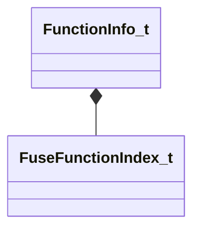

[Schemas](../../schemas.md) / [mathlib_extended](../mathlib_extended.md) / FunctionInfo_t

# FunctionInfo_t

**Kind:** class · **Size:** 32 bytes (`0x20`) · **Align:** 8 · **Module:** mathlib_extended

**Relationships:**

## Memory layout

5 fields (5 declared here, 0 inherited). Offsets are absolute from the object base.

| Offset | Field | Type | From | Annotations |
|--------|-------|------|------|-------------|
| `0x8` | `m_name` | CUtlString |  |  |
| `0x10` | `m_nameToken` | CUtlStringToken |  |  |
| `0x14` | `m_nParamCount` | int32 |  |  |
| `0x18` | `m_nIndex` | [FuseFunctionIndex_t](../mathlib_extended/FuseFunctionIndex_t.md) |  |  |
| `0x1a` | `m_bIsPure` | bool |  |  |

KV3 class defaults

<pre>{
	&quot;m_name&quot;: &quot;&quot;,
	&quot;m_nameToken&quot;: &quot;&quot;,
	&quot;m_nParamCount&quot;: 0,
	&quot;m_nIndex&quot;: 65535,
	&quot;m_bIsPure&quot;: false
}</pre>

