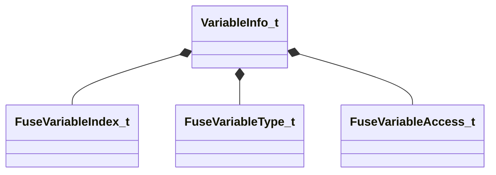

[Schemas](../../schemas.md) / [mathlib_extended](../mathlib_extended.md) / VariableInfo_t

# VariableInfo_t

**Kind:** class · **Size:** 24 bytes (`0x18`) · **Align:** 8 · **Module:** mathlib_extended

**Relationships:**

## Memory layout

6 fields (6 declared here, 0 inherited). Offsets are absolute from the object base.

| Offset | Field | Type | From | Annotations |
|--------|-------|------|------|-------------|
| `0x0` | `m_name` | CUtlString |  |  |
| `0x8` | `m_nameToken` | CUtlStringToken |  |  |
| `0xc` | `m_nIndex` | [FuseVariableIndex_t](../mathlib_extended/FuseVariableIndex_t.md) |  |  |
| `0xe` | `m_nNumComponents` | uint8 |  |  |
| `0xf` | `m_eVarType` | [FuseVariableType_t](../!GlobalTypes/FuseVariableType_t.md) |  |  |
| `0x10` | `m_eAccess` | [FuseVariableAccess_t](../!GlobalTypes/FuseVariableAccess_t.md) |  |  |

KV3 class defaults

<pre>{
	&quot;m_name&quot;: &quot;&quot;,
	&quot;m_nameToken&quot;: &quot;&quot;,
	&quot;m_nIndex&quot;: 65535,
	&quot;m_nNumComponents&quot;: 1,
	&quot;m_eVarType&quot;: &quot;INVALID&quot;,
	&quot;m_eAccess&quot;: &quot;WRITABLE&quot;
}</pre>

