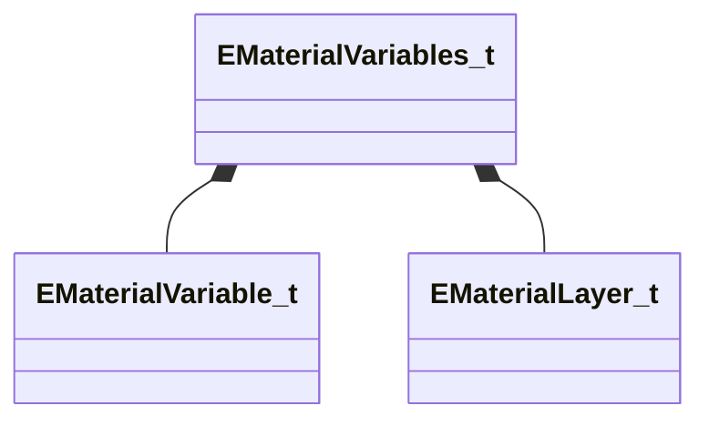

# Module: met

[📊 View UML Diagram](../diagrams/met.md)

| Name | Kind | Bases | Fields |
|------|------|-------|--------|
| [EMaterialLayer_t](#emateriallayer_t) | class |  | 8 |
| [EMaterialVariable_t](#ematerialvariable_t) | class |  | 36 |
| [EMaterialVariables_t](#ematerialvariables_t) | class |  | 3 |

---

### EMaterialLayer_t

**Metadata:** `MGetKV3ClassDefaults {
	"m_VariableNames":
	[
	],
	"m_HiddenVariableUiNames":
	[
	],
	"m_ReferenceVariableIndex": -1,
	"m_RefType": "",
	"m_RefFileEnding": "",
	"m_bActive": true,
	"inheritedVariableValues": null,
	"inheritedVariableSources": null
}`

**Fields:**

| Name | Type | Annotations |
|------|------|-------------|
| `m_VariableNames` | CUtlVector<CUtlString> |  |
| `m_HiddenVariableUiNames` | CUtlVector<std::pair<CUtlString,CUtlString>> |  |
| `m_ReferenceVariableIndex` | int32 |  |
| `m_RefType` | CUtlString |  |
| `m_RefFileEnding` | CUtlString |  |
| `m_bActive` | bool |  |
| `inheritedVariableValues` | KeyValues3 |  |
| `inheritedVariableSources` | KeyValues3 |  |

### EMaterialVariable_t

**Metadata:** `MGetKV3ClassDefaults {
	"m_Name": "",
	"m_ExportName": "",
	"m_UiName": "",
	"m_UiOptions": "",
	"m_bEnabled": false,
	"m_bHidden": false,
	"m_EnumLabel": "",
	"m_nLayerId": -1,
	"m_bLayerAllowOverride": true,
	"m_bLayerReference": false,
	"m_inheritedValue": "",
	"m_inheritedValueSource": "",
	"m_Group": "",
	"m_SubGroup": "",
	"m_nSortKeyGroup": -1,
	"m_nSortKeySubGroup": -1,
	"m_nSortKeyVariable": -1,
	"m_error": "",
	"m_expression": "",
	"m_referencedExpressionPath": "",
	"m_referencedValuePath": "",
	"m_nElements": 1,
	"m_value": "",
	"m_default": "",
	"m_min": "",
	"m_max": "",
	"m_step": "",
	"m_precision": "",
	"m_bInitialTextureInput": true,
	"m_nTextureAutoFillCount": 0,
	"m_alternateInput": "",
	"m_defaultColor": "[0 0 0 0]",
	"m_defaultInput": "",
	"m_textureSuffix": "",
	"m_defaultSlider": "[0 0 0 0]",
	"m_fDefaultSlider":
	[
		0.000000,
		0.000000
	]
}`

**Fields:**

| Name | Type | Annotations |
|------|------|-------------|
| `m_Name` | CUtlString |  |
| `m_ExportName` | CUtlString |  |
| `m_UiName` | CUtlString |  |
| `m_UiOptions` | CUtlString |  |
| `m_bEnabled` | bool |  |
| `m_bHidden` | bool |  |
| `m_EnumLabel` | CUtlString |  |
| `m_nLayerId` | int32 |  |
| `m_bLayerAllowOverride` | bool |  |
| `m_bLayerReference` | bool |  |
| `m_inheritedValue` | CUtlString |  |
| `m_inheritedValueSource` | CUtlString |  |
| `m_Group` | CUtlString |  |
| `m_SubGroup` | CUtlString |  |
| `m_nSortKeyGroup` | int32 |  |
| `m_nSortKeySubGroup` | int32 |  |
| `m_nSortKeyVariable` | int32 |  |
| `m_error` | CUtlString |  |
| `m_expression` | CUtlString |  |
| `m_referencedExpressionPath` | CUtlString |  |
| `m_referencedValuePath` | CUtlString |  |
| `m_nElements` | int32 |  |
| `m_value` | CUtlString |  |
| `m_default` | CUtlString |  |
| `m_min` | CUtlString |  |
| `m_max` | CUtlString |  |
| `m_step` | CUtlString |  |
| `m_precision` | CUtlString |  |
| `m_bInitialTextureInput` | bool |  |
| `m_nTextureAutoFillCount` | int32 |  |
| `m_alternateInput` | CUtlString |  |
| `m_defaultColor` | CUtlString |  |
| `m_defaultInput` | CUtlString |  |
| `m_textureSuffix` | CUtlString |  |
| `m_defaultSlider` | CUtlString |  |
| `m_fDefaultSlider` | float32[2] |  |

### EMaterialVariables_t

**Metadata:** `MGetKV3ClassDefaults {
	"m_bIsLayeredShader": false,
	"m_Variables":
	[
	],
	"m_Layers":
	[
	]
}`

**Relationships:**

**Fields:**

| Name | Type | Annotations |
|------|------|-------------|
| `m_bIsLayeredShader` | bool |  |
| `m_Variables` | CUtlVector<[EMaterialVariable_t](../schemas/met.md#ematerialvariable_t)> |  |
| `m_Layers` | CUtlVector<[EMaterialLayer_t](../schemas/met.md#emateriallayer_t)> |  |
