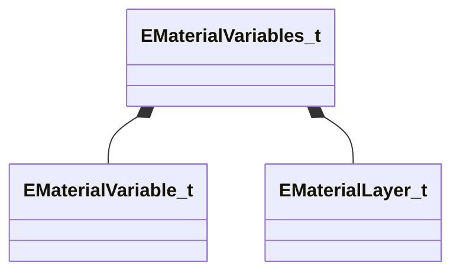

[Schemas](../../schemas.md) / [met](../met.md) / EMaterialVariables_t

# EMaterialVariables_t

**Kind:** class · **Size:** 64 bytes (`0x40`) · **Align:** 8 · **Module:** met

**Relationships:**

## Memory layout

3 fields (3 declared here, 0 inherited). Offsets are absolute from the object base.

| Offset | Field | Type | From | Annotations |
|--------|-------|------|------|-------------|
| `0x0` | `m_bIsLayeredShader` | bool |  |  |
| `0x8` | `m_Variables` | CUtlVector< [EMaterialVariable_t](../met/EMaterialVariable_t.md) > |  |  |
| `0x20` | `m_Layers` | CUtlVector< [EMaterialLayer_t](../met/EMaterialLayer_t.md) > |  |  |

KV3 class defaults

<pre>{
	&quot;m_bIsLayeredShader&quot;: false,
	&quot;m_Variables&quot;:
	[
	],
	&quot;m_Layers&quot;:
	[
	]
}</pre>

